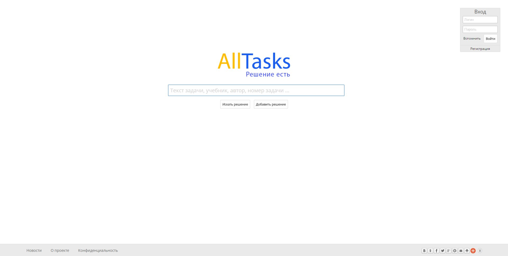
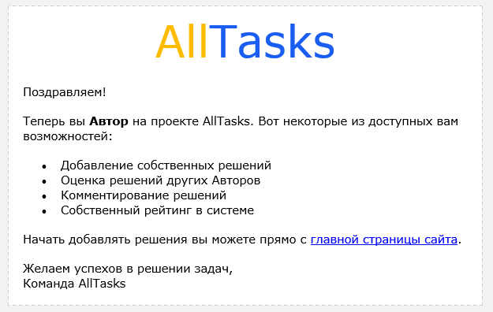

<gallery>
    
    
</gallery>

В мире есть множество задач, они сформулированы в учебниках, задачниках, на олимпиадах и в других источниках.
В интернете много разных решебников.
Есть даже полноценные вопросно-ответные системы, типо "Школьные знания" или "Stack Exchange".

Я загорелся идеей создать глобальный сайт, на котором размещены подробные и понятные решения задач из любых источников, где каждый может зарегистрироваться, оценивать другие решения и добавлять свои собственные. И все это совмещено с полноценной поисковой системой в духе Яндекса или Google.

Сайт так и не запустил, хотя он был готов на ~70-80%.
Мне показалось, что нужно обязательно дать возможность предлагать правки к решениям других пользователей, как это сделано на сайтах проекта "Stack Exchange".
В безуспешных попытках реализовать этот и другой сложный функционал я растерял всю мотивацию и забросил почти готовый проект...