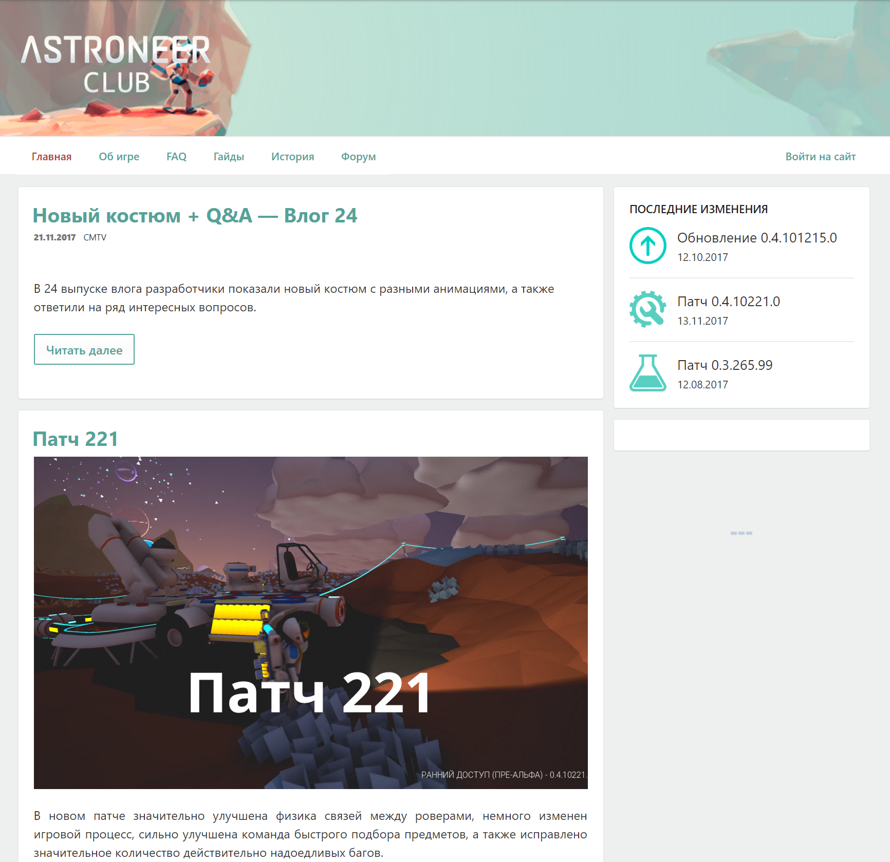
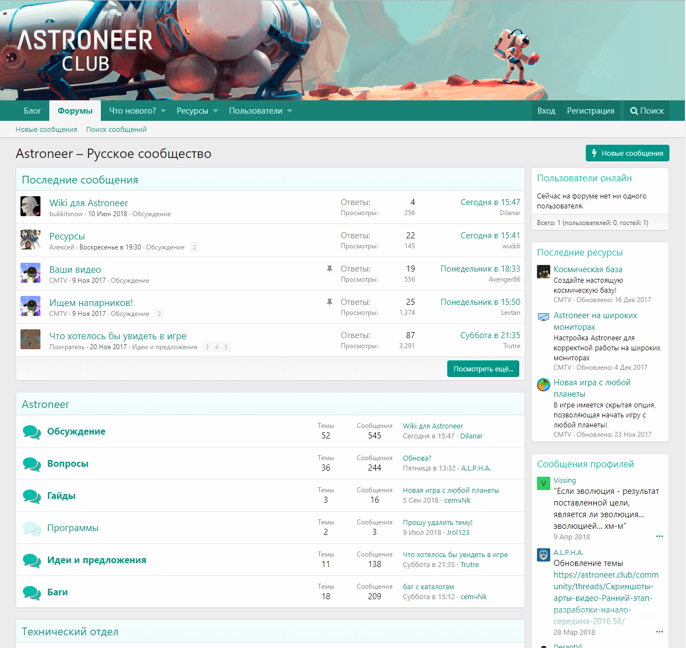
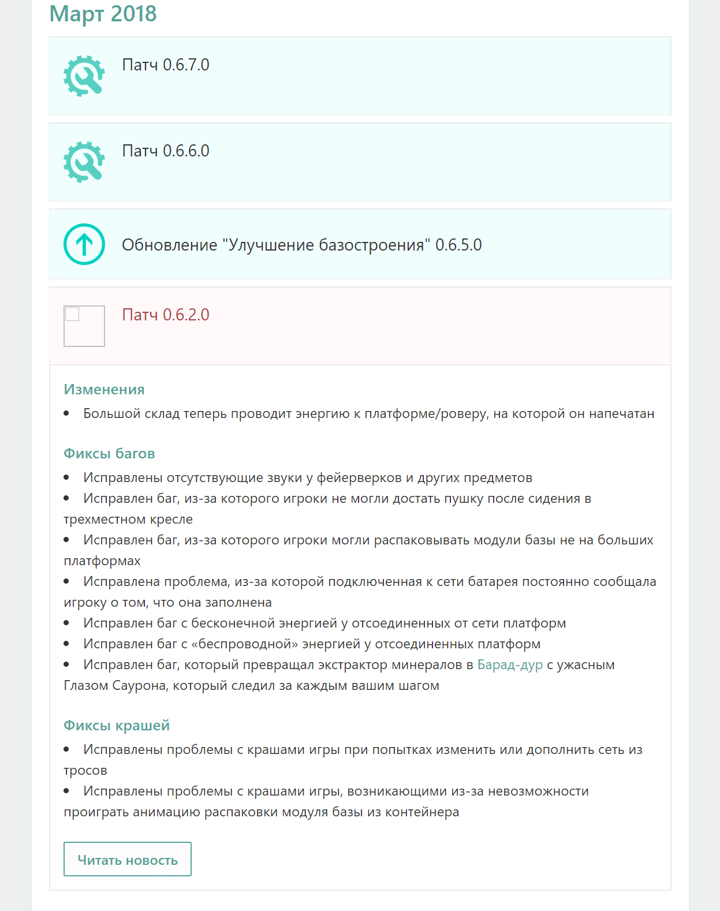

# Идея проекта

В декабре 2016 меня очень заинтересовал трейлер игры Astroneer.
Она как раз вышла в раннем доступе и стоила недорого.
Игра мне очень понравилась и почему-то напомнила ранние версии Minecraft.

Я понял, что это мой шанс оседлать потенциальную волну популярности.
Нет пока никаких сайтов и форумов по этой игре. Нужно быть первым!
Так родилась идея проекта Astroneer Club.

# Структура и деятельность проекта

Сначала я сделал все, чтобы максимально захватить информационное пространство Astroneer в рунете:

* Группа ВКонтакте
* Аккаунт в Twitter
* YouTube канал
* Новостной сайт
* Форум для обсуждений

Конкурентов практически не было, а имеющиеся делали контент слишком медленно и некачественно.
Благодаря своевременной и регулярной публикации качественных материалов проект стал самым популярным в нашем регионе.

## Деятельность

90% времени моя работа заключалась в том, чтобы переводить контент, публикуемый авторами игры.
В этот контент входили описание патчей и обновлений, конспекты влогов, ключевые моменты трансляций.

Иногда мы с небольшой командой создавали собственный уникальный контент.
Например, ставили необычные эксперименты в игре, помогали переводить ее, а один раз даже провели совместный стрим с разработчицой.

# Команда

На форуме познакомился с увелченным игроком под ником stal2142 (Никита Семёнов).
В какой-то момент он пригласил меня в дискорд для совместного эксперимента по выходу в открытый космос, что не было запланировано игрой.
Так началась наша долгая и дружная совместная работа над созданием контента.

В том же дискорде на официальном сервере Astroneer я познакомился и с другими активными игроками, с которыми тоже делали контент. Вместе мы (4-5 человек) составляли ядро русскоязычного сообщества игры.

# Группа раннего реагирования

В 2018 меня в числе первых пригласили на закрытый Discord сервер специально для создателей контента по Astroneer.
Мы получали ранний доступ ко всем предстоящим большим обновлениям (примерно за неделю), чтобы успеть подготовить материалы для своих посетителей, подписчиков и зрителей.

Ранний доступ очень пригодился, так как мне больше не нужно было писать огромный обзор в день выхода обновления.
Появилось время самому поиграть, составить свое мнение, потом внимательно изучить новый контент и уже после всех этих действий вдумчиво и конструктивно писать обзор.

# (Сентябрь 2018) Редизайн

<gallery>
    
    
    
</gallery>

Старый дизайн портала делал в быстром темпе, так как приоритет был в захватите области и производстве контента.
Из уникальных фишек была автоматическая генерация красивых списков изменений на основе моих обзоров обновлений и патчей.

В сентябре 2018 года вышел крутой аддон XenPress, который позволяет тесно связать XenForo форум и блог на WordPress.
Под его выход я решил обновить дизайн портала.
Редизайн занял где-то неделю.
В результате получился один из самых красивых сайтов, которые я когда-либо создавал.
Настоящий шедевр, который наголову уделывал даже официальные англоязычные сайт и форум.

# Результаты

Один из самых популярных моих проектов.
На протяжении 2 лет работы в любом поисковике по запросу Astroneer в первой пятерке всегда висела Steam страница игры, моя группа ВКонтакте и сайт проекта. В какой-то момент мой сайт был даже выше официального сайта игры!

Несколько раз официальные аккаунты, включая твиттер самой игры ретвитили мои обзоры обновлений.
Их менеджер по работе с аудиторий прямым тектом отмечал, что я описываю патчи подробнее него! 

Мое имя добавили в список "Особая благодарность" в игре.

# Выводы

Два года я потратил на тот проект: переводил, рисовал, снимал ролики, писал статьи, копался в исходниках игры, поддерживал блог и форум.

Очень сильно прокачал навык восприятия английской речи на слух.
Получил уникальный для себя опыт работы в небольшой команде.

Понял, что могу при должном желании целиком захватить и грамотно справляться с большим информационным потоком.

В конце концов я уже не в первый раз понял, что могу делать более фундаментальные проекты, что Astroneer не станет очень популярным и относительно скоро умрет.
Тогда я бросил проект и переключился на другие дела.