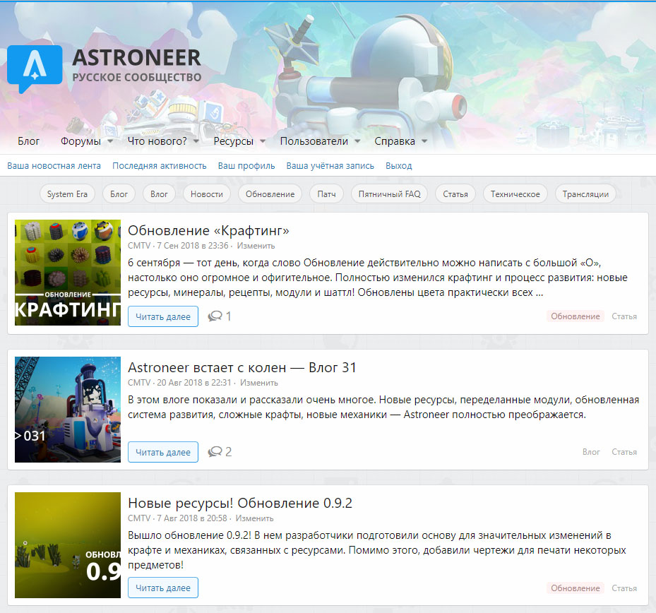
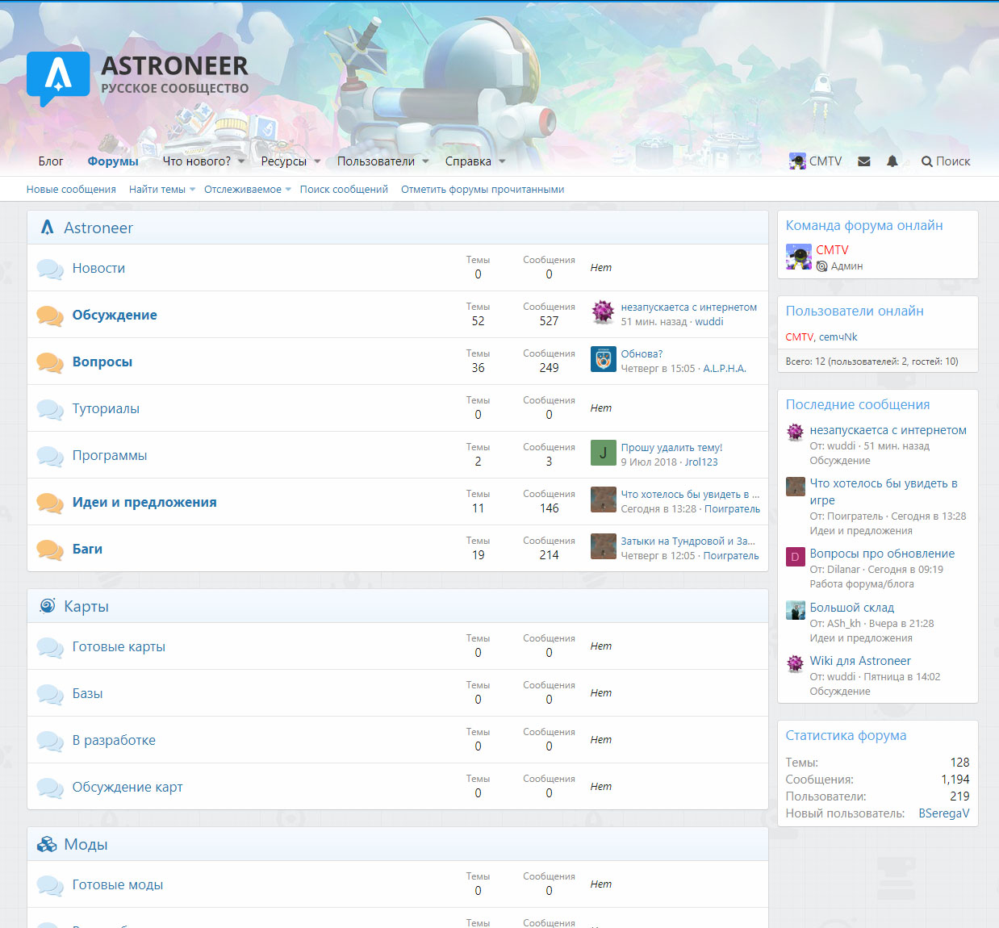
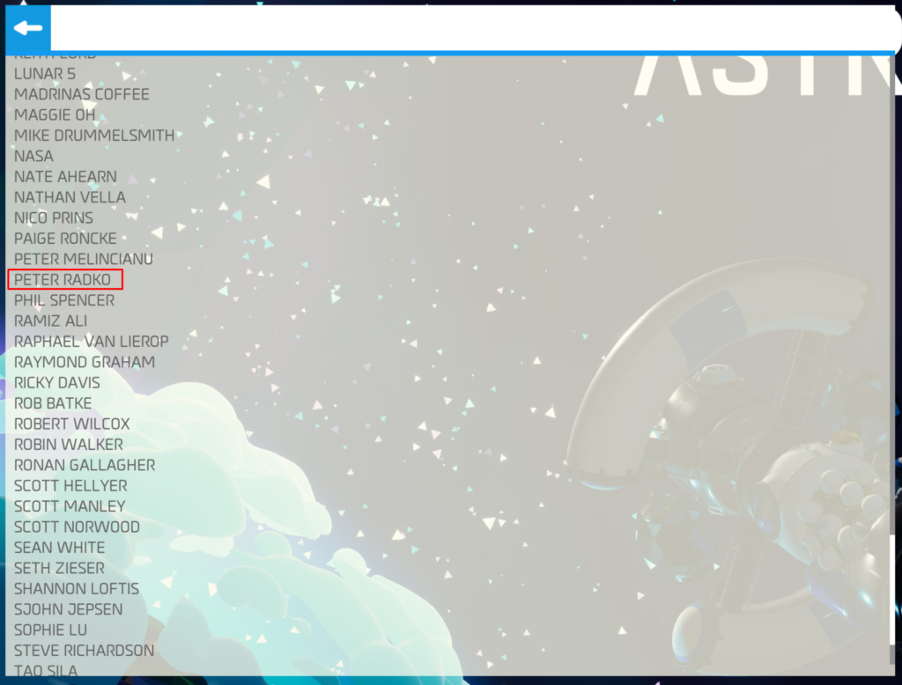
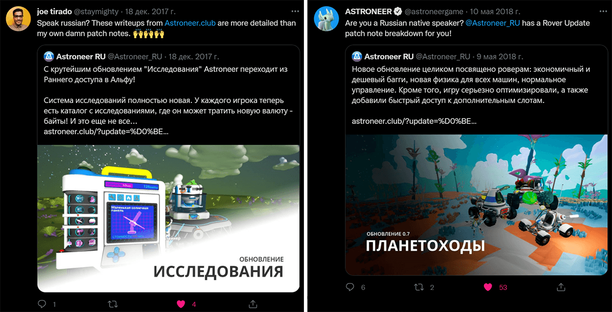
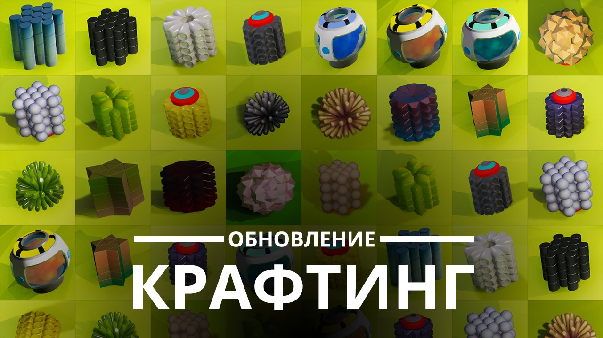
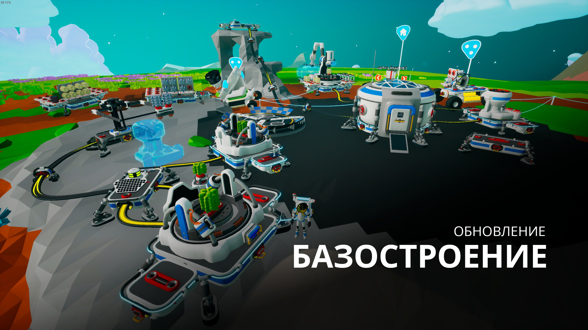
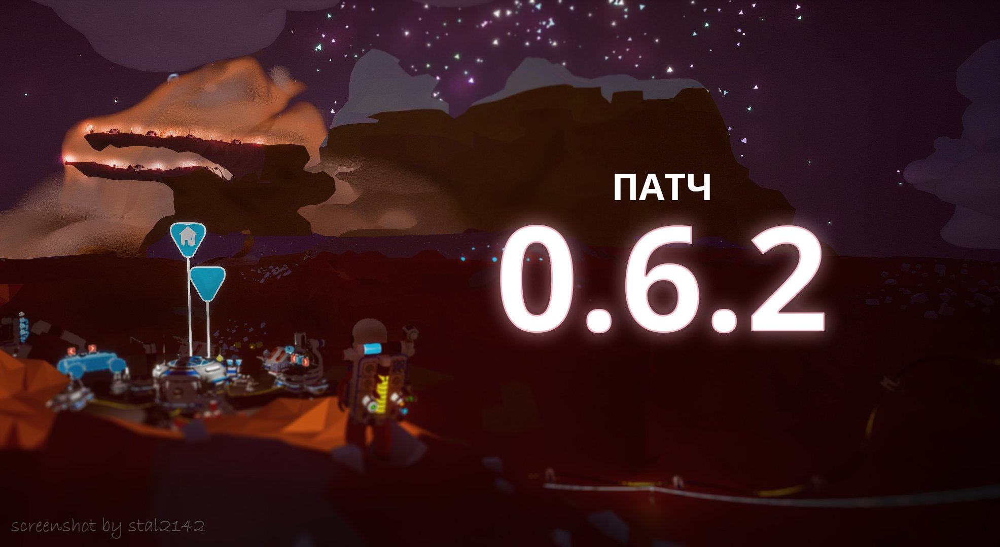

<gallery>
    
    
    
    
    
    
    
</gallery>

Масштабный проект, де-факто официальный русскоязычный источник информации и площадка для обсуждений, посвященные космической survival-песочнице Astroneer.

С момента выхода игры в ранний доступ и вплоть до полноценного релиза переводил все новости, влоги, делал краткие выжимки из онлайн трансляций. С небольшой командой создавали собственные материалы по игре.

Состоял в группе раннего реагирования, получавшей все обновления заранее для подготовки материалов.
Упомянут в титрах игры. За все время работы проект не покидал топ-5 Google и Яндекса по запросу «Astroneer».

После двух лет работы решил переключится на более стоящие и фундаментальные проекты.
Проект оказался заброшен, сайт и форум удалены.