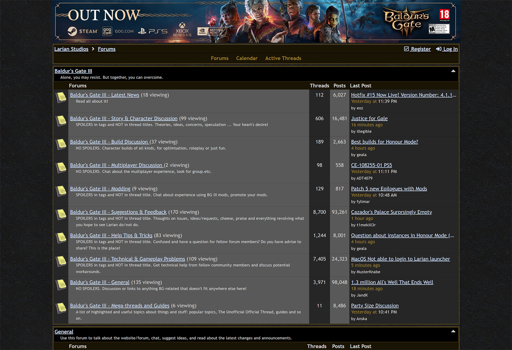
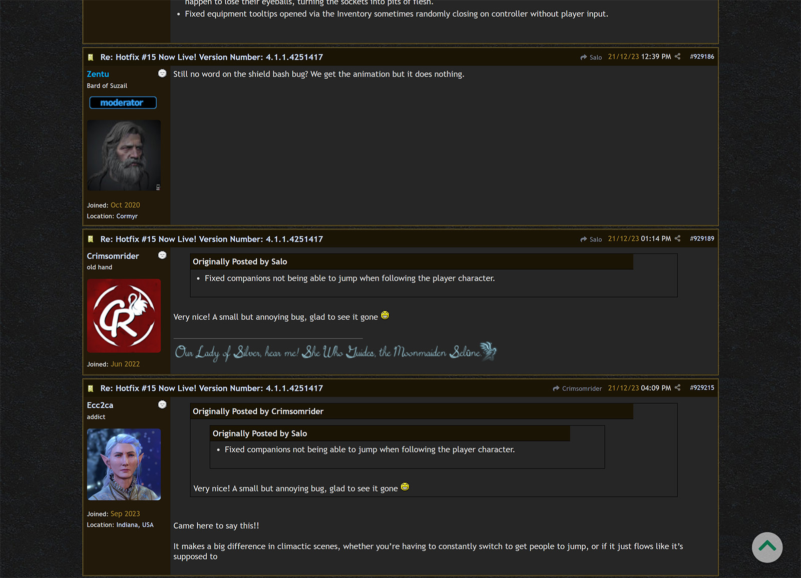
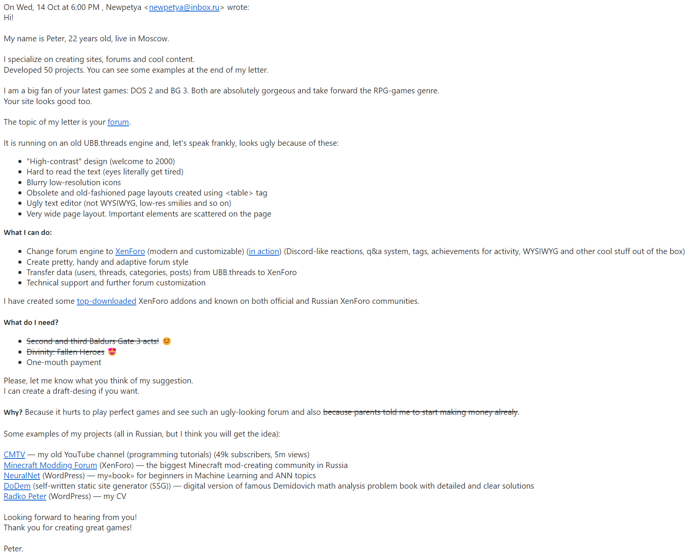
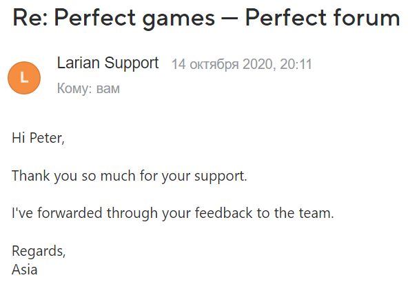

# (6 октября 2020) Ранний доступ

С появления первого тизера я с нетерпением ждал, когда же откроется ранний доступ.
И дождался.
Вкатился вечером и играл до ночи.
На следующий день встал в 6 утра только затем, чтобы утром еще немного поиграть.

Подсел на игру как на наркотик и был в настоящем шоке.
Куда бы ты не пошел, везде найдешь много интересного контента.
В первом прохождении я даже не обнаружил Подземья!
И у меня просто челюсть отвалилась, когда я спрыгнул в дыру в земле и попал в локацию еще на десяток часов контента!

Ранний доступ произвел на меня неизгладимое впечатление.
Настолько сильное, что на протяжении следующих трех лет мыль о релизе игры посещала меня практически каждый день.

# (14 октября 2020) Предложение улучшить форум

Игры у Larian изумительные, а вот форум просто ужасный.
Сразу видно, что толкового веб-программиста у них в штате нет.
Сам их форум работает на допотопном движке (UBB.threads) из времен, когда динозавры по улице бегали.
Просто страх и ужас:

<gallery>
    
    
</gallery>

В октябре 2020 года я с головой был погружен в работу с форумными движками.
В начале месяца Baldur's Gate III вышла в раннем доступе и я находился под огромным впечатлением от нее.
Сразу понял, что грядет новое слово в жанре, эталон РПГ, игра года и прочее.
На волне воодушевления, я предложил сделать им форум на XenForo с авторским дизайном (как [MC Modding Forum](p:mcmodding)):

<gallery>
    
    
</gallery>

К сожалению, помимо сообщения о том, что моя идея "была передана команде", больше ничего не приходило.
Я довольно сильно расстроился.
С другой стороны, с тех пор у меня в разработке есть свои, гораздо более масштабные [проекты](p:omath) и идеи.
Все что ни делается — все к лучшему...

# Впечатления

Игра взяла самые сильные стороны DOS 2 и улучшила их.
В ней можно благодаря Харизме чилить на "вражеской базе" и находить там квесты.
Игрок сам решает, когда, на кого и как нападать.
Никто не заставляют зачищать орды копи-паст противников.

Полная геймплейная свобода поражает.
Можно в соло на Астарионе на стелсичах выкрасть из яслей яйцо, не нанеся ни одного удара.
Можно кастануть медленное падение, прыгнуть в дыру в земле и открыть локацию с контентом на 20 часов.

И еще множество разных "можно": вытолкнуть босса с арены, обрушить под ним мост и залутать его труп в Андердарке, смазать статуи для их поворота, замкнуть электрический прибор водой, построить башню из ящиков и перепрыгнуть высокую стену, создать себе женщину с членом и украсть у всего отряда трусы.