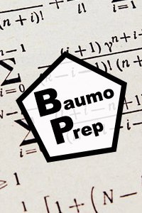
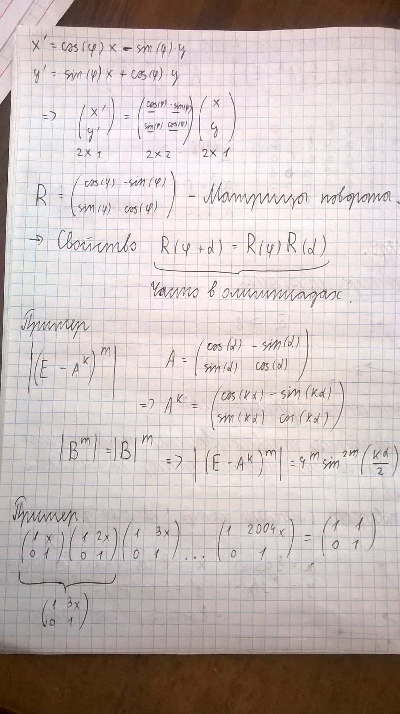
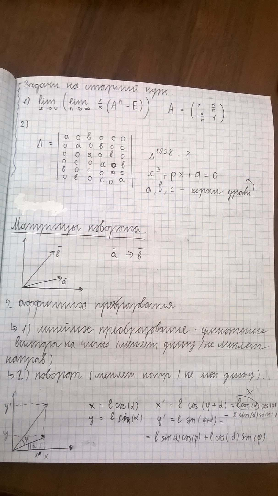

# Поступление

Первоначально я рассчитывал поступить на бюджетную форму обучения через проект ["Шаг в Будущее"](p:step-into-the-future).
После провала пришлось усиленно готовиться к ЕГЭ.
И все же мне совсем чуть-чуть не хватило баллов, чтобы попать на бюджет.
Пришлось идти на платную форму обучения.

# Общие впечатления

У меня были наивные мечты, что ВУЗ это храм науки, где по просторным коридорам ходят студенты в черных робах с задумчивыми выражениями лиц, придумывая решения великих теорем.
Ну, просторные коридоры там действительно есть, как и студенты, правда они не носят робы и сводят концы с концами любой ценой пытаясь успеть сдать задания в срок...

В целом, от реальной университетской жизни (скорее от ее темпа) я больше разочаровался, но положительных моментов было тоже очень много.

## Университет

От самого университета только положительные впечатления.
Несколько огромных, монументальных зданий, просторные коридоры, большие лектории с огромными досками высотой почти под двухэтажный дом, "Дом Физики" с крутыми лабораториями, умные профессора, олимпиады, вкусная и недорогая еда в столовых, собственный комбинат питания.

Идеальное место для того, чтобы посвятить себя науке и образованию...

## Режим

Невыносимый, это если одним словом.
Больше десятка предметов, каждый имеет свой внушительного размера учебник, который нужно пройти за один семестр.
Естественно, пройти его за это время невозможно. Поэтому огромная часть материала просто выкидывается и на лекциях подаются только ключевые понятия, часто даже без доказательств.

Мне понятны причины введения подобного подхода, но менее противным от этого он не становится.
Я почти всю сознательную жизнь провел на домашнем обучении, пытаясь освоить матеирал в своем темпе, поэтому подобные скачки мне совсем не подходили.

В результате, в ВУЗ регулярно я отходил где-то неделю или две.
После этого стал проходить материал дома по учебникам.
Обстановка более приятная и не надо тратить кучу времени на поездки.

## Студенты

Расстроила и большая часть студентов.
Каких-то общих глобальных планов у большей их части нет.
Ну поступил и поступил. Почему именно на физику? Не знаю.

90% учащихся приходят в университет как в продолжение школы без особых переспектив и мотивации.
И только 10% ясно понимают, что они хотят, а также **делают конкретные шаги** в этом направлении.
Впрочем, подобное распределение работает почти в любом коллективе.

# Мой путь

Первое время я был образцовым студентом.
В первый же день проявил себя ответственным человеком и стал старостой группы.
Было сложно, но я стойчески принимал все невзгоды.

Проблемы по учебной части начались практически сразу.
А дальше начался снежный ком проблем.
Все новые и новые задания наваливались, а я не успевал даже усваивать новую информацию.
Тут свою роль сыграло еще и то, что моя математическая подготовка оказалось не такой уж мощной.

Если бы не помощь "Команды Мечты", о которой ниже, я бы наверное не продержался бы и пары месяцев в университете.
Но ребята меня буквально спасли, и я удержался на плаву.

Удержаться то я удержался, но кардинально изменился мой подход.
Я все реже появлялся в университете и все больше времени проводил дома, в комфортной обстановке изучая материал по учебникам в своем темпе. Обязанности старости передал одногруппнице.

Но это не помогло. День за днем я все больше и больше отставал от группы.
Пытался проходить материал последовательно, осознать его, доказать все используемые теоремы.
Накапливалось все большое долгов.

Постепенно пришло осознание, что это не мой путь.
Я хочу учиться, но не готов жертвовать материалой в угоду "плану".
Группа перешла на второй курс, а я все закрывал долги по первому и планировал после этого уйти.

Но красиво уйти не получилось.
Когда мне оставалсь еще буквально неделя до сдачи последнего долга, заместитель декана просто сказал мне, что все, вот тебе бумага, подписывай.
Я подписал и ушел.

# Команда Мечты

В ВУЗе я встретил пару человек, которые буквально спасли меня.
Люди, без которых я не продержался бы и пары месяцев.
Люди, с которыми связано 99% процентов положительных эмоций от ВУЗа.
Люди, с которыми хочется менять мир.

Команда Мечты:

## Светлана Пичкуренко

Оказывается, Свету, как и Колю я впервые увидел еще во время защиты работы по ["Шагу в будущее"](p:step-into-the-future), просто там я с ними не познакомился.

Впервые я по-настоящему встретился с ней в первый учебный день в университете.
Она попала со мной в одну группу и искала людей, которые помимо основной учебы хотят дополнительно заняться какой-нибудь научной работой. Вызвался только я.

Так началась наша долгая, теплая и крепкая дружба.
Мы сходились во взглядах по большинству вопросов, оба грезили стать великими учеными, выручали друг друга.
Перечитывая нашу переписку понимаю, что она оказывала мне мощную психологическую поддержку в трудные моменты.
Она стала моим первым в жизни близким другом, а других (помимо Коли) я еще не встречал.

Ну и конечно же, Света помогала организовывать и принимала участие в самом крутом и незабываемом в моей жизни 18 дне рожденья!

## Николай Нагибин

Когда я согласился взять дополнительную научную работу, Света познакомила меня с Колей, крутым физиком-математиком, победителем множества олимпиад, вечным студентом и нашим наставником.
Если бы я знал, что встреча с одним человеком может настолько изменить жизнь...

Множество раз мы собирались втроем или вдвоем для того, чтобы он объяснил какую-нибудь сложную тему или помог с домашним заданием. Также он вовлек нас во внеучебную деятельность: мы вместе ездили на олимпиады и даже принимали участие в соревнованиях по "Что? Где? Когда?", сражались против самого Вассермана!
Втроем мы образовали щит, за которым укрывались от шквала сложных университетских будней.

Для меня он всегда выступал идеалом ума.
Я старался максимально мого общаться с ним, перенимать его подход к решению задач.
Он научил меня учиться, понимать высшую математику и физику, дал мне пусть частичную, но все же базу, на основе которой я выстраивал новые знания.

Общение, наставничество и совместная работа продолжились и после того, как меня исключили из ВУЗа.

# Месяц математики

Не могу не рассказать про офигенную аферу, которую мы втроем провернули в начале учебного кода.
Мы со Светой достаточно быстро поняли, что с математикой идет как-то туго.
И тогда кто-то из нас (то ли я, то ли она) выдвинул идею, что было бы круто на недельку или даже больше вдвоем под наставничеством Коли заниматься только математикой.
Я же сказал, что живу в большом коттедже и там как раз есть свободные места для еще двух жильцов.

К моему удивлению, Коля идею воспринял очень серьезно и буквально через пару дней мы все дружно "заболели", Коля и Света переехали ко мне домой и Команда Мечты начала Месяц Математики!

О, это было самое офигенное мероприятие в моей жизни!
Три крутых ума и одна великая цель.
Каждый день от рассвета до заката мы безвылазно сидели в большой комнате и терзали математику.
Исписали сотни A4 листов и десятки ручек.

Парадоксально, но за этот месяц мы совсем немного продвинулись и естественно не догнали группу.
Эксперимент можно было бы посчитать неудавшимся, но мы сделали главное.
За этот месяц Коля подтянул нашу базу. Переставил наши мозги из школьного саней на более-менее университетские рельсы.

# Интересные моменты

Год в университете был очень насыщенным на события.
Ниже рассказал про самые примечательные.

## Помощь одногруппнице

В нашей группе оказалась одна ученица, которая попала на бюджет.
Но ее уровень знаний был совсем низкий.
Честно говоря, я даже не понимаю, как так вышло, что ее сначала послали именно на кафедру физики.
Естественно, у нее в первый же день начались серьезнейшие проблемы.

Но Команда Мечты никого не бросает в беде!
Мы специально договорились и все втроем приехали к ней в общежитие утром, а потом полдня подтягивали ее знания по математике.
Ей это не помогло и через месяц она перевелась на другое направление, но было интересно.
Оставшуюся половину дня мы провели за начертательной геометрией.

## Олимпиада в Ярославле

Собрались мы все вместе и Командой Мечты поехали в Ярославль на математическую олимпиаду.
Было волнительно и очень интересно.
Я был в своем стиле: решил всего полторы задачи, зато на нескольких листах с подробнейшими объяснениями.
Света решила больше и даже заняла призовое место.
Коля, как и всегда, сражался со своим другом за первое место.

## Перестрелка ручками поздно вечером

Однажды мы втроем собрались поздно вечером после пар пройти некоторые темы по математике.
Какое-то время мы действительно занимались.
Но потом занятие постепенно перетекло в стихийное перебрасывание друг другу ручек и карандашей.

Минут 10 мы носились словно слоны по аудитории и кидались друг в друга разными предметами, пока не пришла злая уборщица и не прогнала нас из университета.

Почему-то эта сцена очень прочно засела мне в душу.
Было здорово!

## Группа олимпиадной математики

<gallery>
    
    
    
    
</gallery>

Коля решил организовать занятия по высшей математике для подготовки студентов к олимпиадам.
Я предложил свою кандидатуру в качестве первого ученика, а также администратора: создал группу ВКонтакте, придумал логотип, разместил первые конспекты.

Достаточно быстро я понял, что занятия тоже слишком быстро идут вперед и со своими текущими долгами я просто не успеваю проходить олимпиадный материал.
Поэтому я отошел от дел. Врочем, через некоторое время и Коля передал эти дела своему другу.