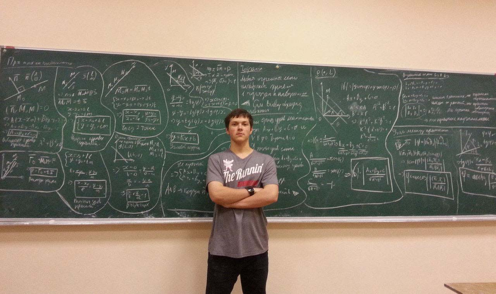
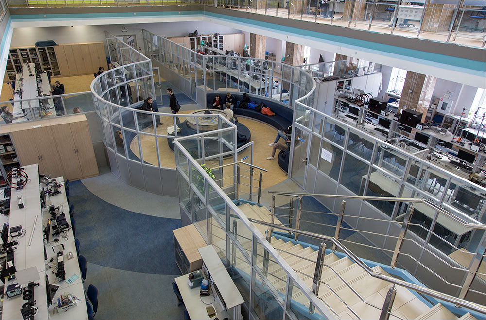
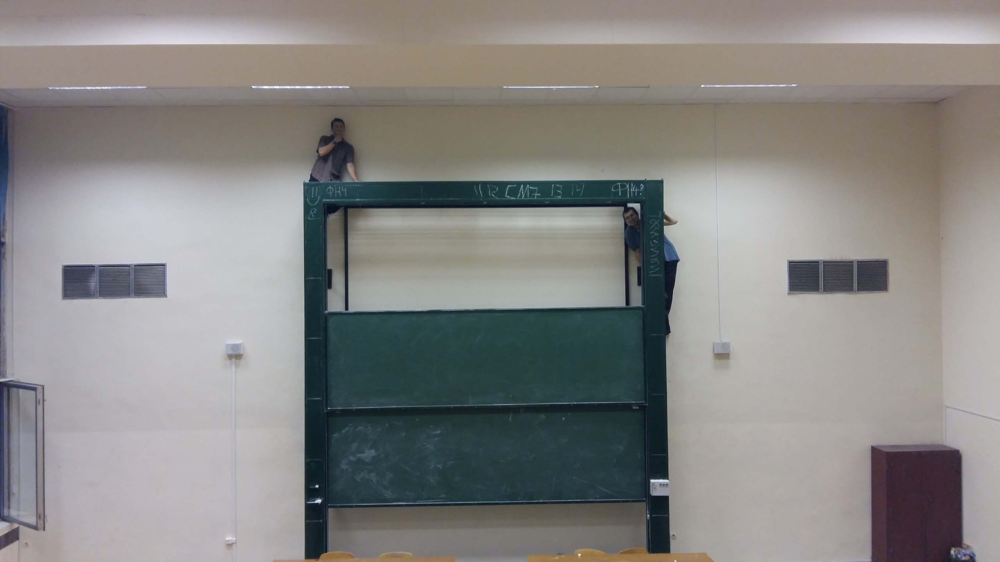
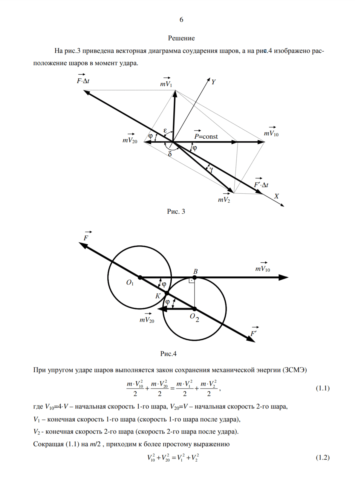

<gallery>
    
    
    
    
    
</gallery>

Мой первый и единственный год в университете я могу сравнить с первой десантной высадкой в какой-нибудь горячей точке.
Теплая и уютная домашная обстановка сменилась адской нервотрепкой ВУЗа с миллионом предметов, людей и заданий.
Но я смог выстоять в этом бою, получить ценный опыт и найти настоящих друзей...

Порой я задаюсь вопросом, какой была бы моя жизнь, если бы я не выбрал кафедру физики? Если бы воля случая определила меня в одну группу, а Свету (и Колю) в другую? Была ба такая жизнь лучше? Не знаю.

Но одно я знаю точно. Мало у кого был настолько необычный и насыщенный первый год в университете. И несмотря на серьезные проблемы по всем фронтам, я не жалею, что прошел через этот период. Он сделал меня другим человеком.