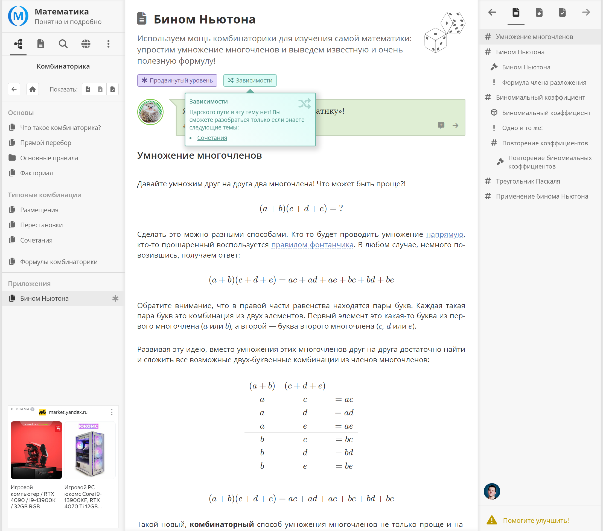
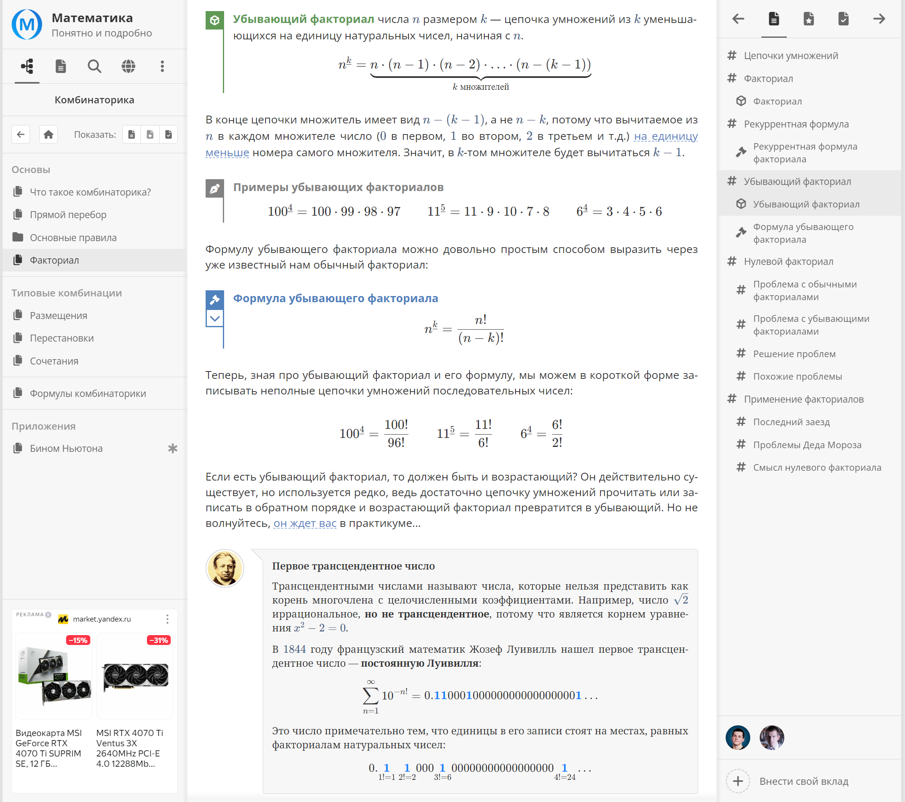
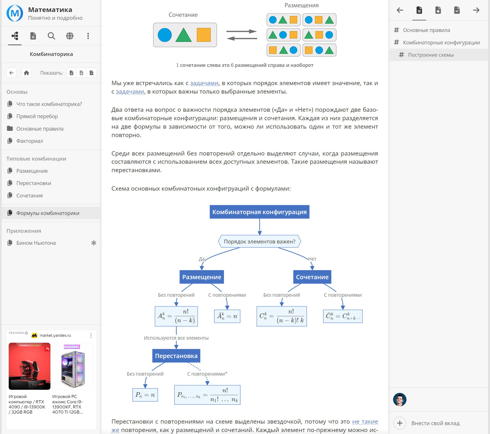

<gallery>
    
    
    
    
    
    
</gallery>

Первый полноценный учебник на платформе [OMath](p:omath).
В процессе написания тем тестировались фишки платформы, выявлялись баги, а также появлялся новый функционал: ссылки на источники, видео, очень красивые математически анимации, схемы, аналогичные и генерирующиеся задачи и так далее!

Выбор пал именно на комбинаторику, потому что она имеет прикладной характер, в ней есть полезные и простые формулы, материала объяснять надо не очень много, а также у меня были хорошие источники, на основе которых можно было выстроить темы.

Проект триумфально выстрелил 1-го марта, когда я запостил новости на DTF и Пикабу по саму открытую математику и учебник в частности.
Обе собрали более 1500 плюсов и весли на первых страницах.
В тот день появилось 3 платных спонсора, больше двух десятков обычных подписчиков, а количество уникальных посетителей на сайте перевалило за 2000!