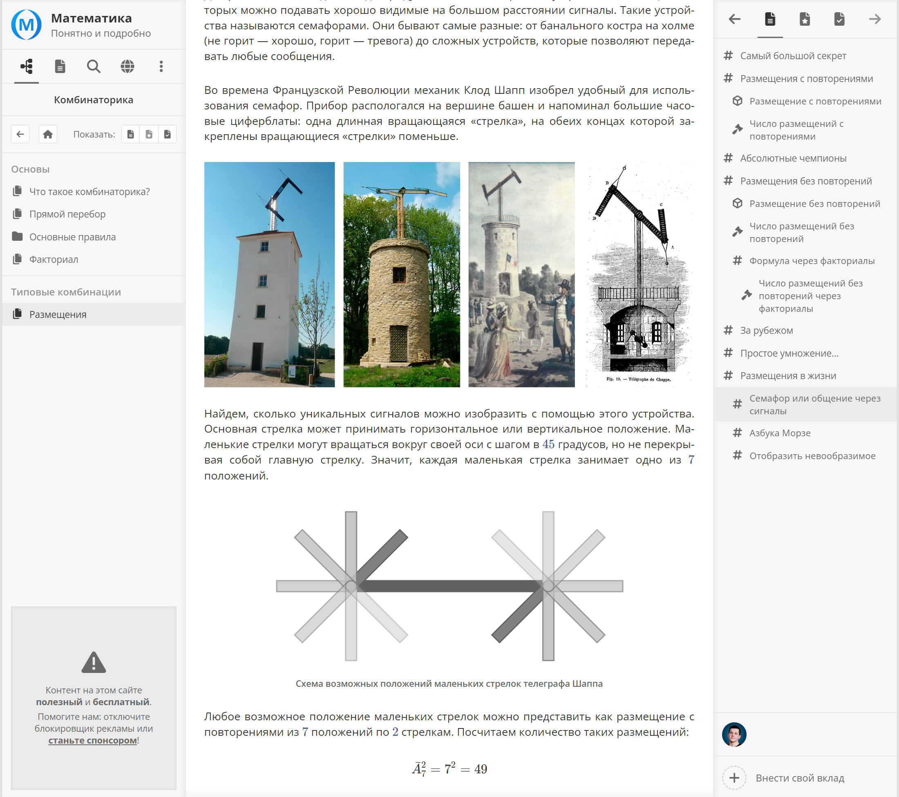
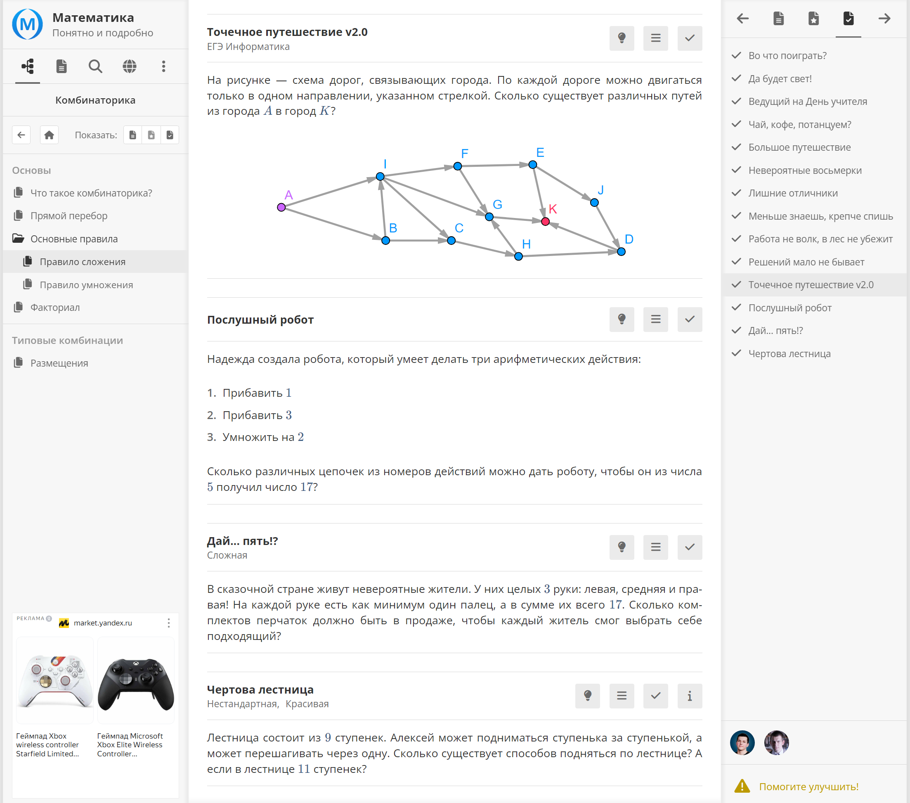

<gallery>
    
    
    
</gallery>

Первый полноценный учебник на платформе [OMath](p:omath).
В процессе написания тем тестировались фишки платформы, выявлялись баги, а также появлялся новый функционал: ссылки на источники, видео, аналогичные и генерирующиеся задачи и так далее.

Выбор пал именно на комбинаторику, потому что она имеет прикладной характер, в ней есть полезные и простые формулы, материала объяснять надо не очень много, а также у меня были хорошие источники, на основе которых можно было выстроить темы.