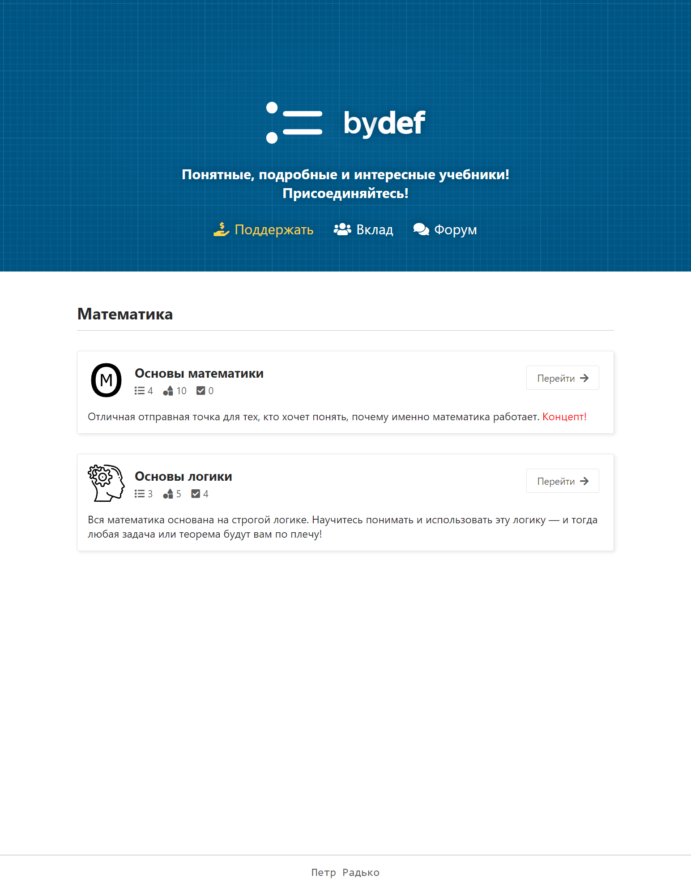
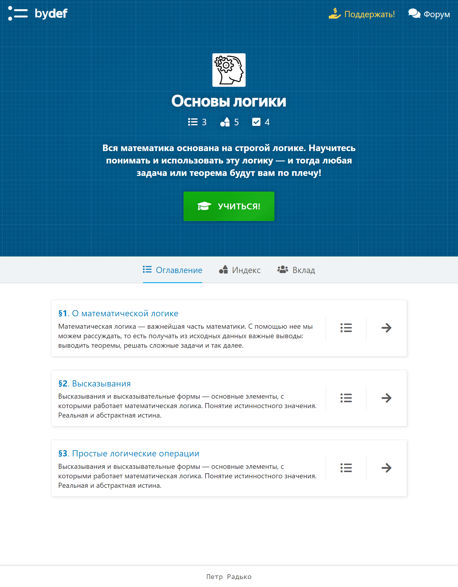
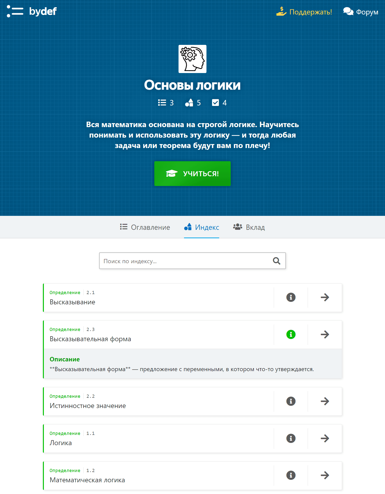
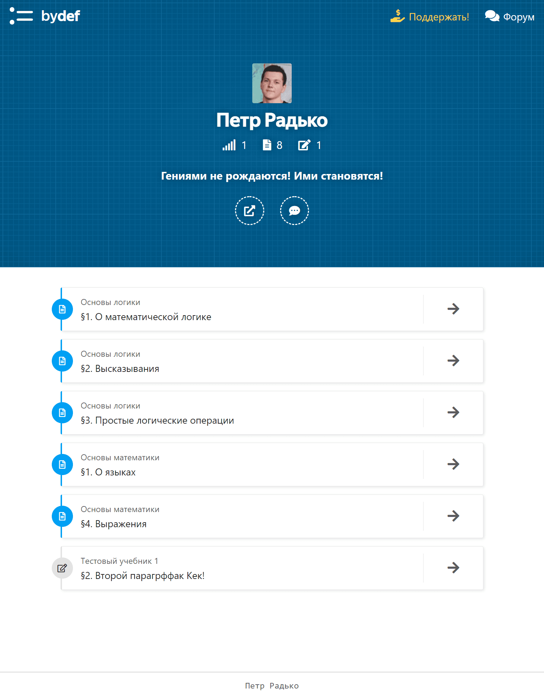
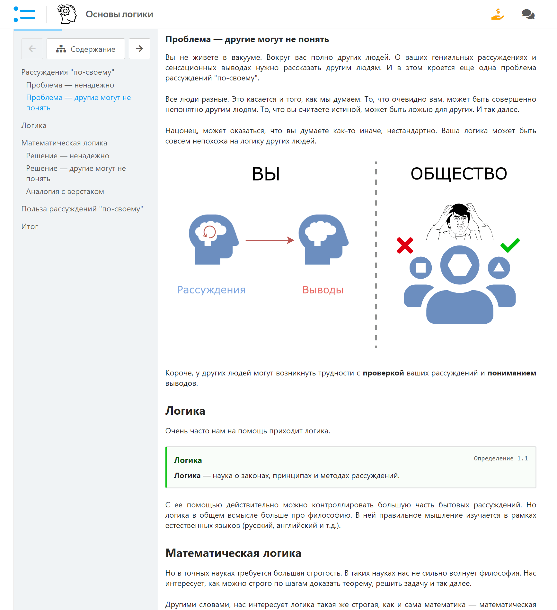
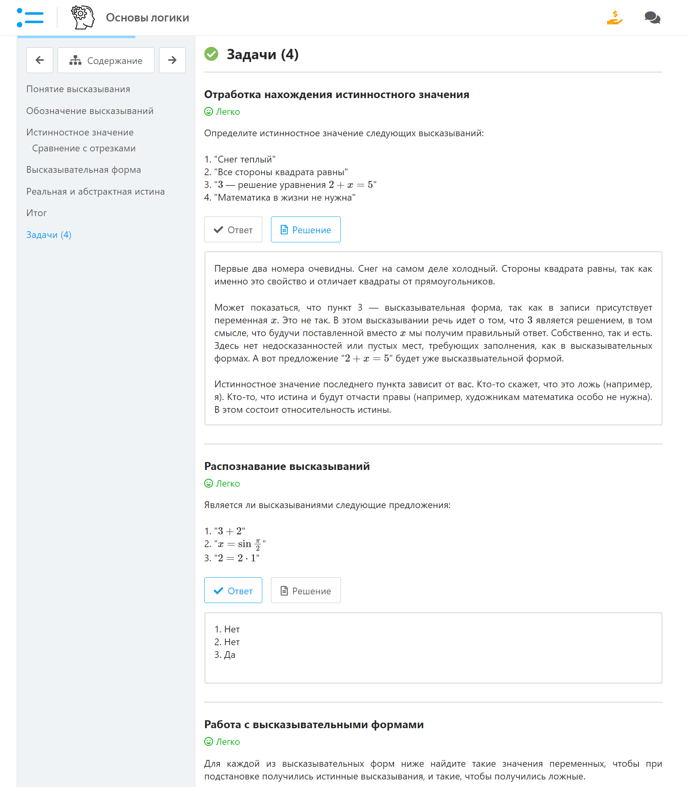

<gallery>
    
    
    
    
    
    
</gallery>

Третья и самая амбициозная попытка создать лучший онлайн учебник по математике.
На самом деле структура сайта позволяла создавать вообще любые учебники, но начать я решил именно с нее.

После создания ["Крестиков Ноликов 3D"](p:tictactoe3d) вместе с Колей на пару недель отправились из [Североморска](p:severomorsk) ко мне домой. Вот в это время я и решил написать новую версию онлайн учебника.

В отличие от [MathIt](p:mathit), этот сайт был полностью самописным статическим генератором.
Из уникальных черт:

* Возможность создавать учебники по разным темам.
* Автоматическое построение индекса, содержащего все определения и теоремы.
* Поддержка задач разной сложности с указаниями, ответами и решениями.
* Система авторов с учетом написанных ими статей и сделанных правок.
* Впервые испробовал библиотеку Vue.js.

К сожалению, проект пришлось закрыть. Первое время написание контента шло хорошо.
Но потом я что-то сильно закопался в математическую логику и то, как ее стоит подавать.
К тому же параллельно я решал задачи по высшей математике и постепенно полностью переключился на них, создав проект [Демидович](p:dodem).