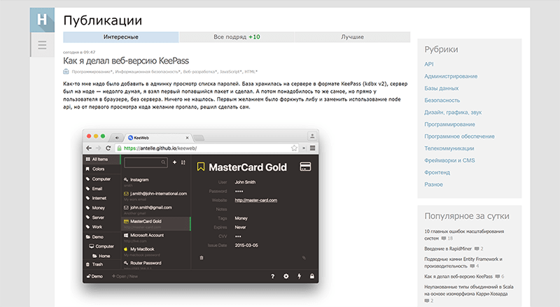

# Технология

Сайт я написал самостоятельно.
В те времена я еще ничего не знал про препроцессоры, про TypeScript, про Node.js в целом, поэтому
пришлось использовать старые добрые HTML, CSS и JS.

Дизайн решил скопировать у Хабра. У него тематика схожа с моей, плюс мне очень понравилась
идея с вертикальной "шапкой" слева.

# Нейронные сети

В процессе работы над курсами по разработке сайтов я наткнулся на книгу Ришарда Тадеусевича "Элементарное введение в технологию нейронных сетей".
Эта тема полностью захватила меня.

Прочитав всего пару глав я c горящими глазами взялся за работу: создал отдельный курс на сайте и начал новую серию роликов на YouTube канале.
Тема выстрелила. Ролики про нейросети смотрело на **порядки** больше человек, чем любые другие.
Просмотры росли как на дрожжах!
Вероятно, свою роль в такой популярности сыграло и то, что зрители чувствовали мой энтузиазм и желание разбираться в этой теме.

В итоге я полностью забросил идею создать курсы по разработке сайта и полностью переключился на нейронные сети: создал отдельный [сайт](p:neuralnet-info) и продолжил серию роликов по ним. На проекте "Центр CMTV" был поставлен крест.