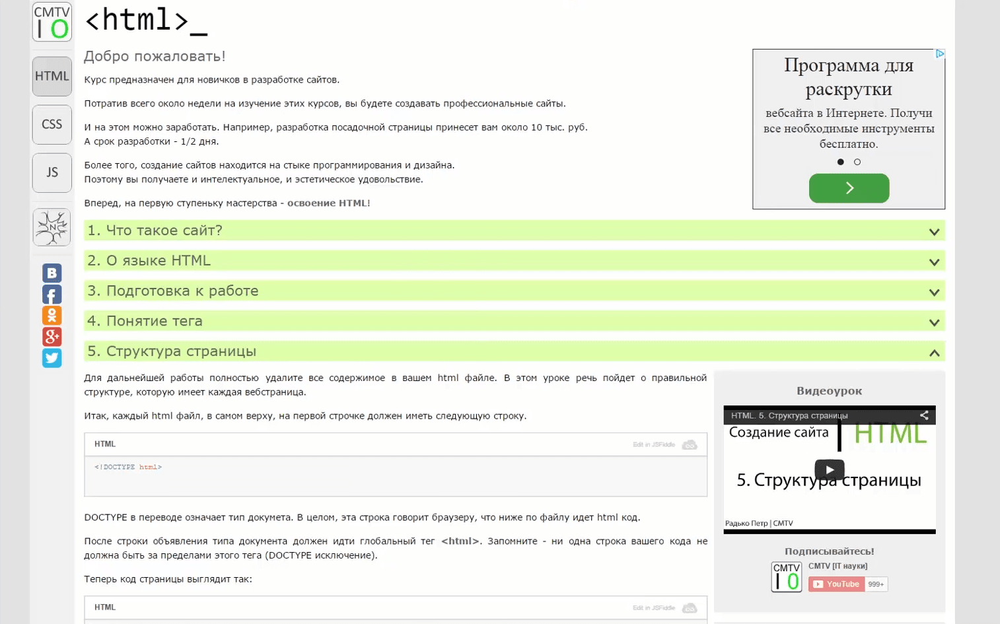
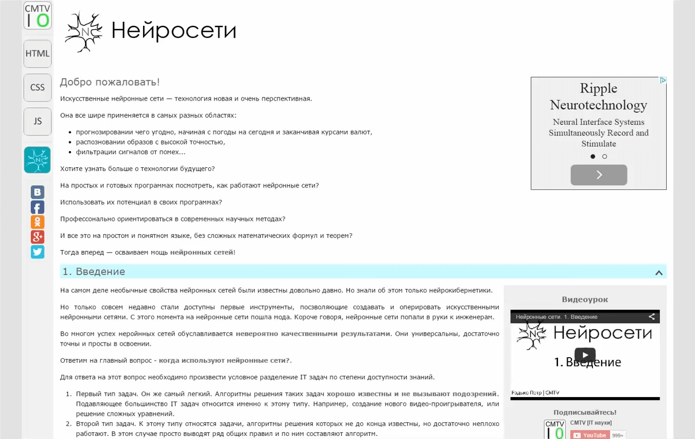

<gallery>
    
    
</gallery>

По мере развития канала я проводил все более серьзеную подготовку перед съемкой роликов. Заранее готовил
текстовый материал, отрывки кода и картинки. Проблема в том, что после выпуска ролика все это лежало без дела!

Возникла идея создать онлайн учебник, писать подробные и понятные статьи в онлайн для него, и уже
на их основе снимать ролики. И материалы без дела не лежат, и качество роликов станет еще лучше!
Так появился сайт "Центр CMTV".

Всего на проекте было создано 4 курса. Три посвящены созданию сайтов (HTML, CSS, JS) и один про нейронные сети.
Последний позднее перерос в отдельный очень куртой проект ["Нейронные сети"](p:neuralnet-info).
По двум курсам (HTML и нейросети) были сняты серии роликов на моем YouTube [канале](p:youtube-cmtv).