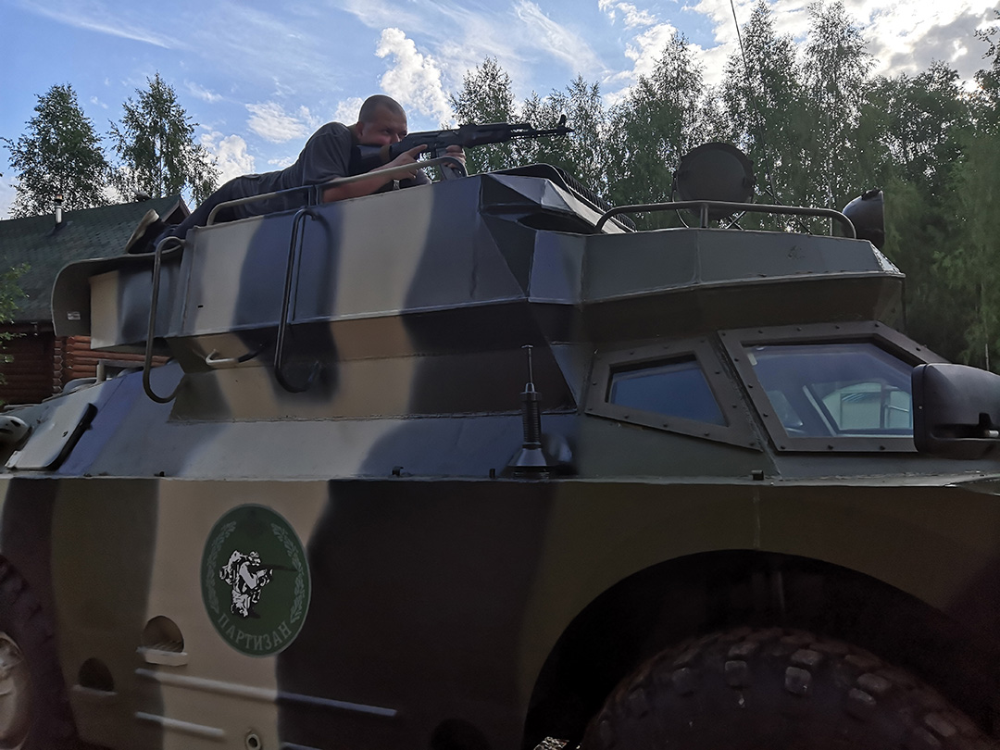
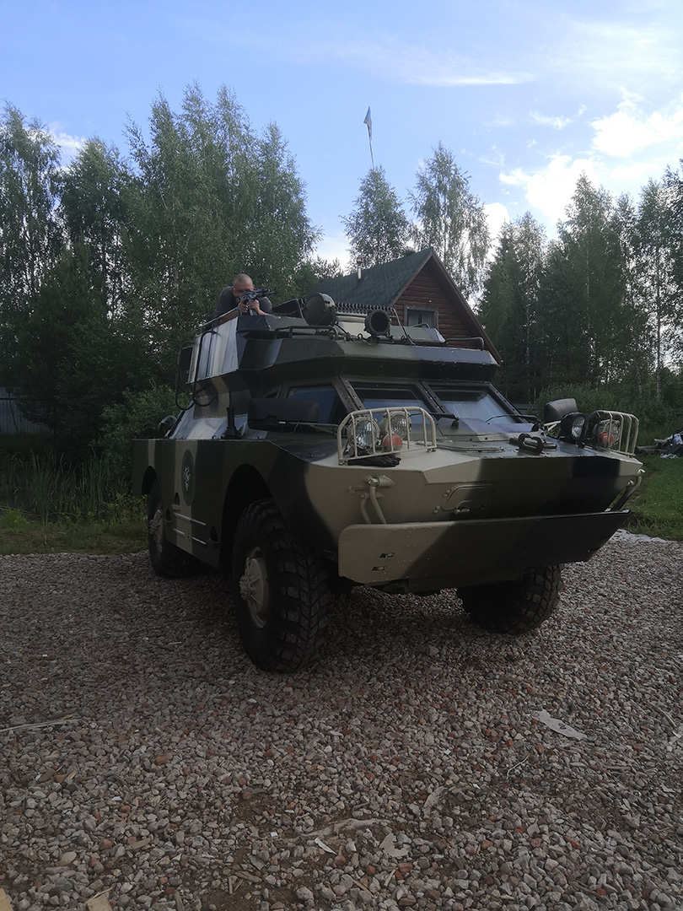
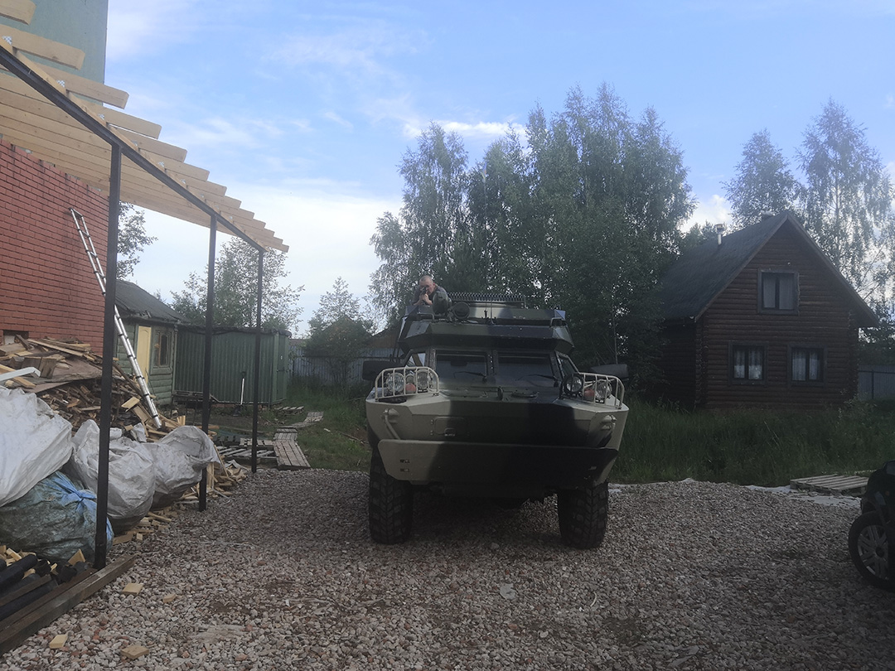

# Хронология

В нужную деревню мы прибыли вечером 23 числа.
И сразу же начались проблемы.
Координаты оказались не совсем верными, поэтому мы еще где-то час ходили туда-сюда в поисках нужного места.
В конце концов, нам подсказали нужный поворот, а сам ведущий курса вышел на дорогу нас встречать.
Отвел он нас на базу.

Увидев ее, я сразу выдохнул.
Срать в лесу и спать в обнимку с комарами не придется.
Три огромных палатки, одна из которых отведена под казармы.
Рядом небольшой домик, в котором распологается столовая, туалеты и душ.
Райские условия.

Инструктор кратенько объяснил, где и что на базе находится, сказал, что начало курса завтра в 9:00 и послал обустраиваться в казармы.
В этот день прибыла еще пара человек.

## День 1

Утром я проснулся замерзший.
Немного болело горло.
В 9:00 появился инструктор, сел на лавочку, начал неспеша курить.
Все стояли и ждали.

Тогда мне показалось, что он как-будто время растягивает, или может тормознутый.
Потом пошли в палатку.
Там мы подписали анкеты о том, что в возможных травмах и даже смерти центр ответственности нести не будет.

Затем пошел рассказ об автоматах Калашникова и принципах его работы.
Тоже очень неспеша, с заминками и прочим.
Короче, от начала первого дня остались смешанные впечатления.

Ну а потом нам выдали автоматы.
Причем дальше чем на два метра от них отходить было нельзя, потому что инструктора всегда будут искать возможность их украсть.
Все были очень довольны и в приподнятом настроении.

А потом начался **АД** и имя этому аду -- огневая подготовка.
Тебе показывают простое движение: стойка и снятие предохранителя.
А потом под счет ты должен это действие повторять.
Десятки раз подряд.

После этого тебе показывают либо новую стойку, либо новый способ в нее перейти, либо добавляют новое действие.
И снова ты десятки раз под счет это повторяешь.
Под палящим солнцем и кусающими тебя во все места комарами и слепнями.

Никогда в жизни я так сильно не ждал перерывов, как в первые два дня.
Я молился, чтобы инструктор решил выкурить еще одну сигарету, потому что это означает еще пару минут драгоценного отдыха.
Это была пытка.
За палец на курке и другие нарушения правил обращения с оружием отжимались все.
Я быстро устал отжиматься, поэтому все последующие дни приседал.

Вроде действия все простые, но правильно их выполнять было тяжело.
У меня появились проблемы с плечами (левое плечо все время выходило вперед), ноги ставил слишком далеко, наклоняться было тяжело и непривычно.

Ну а в конце нас решили добить окончательно и перед ужином устроили "статику".
Это когда ты вскидываешь автомат, становишься в стойку, да так в ней и стоишь полторы минуты.
Что-то вроде планки, но с дополнительной нагрузкой в виде автомата на вытянутых руках.
Я чуть на ней не умер.

Поздним вечером в отдельной палатке можно было потренироваться разбирать и собирать автомат.
Каждый из нас должен был разобрать автомать за 17 секунд, а потом без вермени собрать его, называя все детали.
Всего две попытки.
Кто их провалил -- на стрельбище не едет.

Ну и за полтора часа я так навострился автомат разбирать, что с начального времени разоборки в ~30 секунд на зачете поставил рекорд -- 9 секунд.
Был очень горд собой.

Ну а ночью нас ждал караул.
Ходишь туда-сюда, спрашиваешь у инструкторов пароль.
Шарахаешься на каждый подозрительный звук из леса.
А звуков там очень много разных.
Очень необычные ощущения.

## День 2

Я опять замерз, хоть уже и не так сильно, как в первый день.
Первые мысли, когда я открыл утром глаза -- зачем я проснулся?!
Лучше бы я вообще не просыпался!
Было невероятно тяжело: все тело ныло, мышцы болели, было понимание, что сегодня будет еще хуже.
Однако после зарядки стало сильно легче.

Впрочем, легче стало не всем.
Первые два человека покинули нас сразу после зарядки.
У одного проблемы с коленями, у другого с сердцем.
Нас осталось 8.

Ну а дальше в 9:00 по расписанию начался ад -- огневая подготовка.
В этот раз к изученым стойкам стали добавляться более сложные действия: разные способы перезарядки, обработка задержек и проблем.
Что примечательно, никто больше ни разу не отжался за палец на курке.
Все еще по 150 отжиманиям в первый день запомнили, что так делать не надо.

Потихоньку, повторение за повторением, я начал замечать, что ноги уже сам собой становятся правильно, что корпус наклоняется вперед, что почти сразу получается свести мушку с целиком.
То есть десятки повторений и отжиманий за нарушения все же потихоньку дают результаты.

В середине дня курс покинул еще один участник.
У него тоже были проблемы с коленями.
Он даже ездил в местную клинику, где ему вкололи обезболивающее.
Но его эффект закончился, боль вернулась и он решил уехать.
Нас осталось 7.

Ближе к вечеру мы пошли в поле рядом с базой отрабатывать падение и работу с автоматом лежа.
Было очень интересно, выучил несколько разных способов упасть так, чтобы автомат смотрел в нужном направлении.
Проблема было только в том, что с каждым подъемом обратно на ноги я прямо ощущал, как скачет давление в голове.

Все это физическое напряжение, плюс подступающая мигрень привели к тому, что перед ужином я попросил освободить меня от выполнения статики в левосторонней стойке.
Пошел в столовую, сел, уткнул лицо в руки и чуть не расплакался.
Нервы были на пределе, тело было на пределе, хотелось схавтить автомат и раздоблать его за всю ту боль, что он мне причиняет.
Тогда я был на грани того, чтобы сдаться и уехать домой.

Но я справился.
Что-то в тот день изменилось внутри.
Стал сильнее.
Выдержал.

Правда, от мигрени меня это не спасло.
Когда меня в 0:20 разбудили, боль была в самом разгаре.
Пришлось принимать таблетку и в полубредовом состоянии заступать в караул.

## День 3

В этот раз я не раздевался после караула, а потому за ночь не замерз.
Все по старому -- зарядка в 6 утра, огневая подготовка в 9.
На ней мы отрабатывали движения, которые будем выполнять на стрельбище.

Потом мы вновь пошли в поле.
К счастью, никаких физически сложных упражнений нам не дали.
Мы просто легли и отрабатывали прицеливание вместе со спуском.

Ну а потом случилось то, чего все так долго ждали -- мы поехали на стрельбище.
Правда, стрельбище это сильно сказано.
Просто небольшая подстриженная полянка с высокими насыпями со всех сторон.

Все очень волновались.
На первых упражениях с холостыми патронами многие от стресса путались и делали не те действия.
У меня в этом плане проблем почти не возникло.

А вот где они возникли, так это в стрельбе на точность.
Первое, что меня удивило -- как ты не целься, пуля все равно полетит куда-то не туда.
Второе -- отдача сбивает тебе прицел и каждый раз приходится заново наводиться.
Короче говоря, попасть куда-то на 100 метров, а уж тем более на 200 это очень **непростая** задача, которая под силу только регулярно тренирующемуся человеку.

Меня также сильно расстроило, что из 10 выстрелов по гонгам я ни разу не попал.
К счастью, потом мне все же удалось их три раза поразить, включая один маленький на 200 метров.

Стреляли мы из двух разных автоматов. Один был под патрон 5.56, другой под 7.62.
И если более маленький калибр давал довольно незначительную отдачу, то 7.62 ощутимо лягался в плечо.
Настолько, что под конец дня я даже отказался достреливать из него, потому что уже не мог терпеть боль после выстрела. 

Вечером учились чистить автоматы.
Как оказалось, это довольно серьезный и времязатратный процесс.
Провозились мы с ними до полуночи.

## День 4

Последний день был еще проче, чем предыдущий.
Мы с самого утра отправились сдавать автоматы, потом послушали лекцию про поправки на ветер, высоту и движение мишени.
Ну а затем мы отправились на стрельбище.

Признаться честно, утром я побаивался автомата с калибром 7.62.
Думал, он опять будет делать мне очень больно.
Но все обошлось, и никакой боли в этот раз не наблюдалось.

В этот раз у нас были более сложные упражнения с упором на скорость.
Стрельба с колена, с колена из-за укрытия, стоя, стоя из-за укрытия, быстрые выстрелы по два и так далее.
Было классно, но точность сильно страдала.

Освободились мы довольно рано.
Все довольные и настрелявшиеся.
Казалось бы, осталось только почистить два автомата и можно уезжать.

Вот только в этот раз мне досталось чистить ствол.
И это был кошмар.
Все уже завершили, а я все чистил его и чистил.
Шомпол постоянно в нем застревал.

Под конец из-за напряжения я умудрился забить ствол автомата: стальной цилиндрик с тканью отсоединились от шомпола в середине ствола и остались в нем.
Честно говоря, я думал, что сломал автомат.
Но все обошлось, и ударами дощечки застрявшие внутри детали удалось выбить.

Записали видео-отзывы, сделали совместое фото и поехали домой.
Интересно, что возвращясь обратно, я смотрел на знакомые места уже каким-то немного другим взглядом.
Словно обратно вернулся другой человек.

# Общие впечатления

Я думал, на последнем дне "Тактической медицины" было невероятно тяжело.
Так вот на этом курсе первые два дня были в несколько раз тяжелее.

Если говорить общими словами -- то этот курс состоит из двух дней адских физических нагрузок и двух дней кайфа от стрельбы на стрельбище.
Причем ты понимаешь, что одного без другого невозможно.
Нельзя без десятков монотонных повторений и закреплений действий и стоек просто приехать и пострелять.
Равно как и бессмысленно все это повторять, если в итоге ты это не опробуешь в реальной стрельбе.

## Концепция "отсева"

Под конец курса пришла идея, что такие тяжелые физические нагрузки, помимо выработки навыка, служат своебразным отсевом "слабых".
Выдержит ли твое тело и психика.
Достаточно ли ты адекватный, чтобы получить в руки настоящее оружие с настоящими патронами.

## Инструкторы

Несмотря на некоторые подозрения относительно "слабого" начала курса, под конец понимаешь, что все прошло идеально.

Есть основной "начальник" -- спокойный, никуда не спешит, не душит.
Есть хороший полицейский -- тоже спокойный, если что подойдет объяснит, как лучше делать и прочее.
А есть плохой полицейский -- заставляет отжиматься, следить за недочетами, топит за то, чтобы все побольше страдали.

Но самое главное -- никто тебя не прессует до срыва.
Проблемы с плечами -- подсказывают и показывают как их исправить.
Но даже если сразу не выходит, они на тебя не давят.
Все равно рано или поздно плечи потихоньку сами выправляются.

Лучшей тройки инструкторов для подобных занятий и не найти.

## Прицельный огонь

Очень удивился, что даже на 100 метрах пуля летит не туда, куда ты целишься.
А попасть куда-то на 200 метрах вообще можно только случайно.

Я всегда думал, что если уж ты совместил мушку с целиком, более-менее получил заветную букву "Ш", то пуля непременно туда и полетит.
А вот нифига.
От напряжения ты постоянно автоматом немного кривишь.
Когда давишь на спусковой крючок, тоже чуть-чуть прицел сбиваешь.

Короче, стрелять точно это целая наука, которая требует большой практики.

## Еда

Отдельного упоминания стоит еда.
Ее было много.
По три блюда на обед и ужин: суп, второе и салат.
Каждый раз еда была разной.
Кто-то не мог все съесть, поэтому у нас образовался довольно большой запас, который потихонькую подъедали по утрам.

# Интересные ситуации

## Инцидент с новым паролем

Очень интересная ситуация произошла на вторую ночь под конец моего караула, где-то в 1:00.
В голове вата из-за принятой обезболивающей таблетки, все мышцы болят.
И тут из темноты выходит один из инструкторов.

Я вскидываю автомат, требую пароль и называю первое число: "4".
Он мне отвечает "6", хотя должен был ответить "3", чтобы в сумме получилось 7!
Потом я называю другое число "3". Он мне "7".
С щелчком я снимаю предохранитель и думаю, что же мне делать.

Мы молча смотрим друг на друга пару секунд.
Со стороны эта заминка наверняка была похоже на знаменитую немую сцену из "Ревизора" Гоголя.
Наконец он говорит, что стрелять холостыми не стоит, есть и другие способы тревогу поднять.
В итоге он пояснил, что пароль сменился.

Я вспомнил, что наш командир говорил про смену пароля, но в конце он пошутил.
И пошутил он так, что я подумал, что шуткой является как раз сам факт смены пароля!
**Важный вывод**: в очень серезных темах всегда убеждаться, что информация (например, о новом пароле) доведена до каждого и каждый ее понял.
Без шуток и приколов.

## Засада для инструкторов

<gallery>
    
    
    
</gallery>

На третью ночь я решил основательно подготовиться к ночному визиту инструкторов.
Задний выход из палатки закрыл на молнию (она была наполовину расстегнута).
Перекрыл его фанерой, чтобы при попытке проникнуть в палатку она с грохотом упала.

Убедившись, что задний вход заблокирован, я попросил у одного из курсантов туристический коврик, и устроил огневую точку на крыше БРДМ.
Позиция была идеальной.
Правда, через полчаса я понял, что все это время наблюдал не за той палаткой.

Пришлось менять позицию и расположиться на земле в кустах в углу участка.
Там же свой караул провел папа и еще один курсант.
Лежишь себе, укрывшись камуфляжными панамкой и курткой.
Место было идеальное.

К сожалению, инструктора так и не пришли в эту ночь.
По их словам, они дважы проверяли камеры и не видели караульного.
Подумали, что им устроили засаду и решили не приходить.

А жаль, потому что второй инструктор сказал, что именно в эту, третью ночь, они хотели устроить прямо атаку на казармы.
Но, видимо, заленились.
А жаль.
Было бы интересно переиграть и поймать их.