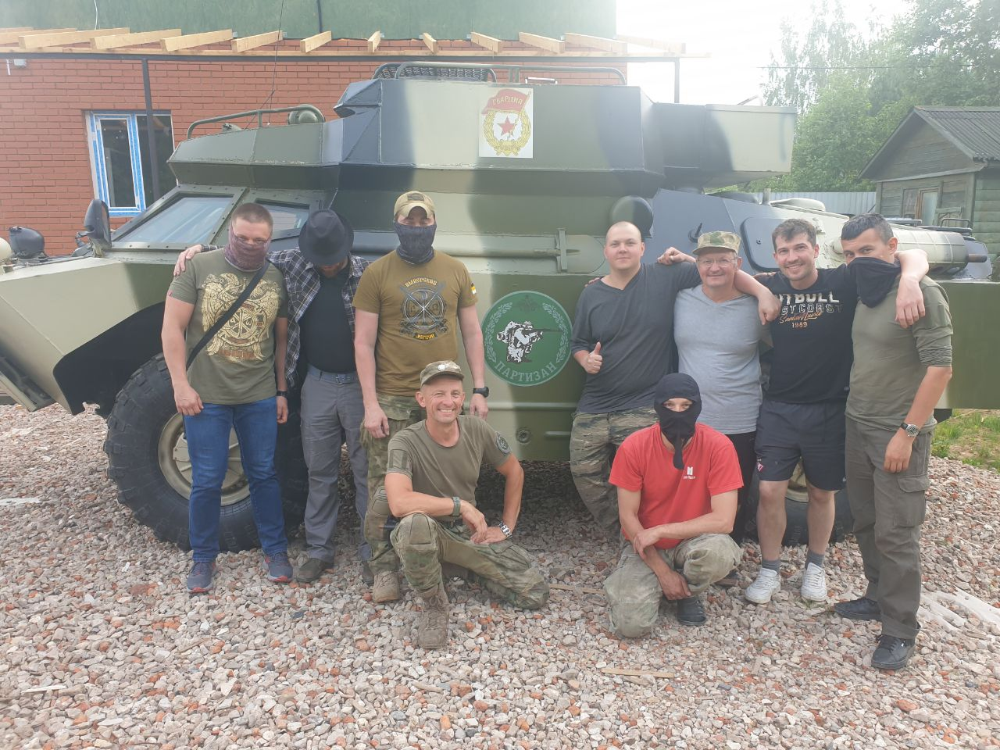
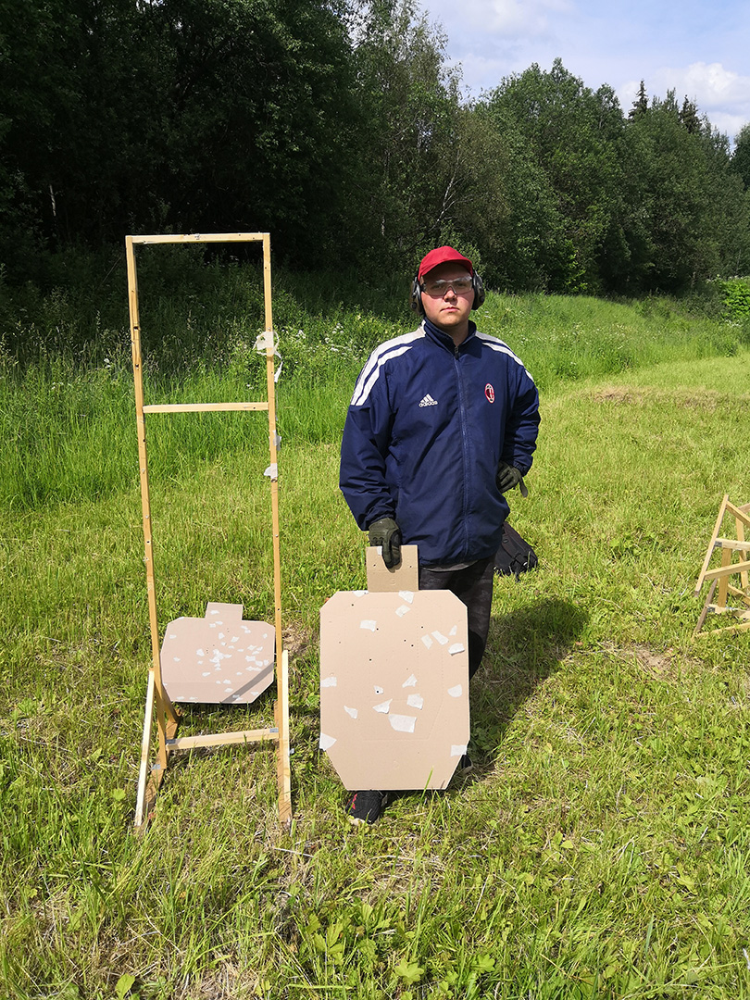
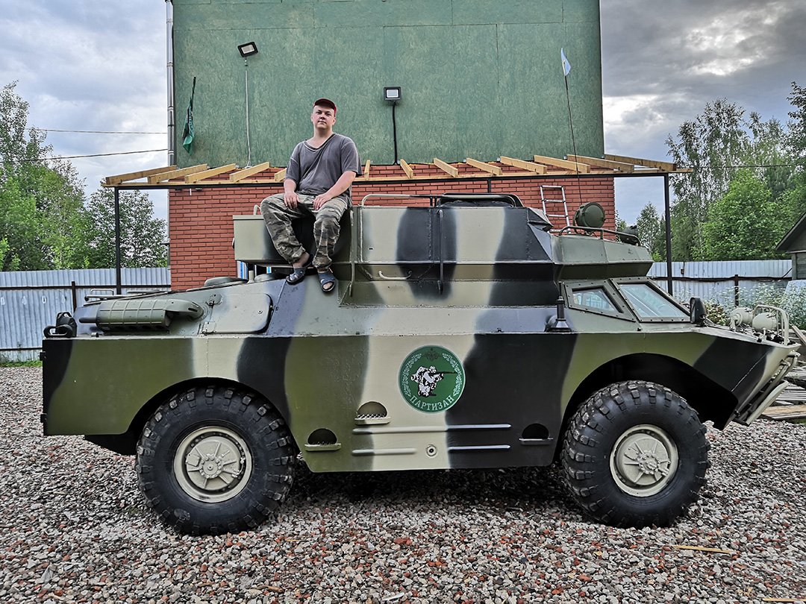
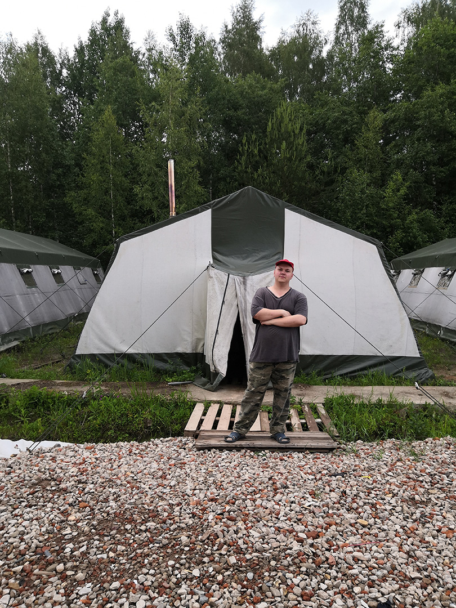
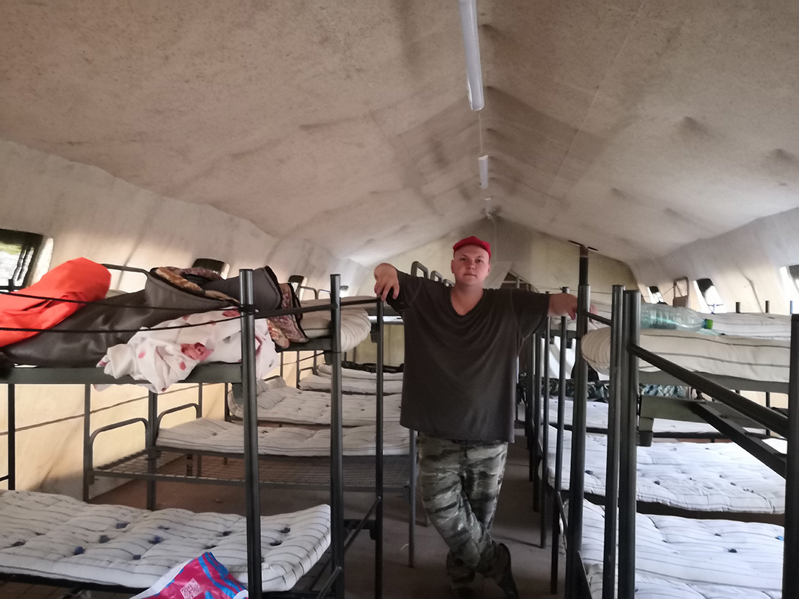
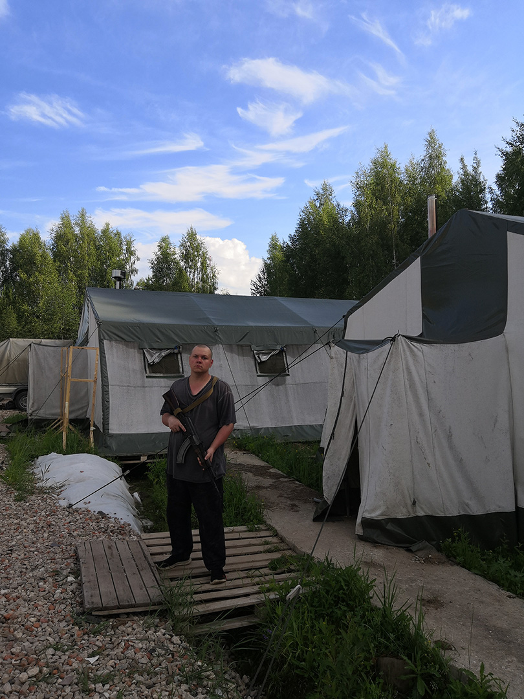

<gallery>
    
    
    
    
    
    
</gallery>

После прохождения [тактической медицины](p:tactical-medicine), мы решили, что надо научиться обращаться с оружием.
Тем более как раз подвернулсь очень выгодное предложение: 4 дня, посвященные АК в Московской области с 150+ выстрелами и всего за 30 000 рублей.

В предвкушении, мы с отцом отправились в очередное приключение за важными знаниями.
Знания мы получили и очень хорошо их закрепили, но какой ценой...
Я и не подозревал, насколько тяжело это будет.
Но после двух дней тяжелейших физических испытаний мы были награждены двумя днями стрельбы настоящими патронами из настоящих автоматов.

Этот курс довел меня до предела моих физических и ментальных возможностей.
И сделал меня сильнее.