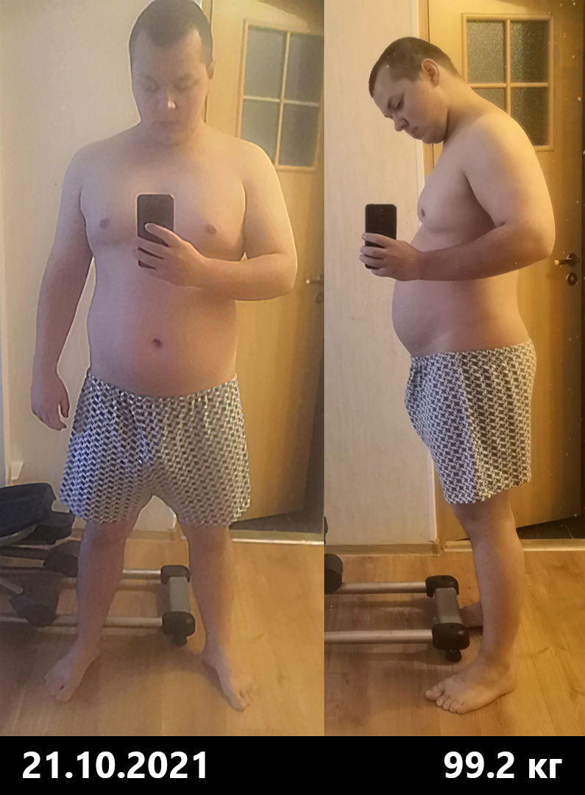
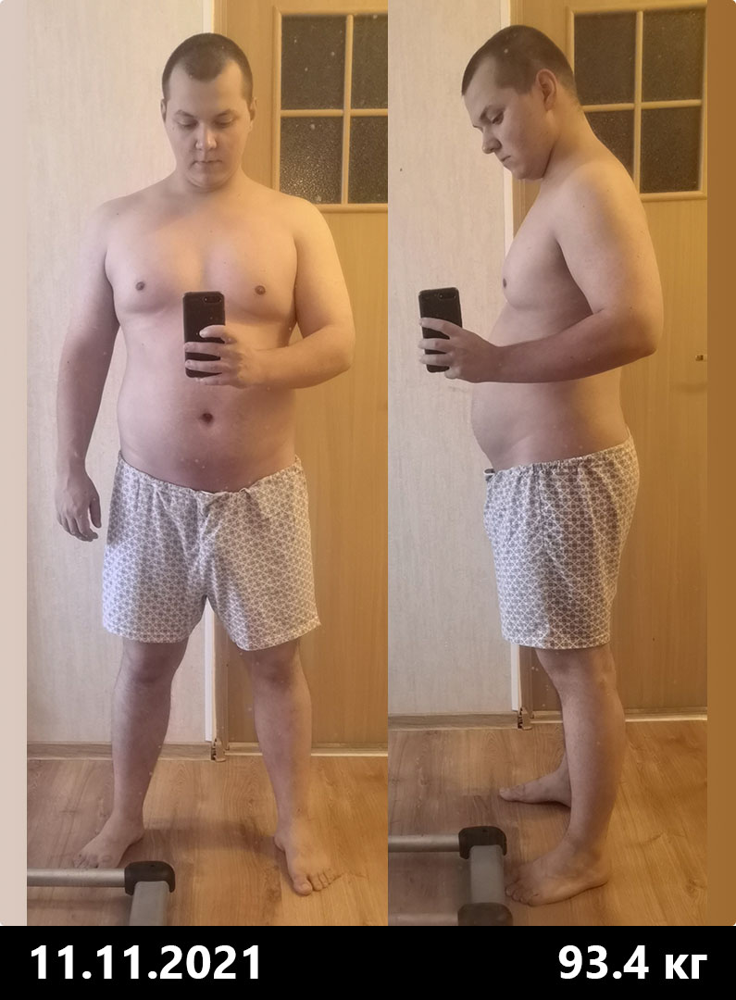

<gallery>
    
    
    
    
    
    
    
</gallery>

90 процентов всего рабочего дня я провожу сидя за компьютером.
Такой образ жизни очень негативно сказывается на здоровье и внешнем виде.
Эти проблемы я компенсирую двумя основными способами: контролем съеденного и тренировками.

Ум гения требует тело атланта!