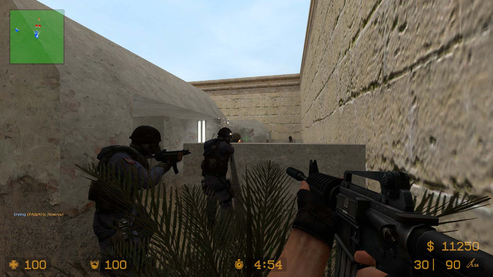
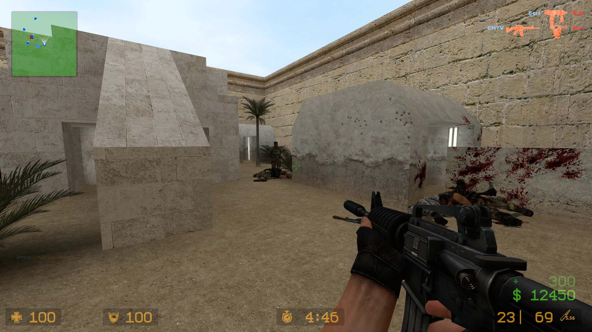
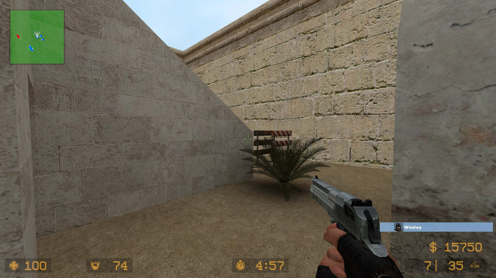
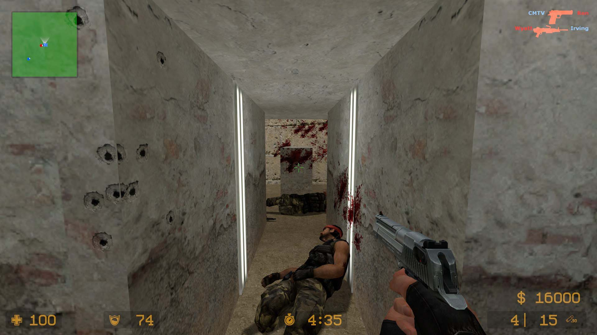
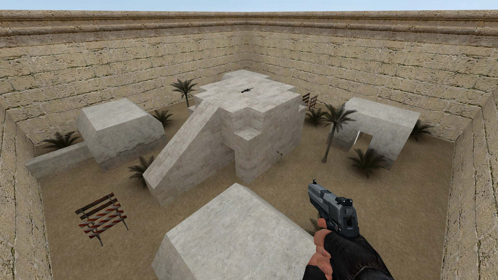
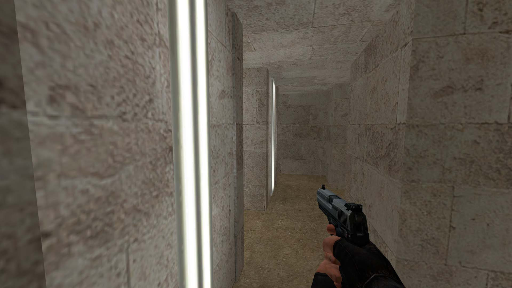
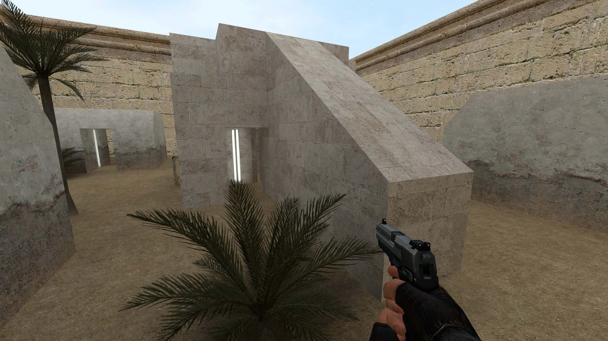
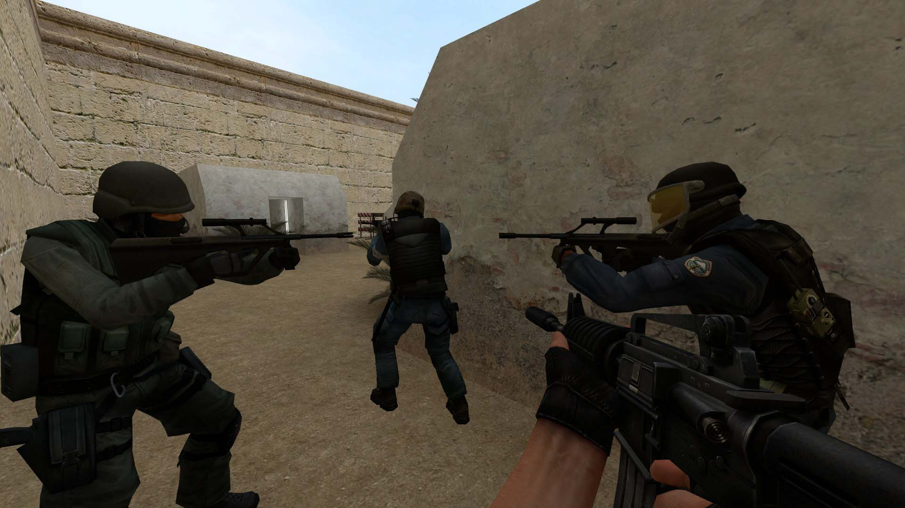
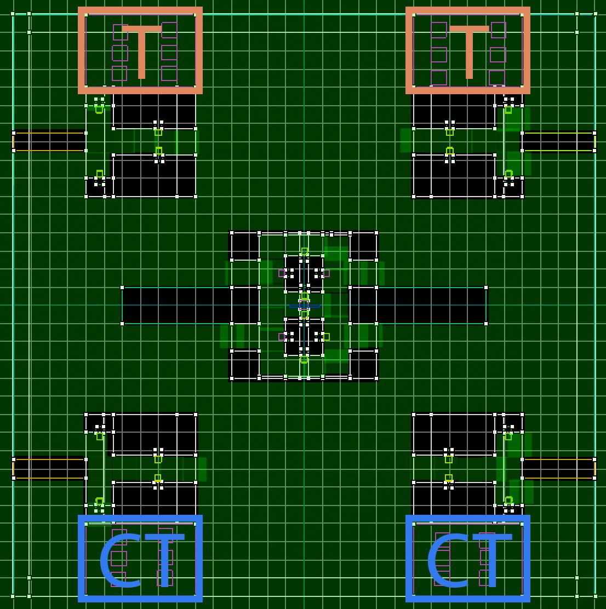

<gallery>
    
    
    
    
    
    
    
    
    
</gallery>

Моя первая и единственная карта для Counter-Strike: Source.
Я в то время сильно увлекся играми от Valve и вовсю изучал их редактор карт Hammer.

Хотел сделать простую карту для тренировок в стрельбе по типу знаменитой "$2000" с очень короткими раундами.
Потом увлекся процессом и решил усложнить структуру карты.

Проходы в домиках и центральном здании позволяют более-менее спрятаться и перевести дух.
Их же можно использовать для того, чтобы обмануть противника и выйти с неожиданной стороны.

В углах карты расположены стенки такой высоты, чтобы видно было только головы. Близость к точкам спавна позволяет любителям месива буквально за секунду окунуться в бой.

Центральное здание разделяет карту и не позволяет окинуть взглядом боле боя целиком.
Но общий обзор все же можно получить, забравшись на его крышу. Правда, спрятаться там негде.

Наиграл с ботами много матчей на этой карте. Горжусь своим творением!