# (Январь 2020) Первая версия

<gallery>
    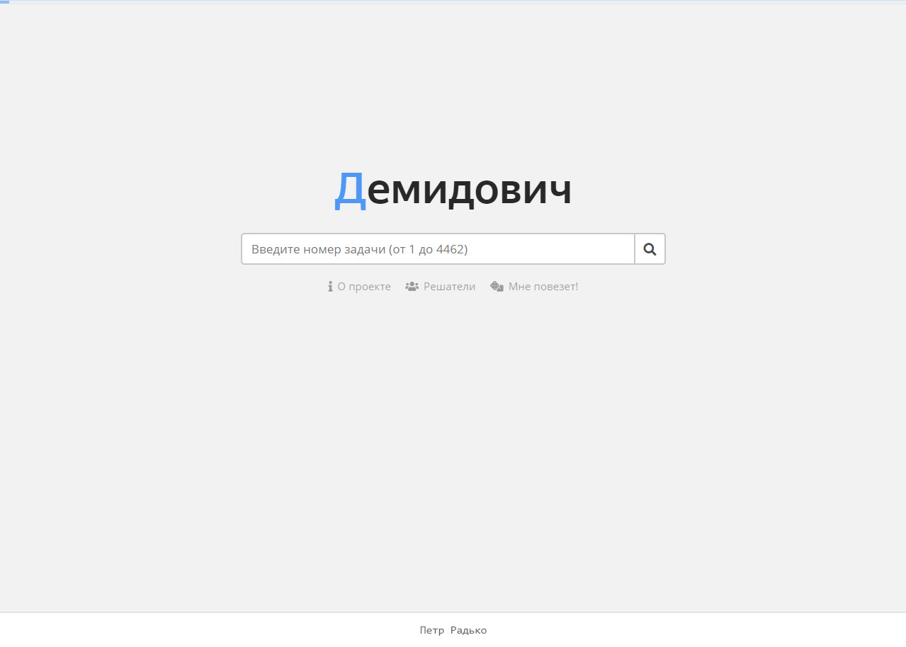
    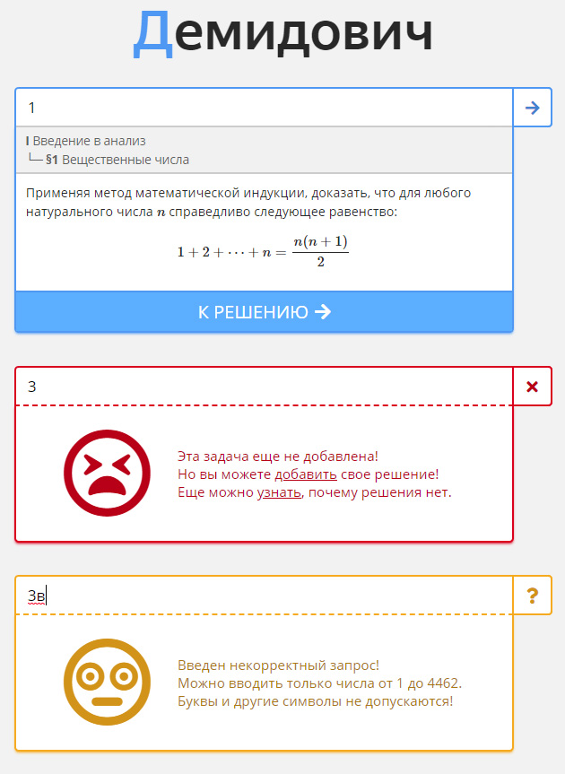
    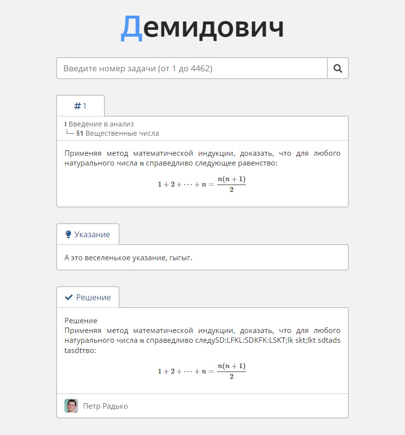
</gallery>

Заканчивался 2020 год. Я все еще [жил](p:severomorsk) в Североморске.
Мы с Колей только завершили работу над ["Крестиками Ноликами 3D"](p:tic-tac-toe-3d).
После решили полностью переключится на изучение математического анализа.

Для отработки полученных знаний выбрали задачник Демидовича.
И не прогадали. Задачи были интересными и сложными.
Так продолжалось где-то месяц.

Это был месяц открытий.
Каждая задача поднимает какой-то важный аспект, раскрывает пройденную тему под необычным углом, решается хитрым образом.
Я все яснее понимал, что просто не успеваю осознать и переварить всю эту информацию, что выбранный нами темп слишком быстрый для меня.

Сразу после Нового года, я поделился своими мыслями с Колей и предложил идею сайта-решебника "Демидович".
Подробно расписывая решения я не только сам полностью их понимаю и осознаю, но еще помогаю понять и другим учащимся, у которых нет такого крутого наставника. 

Коля идею поддержал и в начале 2021 года я за 10 дней сделал первую версию Демидовича.
Сайт был статическим. Специально для него я написал генератор, который из подготовленных файлов решений
собирал готовый сайт. Файлы сайта были расположены на GitHub. Платить нужно было только за доменное имя.

Общий темп прохождения задачника и оформления решений на сайт оказался очень медленным.
Удачей было в день решить и оформить 5 задач. Но зато я выжимал из этих 5 задач максимум информации.

По мере оформления решений у нас накопилось много полезного материала, который использовался в большом количестве
разных решений. И тогда мы придумали концепцию прото-задач, то есть отдельных страниц на сайте, в
которых расписаны типовые приемы решения задач, полезные теоремы, свойства и всякое такое.

# (Июнь - июль 2020) Вторая версия

<gallery>
    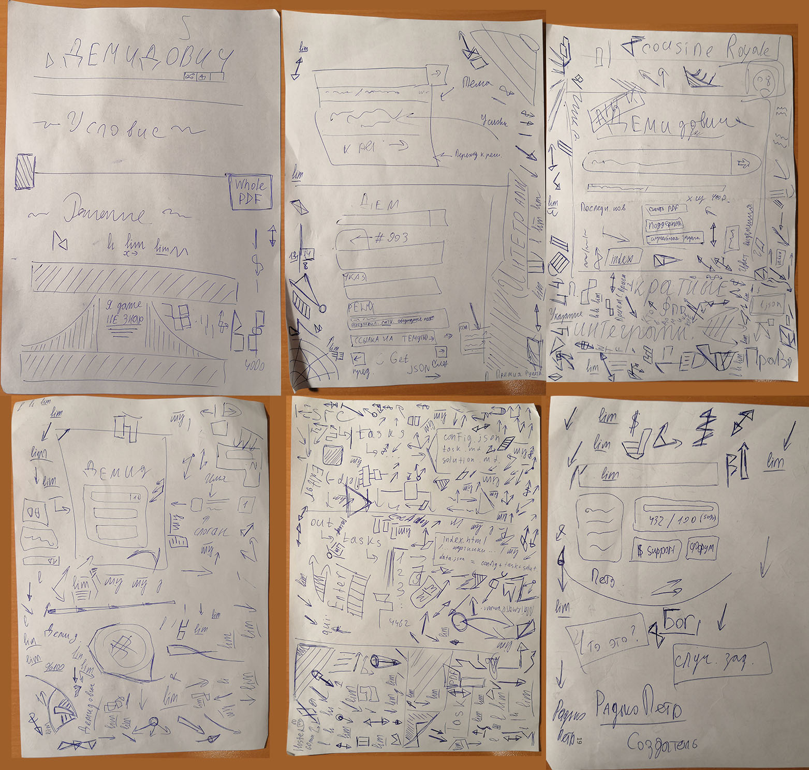
    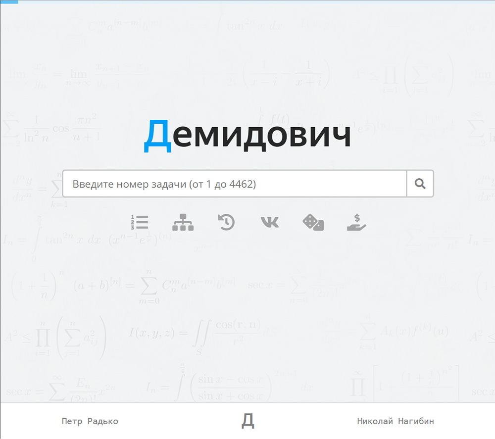
    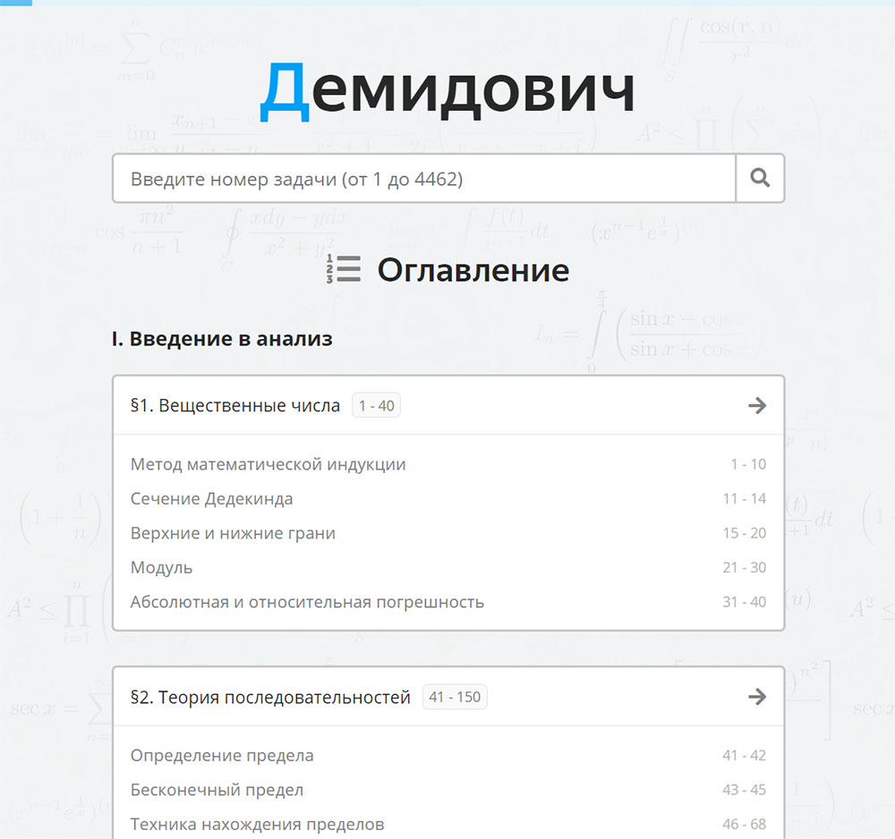
    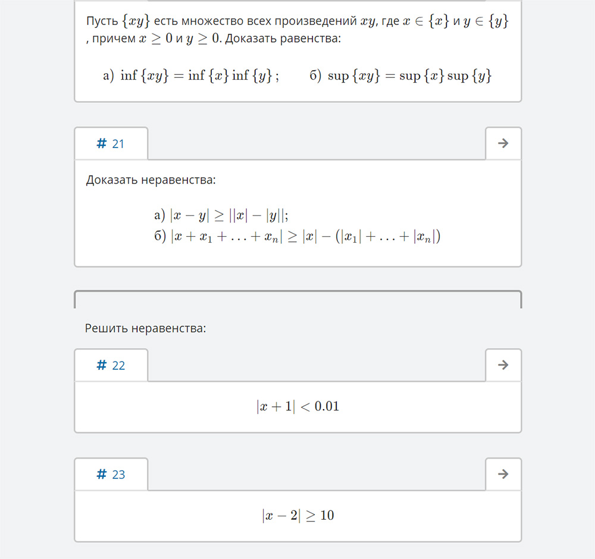
    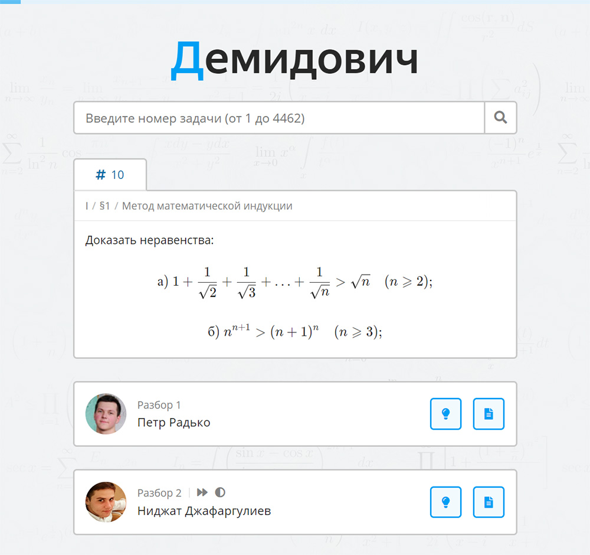
    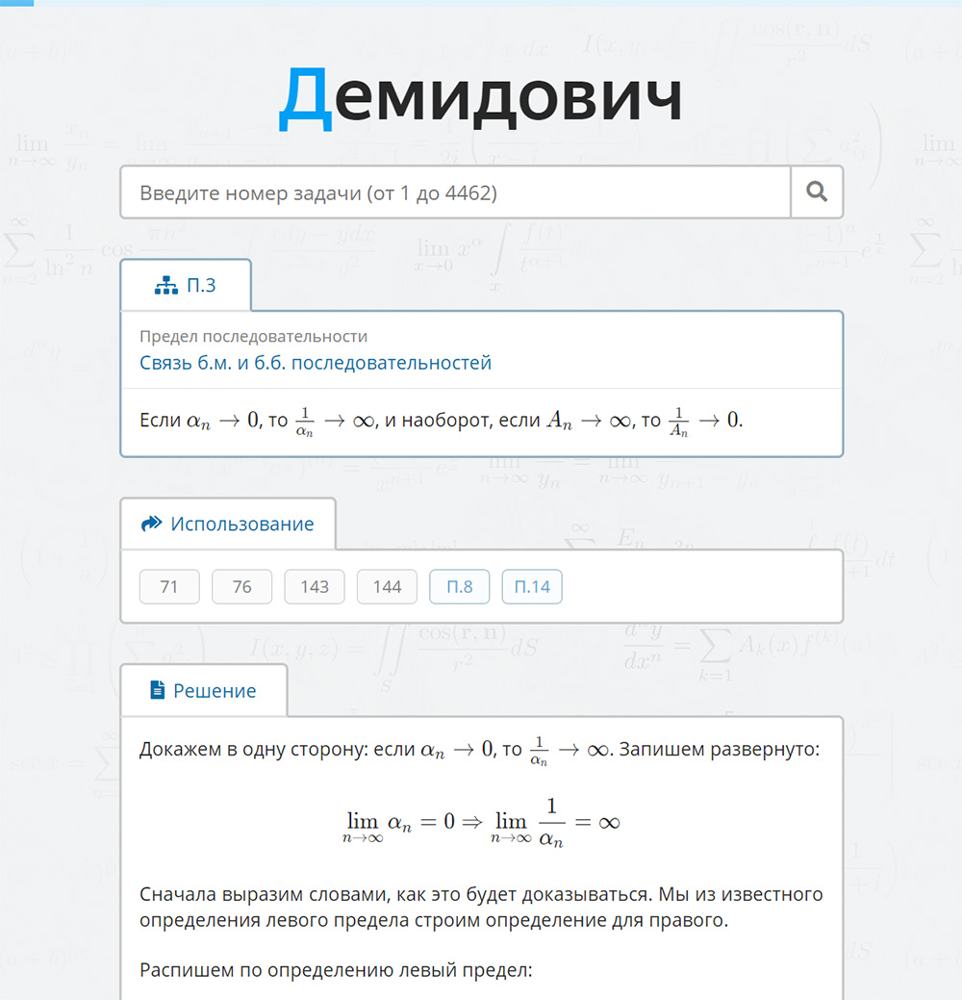
    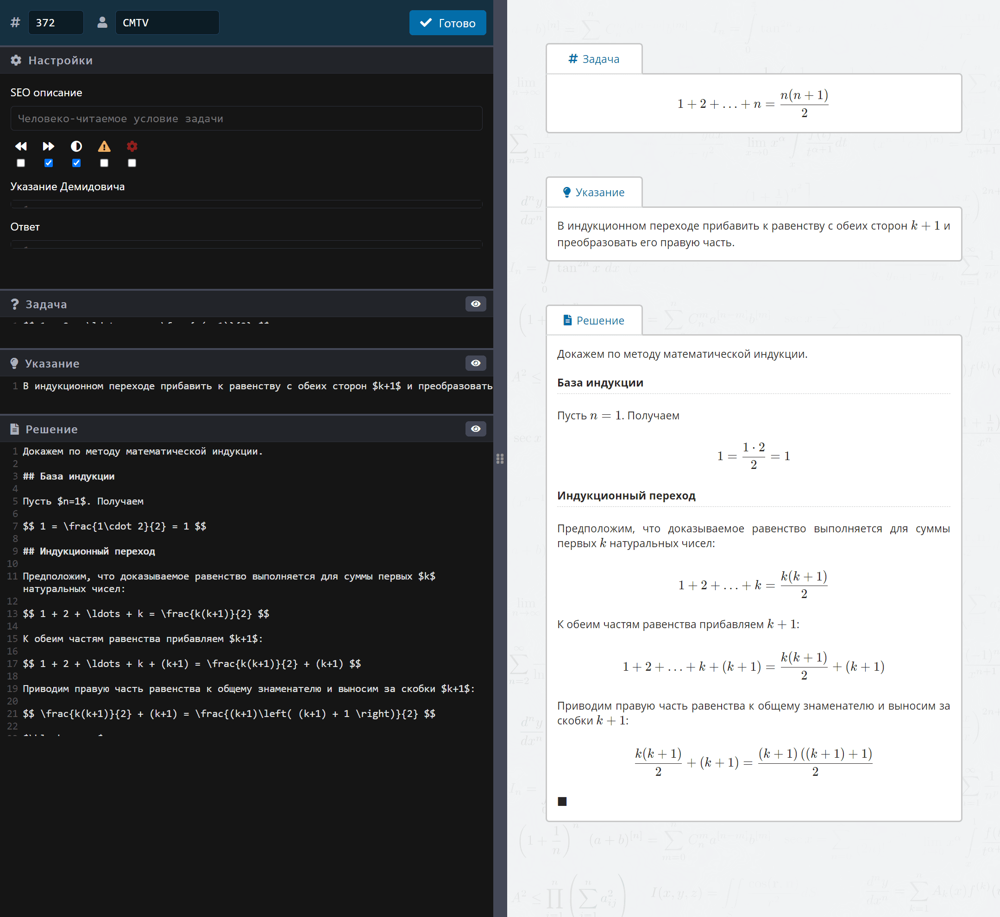
</gallery>

Вскоре после возвращения домой из Североморска я принялся за разработку второй версии Демидовича,
так как имеющегося функционала сайта просто не хватало. На разработку ушло полтора месяца.

Целая неделя ушла на прототипирование дизайна страницы задачи.
Нужно было придумать, как удобно и красиво расположить большое количество информации и множество элементов управления
на одну веб-страницу. Мы с отцом перепробовали около 10 разных вариантов компоновки страницы. Но конечной результат получился просто шикарным.

Отмечу также, что изначально логику интерфейса я писал с помощью библиотеки Vue.js.
Когда все уже было готово я заметил, что на некоторых страницах кнопки раскрытия указания и решения после нажатия "тупят" по несколько секунд. В итоге выяснилось, что Vue.js мониторит DOM-дерево решения целиком, а из-за использования математических формул количество DOM-элементов внутри блока большого решения может прилижаться к тысяче. Попытка уследить за таким большим количеством элементов приводит к невероятным тормозам интерфейса. От библиотеки пришлось отказаться и писать логику на обычном JS.

В этой версии математические формулы генерировалась вместе с генерацией страниц сайта.
При загрузке страницы в браузере сразу отображается готовая математика без тяжеловесной JavaScript библиотеки. Это сильно облегчило страницы, ускорило их загрузку, а также позволило избавиться от надоедливого бага с пляшущим размером шрифта формул.

Именно во второй версии Демидовича я впервые придумал фишку с "облачным" фоном: еле заметные формулы медленно перекрываются фоновыми "облаками".
Создается красивый эффект проявляющихся и исчезающих математических формул. Такую же идею я позднее использовал в интро своего [YouTube канала](p:youtube-cmtv), а также во второй версии [сайта о себе](p:radkopeter).

Также добавил удобный редактор решений, которым можно было пользоваться прямо внутри браузера.
Это очень сильно ускорило добавление решений. Редактором так же пользовались некоторые из решателей.

В целом, начиная со второй версии сайт превратился из обычного решебника в новое, цифровое, улучшенное издание задачника Демидовича: с оглавлением, удобной навигацией и дополнительными материалами в виде прото-задач.

# (Март - июль 2021) Третья версия

<gallery>
    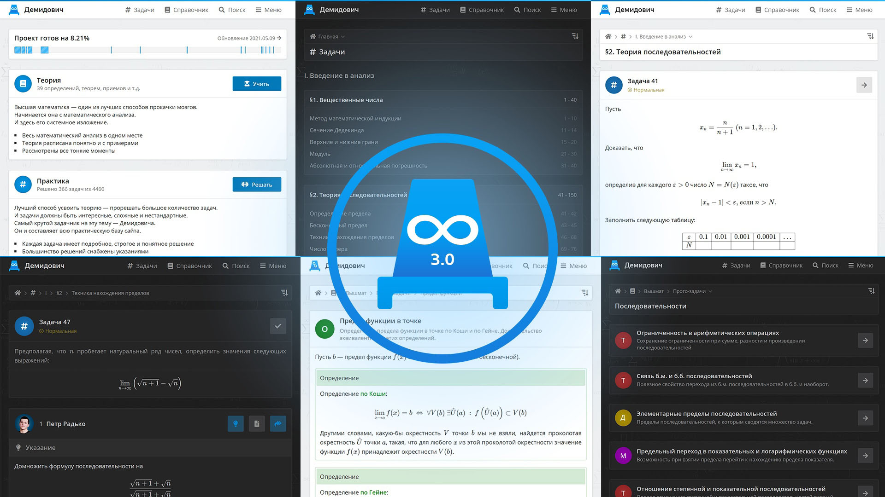
    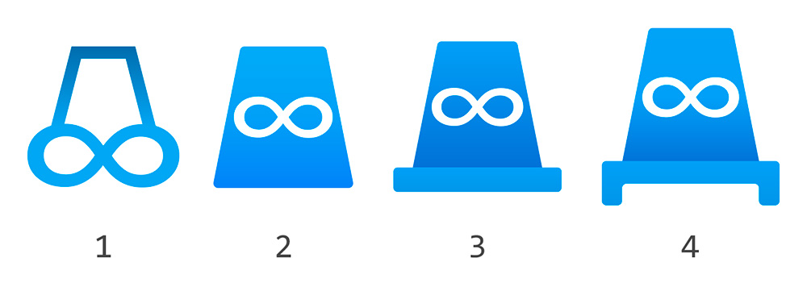
    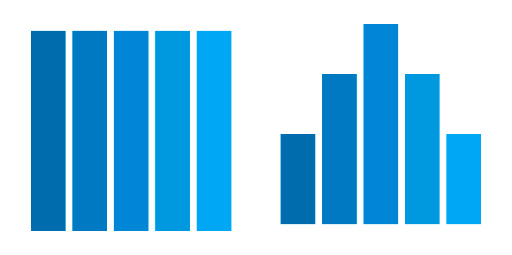
    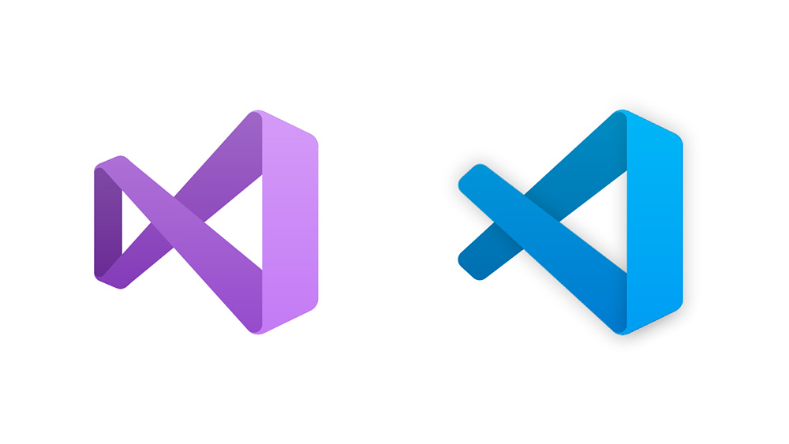
    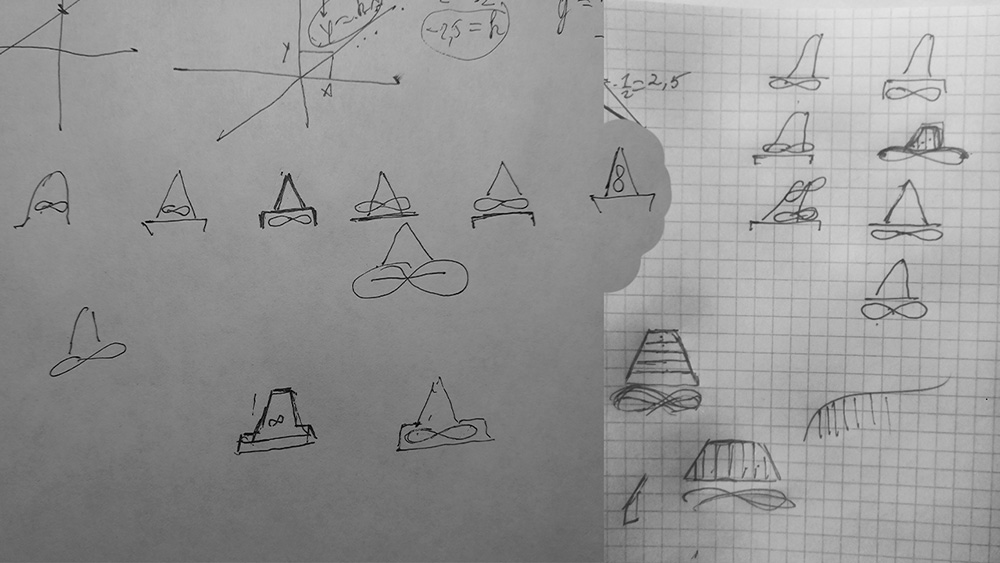
    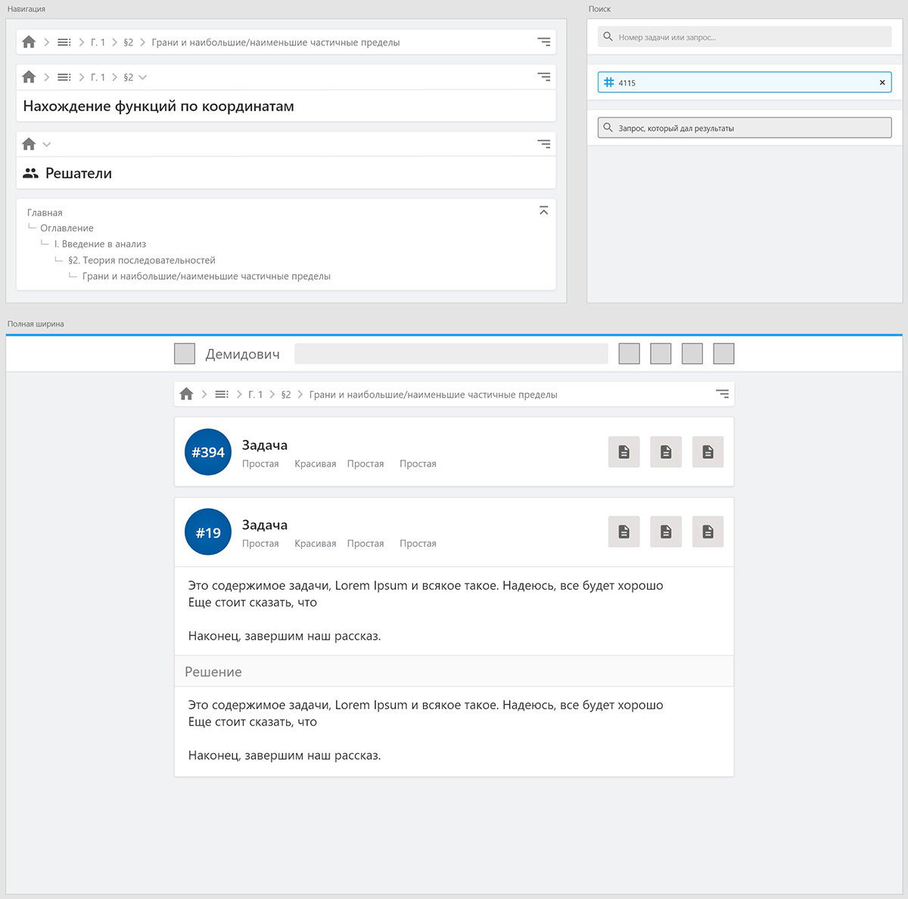
    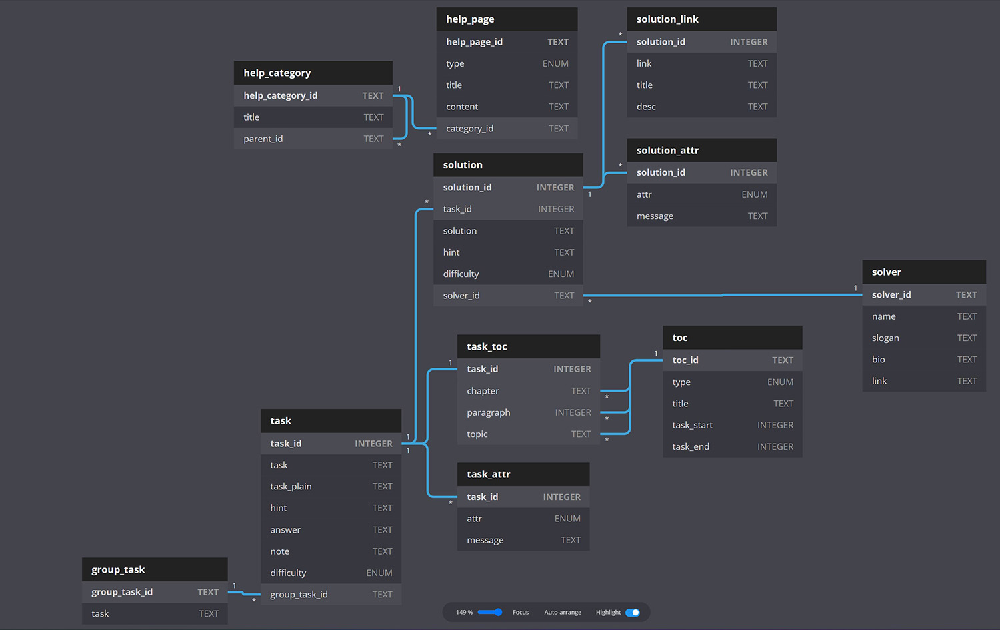
</gallery>

Разработку третьей версии можно назвать первым долгостроем в моей жизни.
Почти 4 месяца ежедневной работы. Было очень сложно. Ближе к концу я очень устал от разработки.
Хотелось все бросить и взяться за какой-нибудь другой проект. Но я справился.

## Новый логотип

В предыдущих версиях логотип представлял собой синюю букву «Д».
На первое время это вполне неплохой вариант.
Но с грядущей третьей версией и окончательным превращением из решебника в информационно-справочную систему стало очевидно, что раскрашенная буква в качестве логотипа смотрится уж очень банально, пресно.

Решил сделать новый, читаемый и стильный логотип.
Основная идея — в должна читаться буква «Д» (отсылка к названию проекта).
Но буква «Д» может много чего обозначать. Поэтому нужно добавить что-то еще.
Что-то, что связывает эту букву и основную тему задачника. Нетрудно догадаться, что это символ бесконечности.
Именно понятие о бесконечности лежит в основе всего математического анализа, которому и посвящен задачник.

Мне сильно приглянулся стильный логотип IDE Visual Studio и Visual Studio Code от Microsofrt потому что в их основе как раз и лежит символ бесконечности. Я пытался изобразить метод интегрирования (разбиение на прямоугольники). Потом от этой идеи мы с отцом решили отказаться, потому что уж слишком отдаленно все это дело намекает букву «Д».

Х отелось использовать красивые переходы цветов и градиенты и логотипов от Microsoft в сочетании с нашей идей для логотипа Демидовича (буква «Д» в сочетании с бесконечностью). В конечном итоге мы остановились на четырех финальных вариантах:

**1**. Первый вариант был прямой попыткой реализовать один из набросков.
Получилось вроде неплохо, правда один из подошедших учеников спросил «Что это за член?».
Больше от этой ассоциации избавиться не удавалось, поэтому пришлось думать над следующим вариантом.

**2**. Этот вариант стал отправной точкой, из которой последовательными шагами получился принятый в итоге вариант.
Равнобокая трапеция как-бы отсылает к букве «Д». Символ бесконечности по центру походит на глаза.
В целом, выглядит неплохо, но буква «Д» вообще не читается.
И даже если человеку сказать, что проект называется «Демидович», ассоциаций с трапецией у него не возникнет.

**3**. К предыдущему варианту добавлен прямоугольник снизу.
Теперь возникают интересные ассоциации с «глазастой шляпой» (прямо как говорящая шляпа из Гарри Поттера) или какой-нибудь мигалкой полицейских.
Именно этот вариант хотел сделать финальным. Но возникла проблема — он не вписывается в квадрат, а это плохо.

**4**. Финальный вариант появился как последняя адекватная попытка вписать третий вариант в квадрат.
Теперь логотип представляет собой четко различимую букву «Д» с бесконечностью в центре.
Темно-синий цвет был опущен ближе к горизонтальному прямоугольнику, как бы создавая эффект тени от него (прямо как в логотипах от Microsoft).
Большой плюс этого логотипа — символ бесконечности можно вращать, что добавляет динамику логотипу.

Последний вариант решено было использовать в готовом проекте.

## Использование базы данных

Файловая структура позволяет удобно организовывать решения и справочные страницы.
Но работать со всеми этими файлами на программном уровне очень тяжело.

Поэтому я внедрил комбинированный подход. Первый уровень — файловая система. Затем вся информация из файлов
загружается в заранее готовую базу данных. И уже с базой данных работает генератор сайта. Да, эта схема гораздо сложнее, чем прямая связь "файлы ↔ генератор", но с ее помощью удалось добавить огромное количество фишек в третью версию сайта.

## Другие фишки

Впервые использовал Adobe XD для создания **цифровых скетчей** важных элементов сайта.
Очень удобно, что можно разработать практически готовый дизайн элементов страницы, а потом
просто программировать их, не терзаясь дизайнерскими вопросами.

Добавил **темную тему** для спасения глаз измученных студентов, которые ботают по ночам.

Реализовал полноценную **поисковую систему**. Теперь можно исказть задачи не только по номерам, но и по условиям.
Страницы справочника тоже включены в поиск.

**Справочник**. Система прото-задач упразднена и вместо нее теперь имеется полноценный справочник с определениями, теоремами и другими терминами, причем многие из них связаны друг с другом! Ссылки на справочник теперь приводятся отдельно для каждого решения, а не в куче после всех решений. Все текущие прото-задачи преобразованы в страницы справочника.

**Атрибуты** задач и решений. У каждой задачи теперь есть сложность, также возможные дополнительные атрибуты (красивая, учебная и т.д.). У решений также есть свои атрибуты.