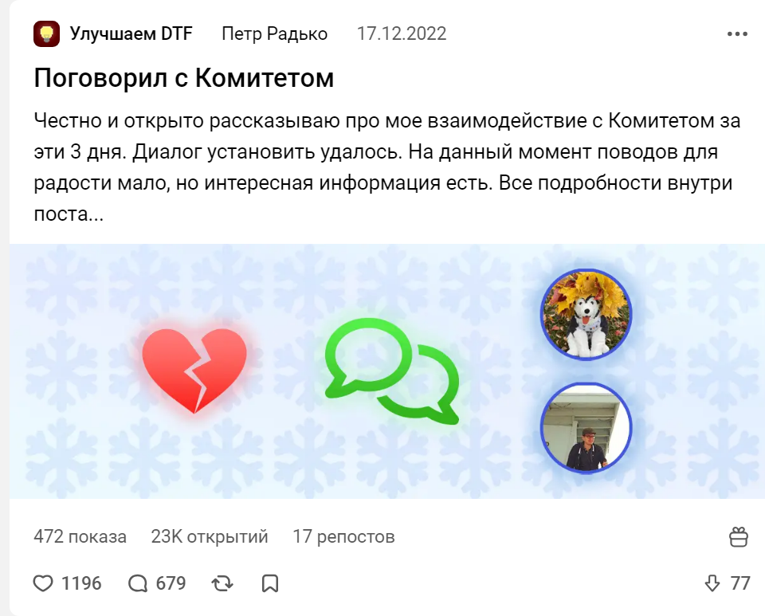

<gallery>
    
    
    
    
    
</gallery>

В конце 2022 года администрация DTF решила приобщиться к модным тенденциям и убрала публичный счетчик дизлайков на постах и комментариях.
В угоду этому изменению в худшую сторону был изменен и сам дизайн кнопок лайка и дизлайка.

Меня и подавляющее большинство пользователей сайта эта ситуация возмутила.
Начались протесты, люди "замораживали" свои аккаунты, из-за чего событие получило название "Бунт снежинок".

Я написал ряд постов, первый из которых в итоге оказался на 5 месте в топе самых залайканных постов за все время существования сайта.
Удалось установить с Комитетом диалог, стал своего рода переговорщиком.
К сожалению, диалог ни к чему не привел.