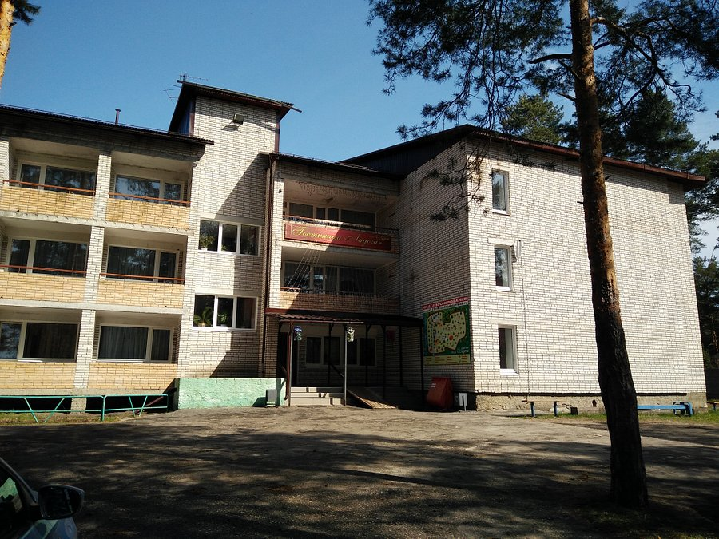
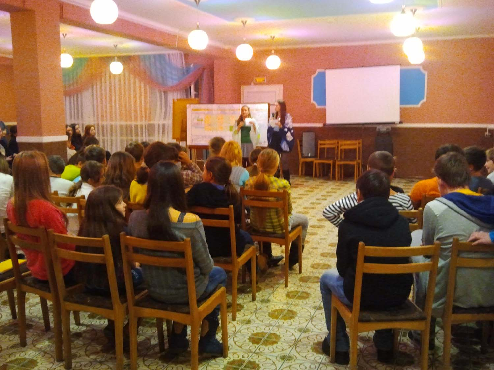
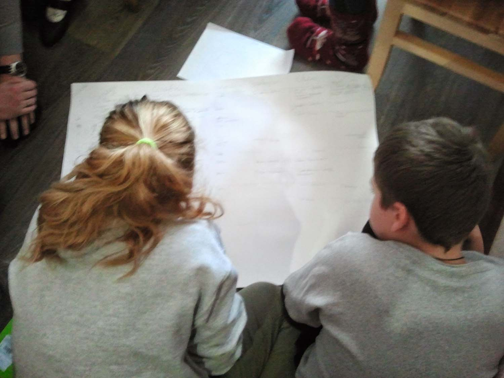
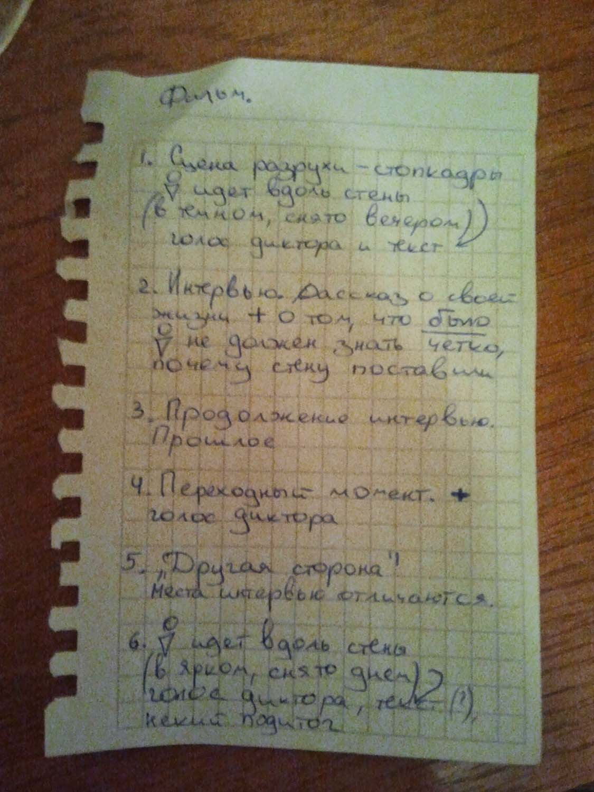
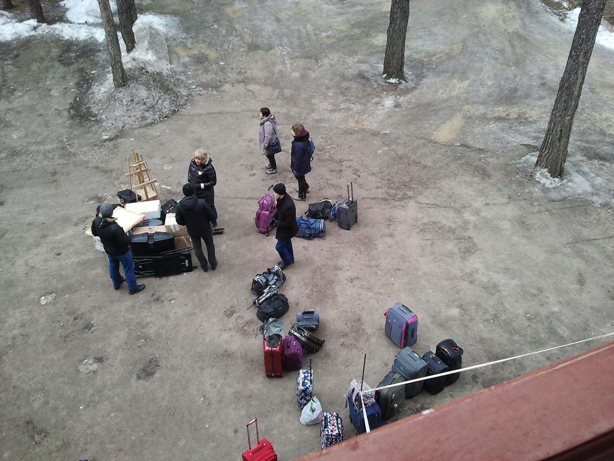
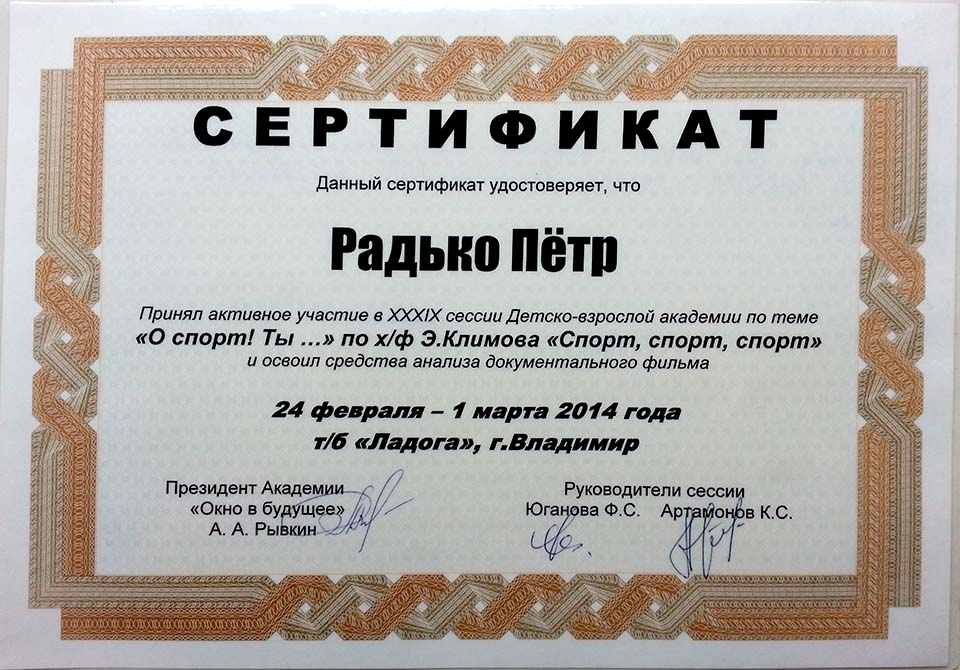

<gallery>
    
    
    
    
    
    
</gallery>

Принял участие в 39 сессии Детско-взрослой академии.
Был единственным представителем школы №446.
7 дней на турбазе «Ладога» во Владимирской области.
Вместе с командой сняли собственный короткий 10-минутный фильм.
Получил сертификат за активное участие.

Главная тема этой сессии "О спорт! Ты..." в рамках которой, помимо съемки своего собственного фильма, мы анализировали фильм Э. Климова "Спорт, спорт, спорт" и другие документалки.
Удивительно, сколько скрытых смыслов и выводов можно извлечь из какого-нибудь понятия (например, "спорт"), если его коллективно анализировать на протяжении недели.

На это мероприятие меня записал отец.
О своей поездке я узнал за день до отъезда.
Я очень обиделся, не хотел ехать и до самого последнего момента дулся.
Но мои скандалы никого особо не волновали. Поехать мне пришлось.
Не жалею.