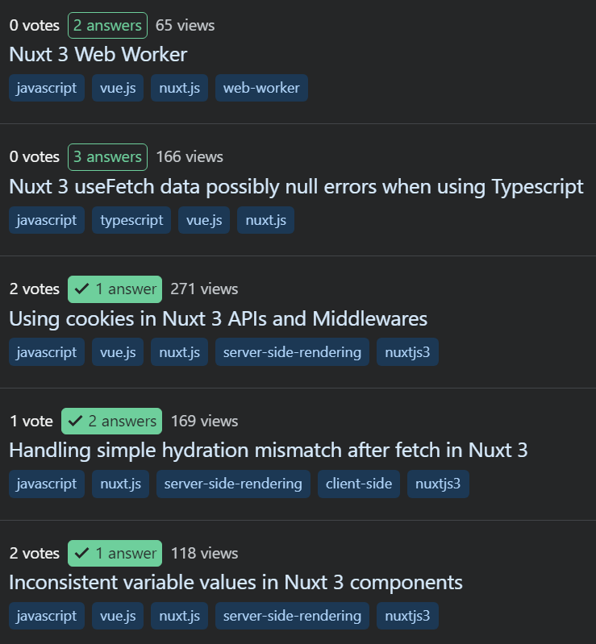

# Узник статической генерации

В последний раз создать полноценный динамический сайт с регистрацией, админ-панелью и прочим я пытался в 2015 году, когда работал над проектом [AllTasks](p:all-tasks).
Это было сложно, так как писал я его на PHP без использования каких-либо библиотек и прочего.
Доделать сайт не вышло, я забросил как сам проект, так и вообще любые идеи работать "с динамикой".

Похожая история у меня случилась сильно позднее с JS фреймворками для создания интерфейсов, например с Vue.
Это очень крутые технологии, с помощью которых можно быстро создавать сложные интерфейсы.
Я использовал Vue для [byDef](p:bydef) и второй версии [Демидовича](p:dodem).
Но прогрузка данных прямо на клиенте и проблемы с производительностью вынудили меня и эту технологию отложить в долгий ящик.

Так я стал заложником статического программирования без всяких фреймворков.
Сайты получались очень быстрыми, но делал я их очень долго...

# Прорыв

Конец 2023 года.
У проекта [OMath](p:omath) есть статический редактор тем, но пользоваться им очень неудобно.
Нужно было делать динамическую версию, с авторизацией, поддержкой нескольких черновиков и так далее.

Так как к тому моменту PHP я забросил и полностью пересел на TypeScript, решил делать сайт на Node.js.
Сначала хотел все писать ручками на базе Express JS.
Первую неделю потратил на то, чтобы убедиться, что все мои задумки реализуемы: регистрация, работа с сессиями, связсь с БД, отправка email писем.

Но потом глаз зацепился за Nuxt и я подумал, раз уж все равно полез в динамику,
почему бы не попробовать снова воспользоваться передовыми технологиями?!

Это было судьбоносным решением.
На протяжении всего декабря 2023 года я изучал Nuxt, Vue, Pinia и офигивал от открывающихся возможностей каждый день.
Просто перешел на новой уровень.
Словно профессию новую освоил.

Освоение шло очень тяжело, куча новых терминов, технологий и прочего.
Раза 3 я был на грани и хотел все бросить и спрятаться обратно в свой мир статики.
Я задолбал весь Stack Overflow своими вопросами.
Если бы ребята оттуда мне не помогли, я бы не справился.

{: style="max-width: 300px" }

Но я справился и сильно вырос как программист.
Великолепное завершение очень продуктивного года.