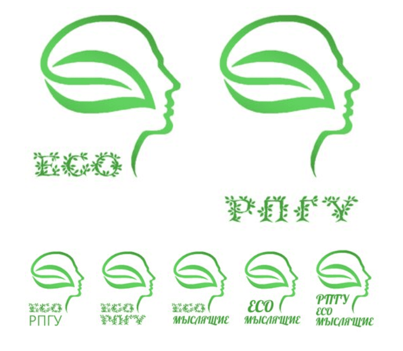
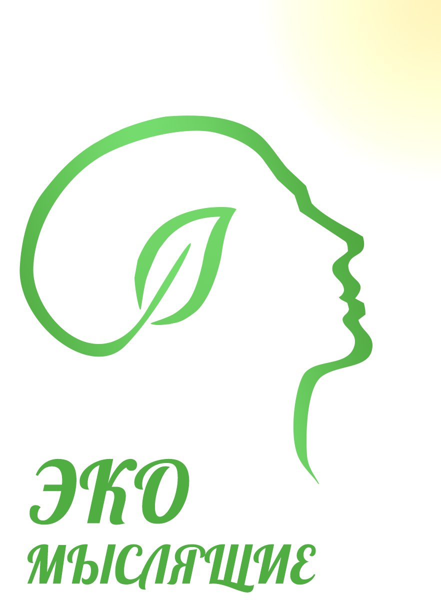
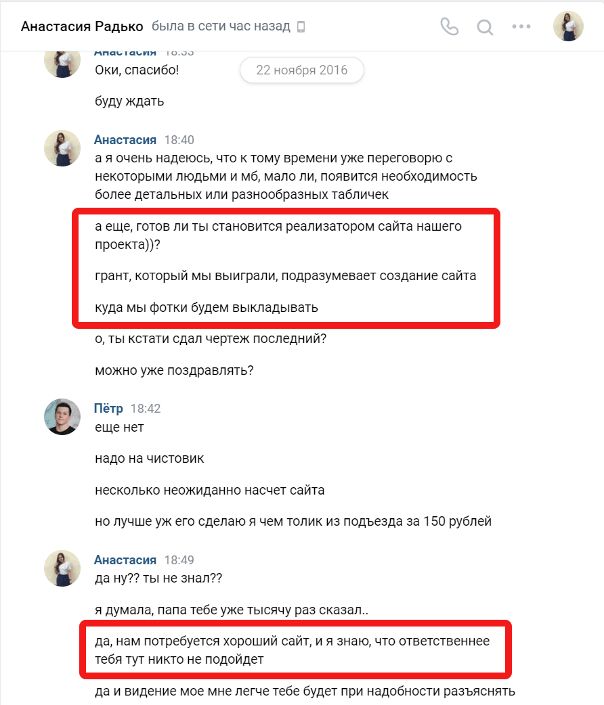
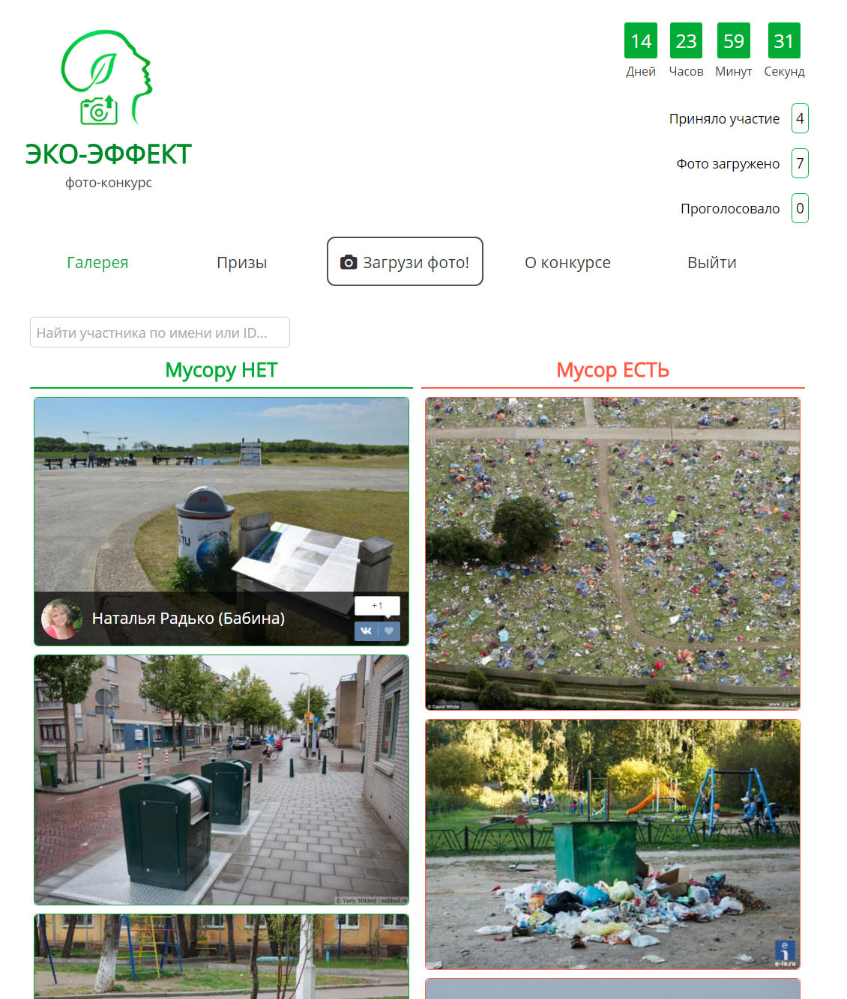
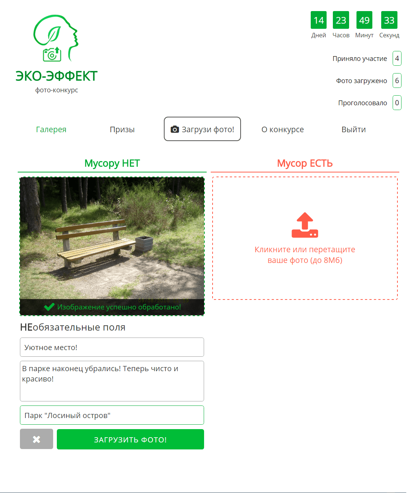

# Логотип для группы ВКонтакте

<gallery>
    
    
</gallery>

Сестра во время учебы в университете решила создать отдельный орган по продвижению эко-инициатив.
Попросила разработать ей логотип.
С работой справился за несколько дней, постепенно внося правки по желаниям сестры или отца.

# Первая версия

<gallery>
    
    
    
</gallery>

22 ноября я неожиданно узнал о том, что моя работа над логотипом группы ВКонтакте была лишь второстепенной задачей.
Оказалось, что сестра выиграла эко-грант и по его условиям она должна была провести конкурс.
Ну а для конкурса надо разработать сайт, на который люди смогут выкладывать фотогорафии и голосовать!
Я был в шоке и как мог пытался отказаться, но меня заставили.

Первая версия сайта была больше пробом пера, так как раньше я никогда не работал со сторонними API.
Разработа заняла где-то два месяца.
Кстати, логотип для сайта сделал из логотипа для группы ВКонтакте, заменив "Эко Мыслящие" на фотоаппарат.

Вскоре принял решение полностью переписать сайт. Основные причины:

* Нет четкой разметки, элементы сайта "висят" в воздухе.
* Изначальный код был написан слишком небрежно, сайт становилось все труднее расширять.

Плюс, к моменту завершения работы над первой версией я серьезно прокачал свои навыки, поэтому взялся за полное переписывание.
Так началась работа над второй версией.

# Вторая версия

Начав работу с нуля я выложился на максимум:

* Красивый и легкий дизайн.
* Улучшенное голосование и комментарии через ВКонтакте.
* Отметки о месте съемки фото в Google Картах.
* Хранение фотографий на серверах Amazon.
* Мобильная версия сайта на отдельном поддомене.
* Система поиска фотографий участников с различными фильтрами.
* Возможность оставлять комментарии к фотографиям.

На разработку этой версии ушло больше двух месяцев.
Проблем было множество, но я героически их решал.
Получил ценные знания по интеграции с другими API и по разработке сайтов в целом.

В процессе работы даже нашел незадокументированный функционал API ВКонтакте: при клике на кнопку "Мне нравится" она возвращала текущее количество лайков.

На фоне главной страницы разместил медленно вращающийся огромный круг, поделенный на "эко" и "мусорную" зоны.
Выглядело просто потрясно!

На тот момент это был мой самый красивый и сложный сайт.