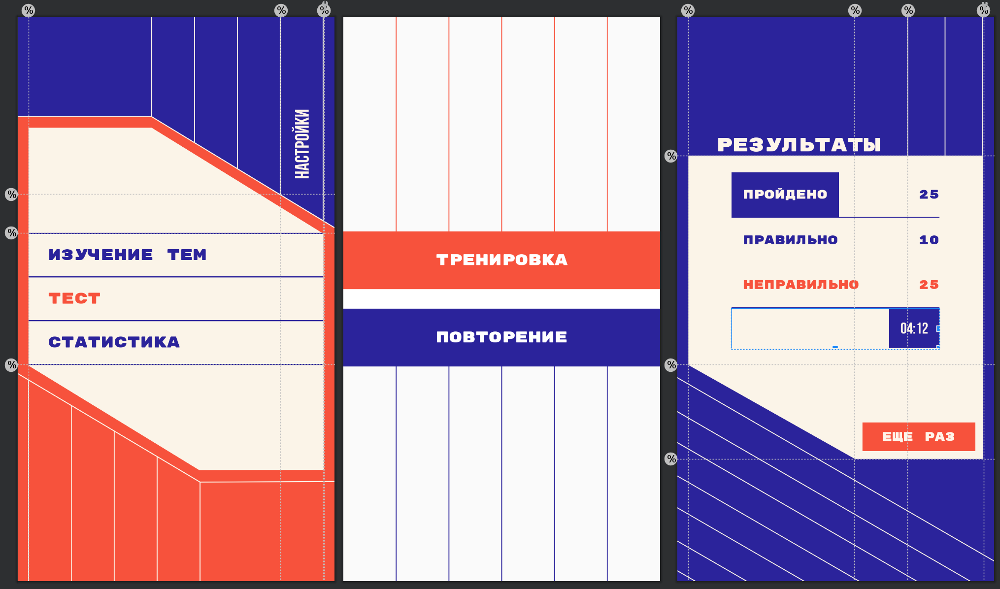
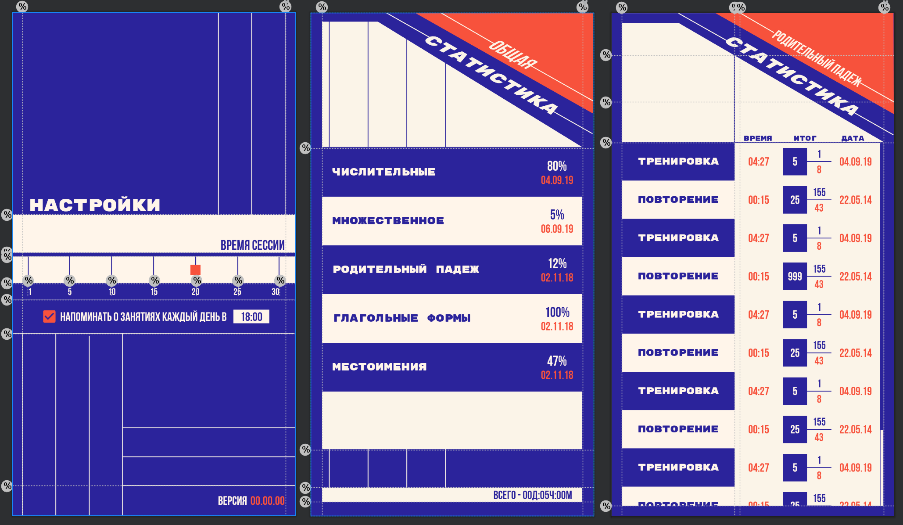
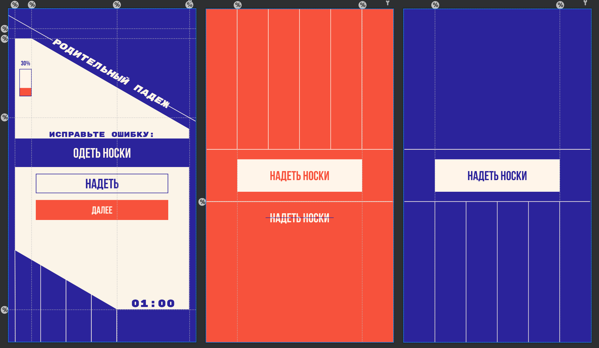

<gallery>
    
    
    
</gallery>

Сверстал все экраны для приложения «ЕГЭ 2020 Русский язык» по готовому дизайну от дизайнера.
Вся разметка использует современные ConstraintLayout с опорными прямыми. Вся графика векторная и спокойно масштабируется при изменении размеров экрана. Отличная тренировка в верстке! 