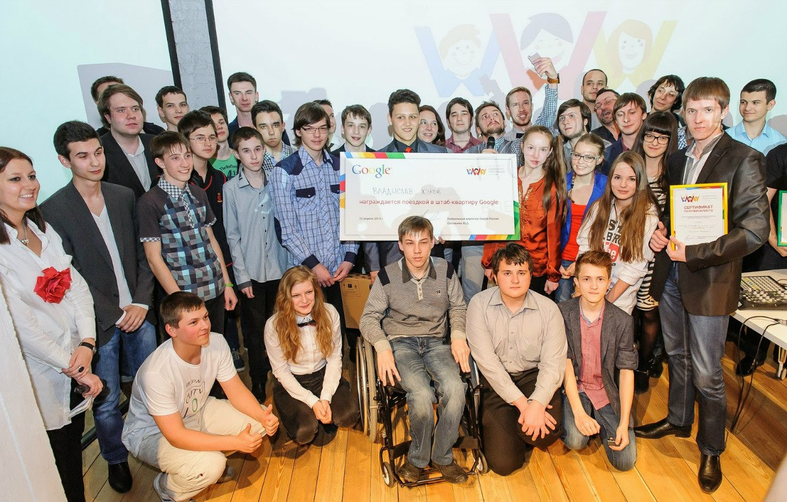

<gallery>
    
    
    
    
    
    
    
</gallery>

Конкурс "Цифровое поколение. Вперед!" проводился российским отделением Google среди старшеклассников.
Отбирались перспективные IT проекты. В качестве своего проекта я выбрал YouTube канал [CMTV](p:youtube-cmtv).

22 апреля, в мой 16 день рождения прошла церемония награждения, во время которой всем финалистам устроили экскурсию по офису Google, а также по зданию русского географического общества. Подведение итогов состоялось вечером в музее современного искусстве «Гараж» в Парке Горького, куда также пригласили известных блогеров.

Финал конкурса — одно из самых ярких впечатлений в моей жизни.