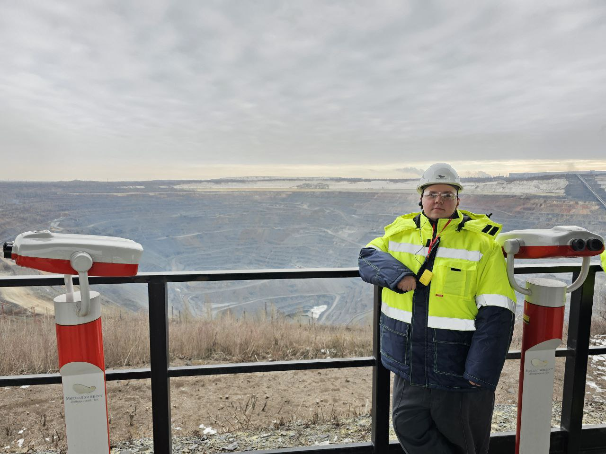
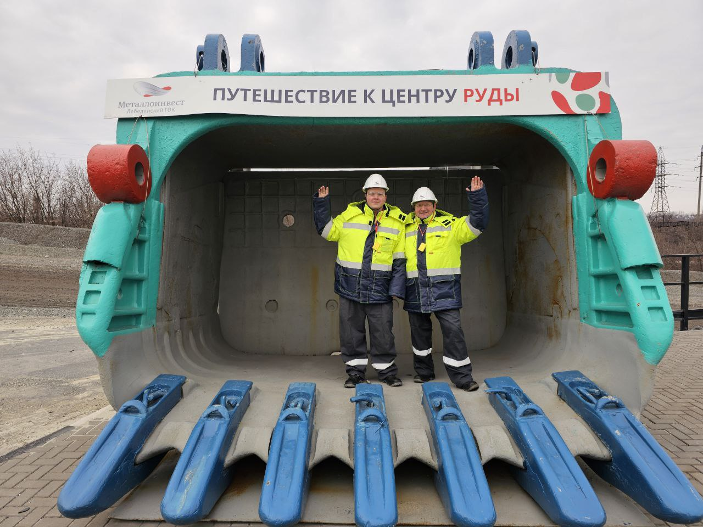
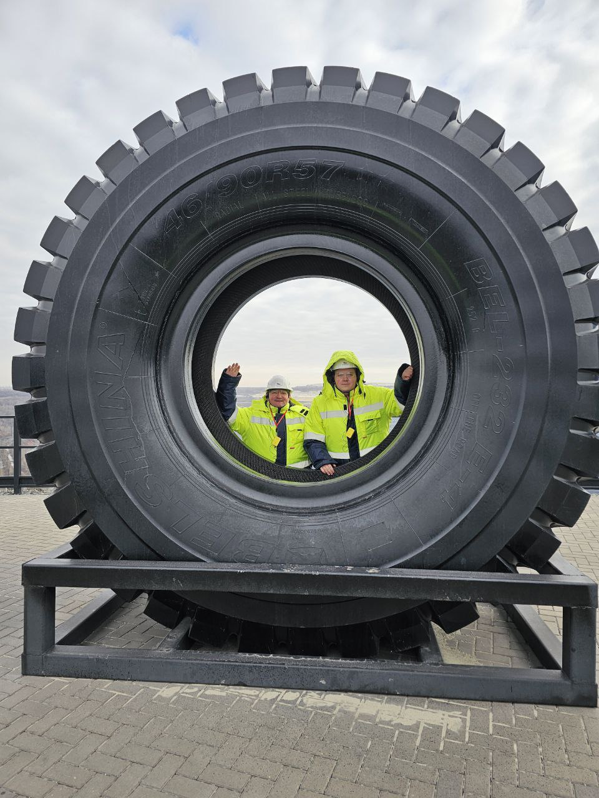
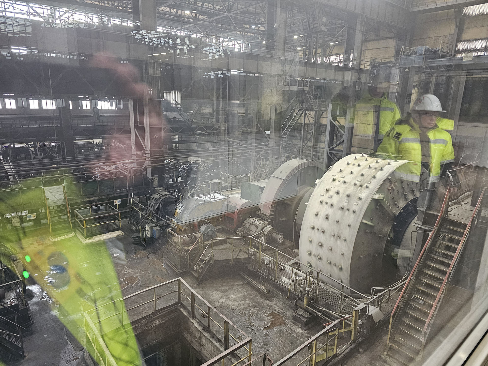
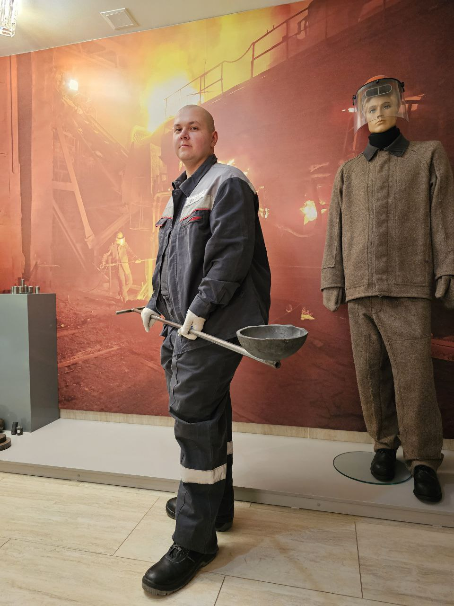
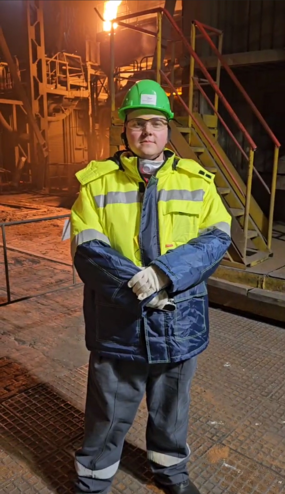
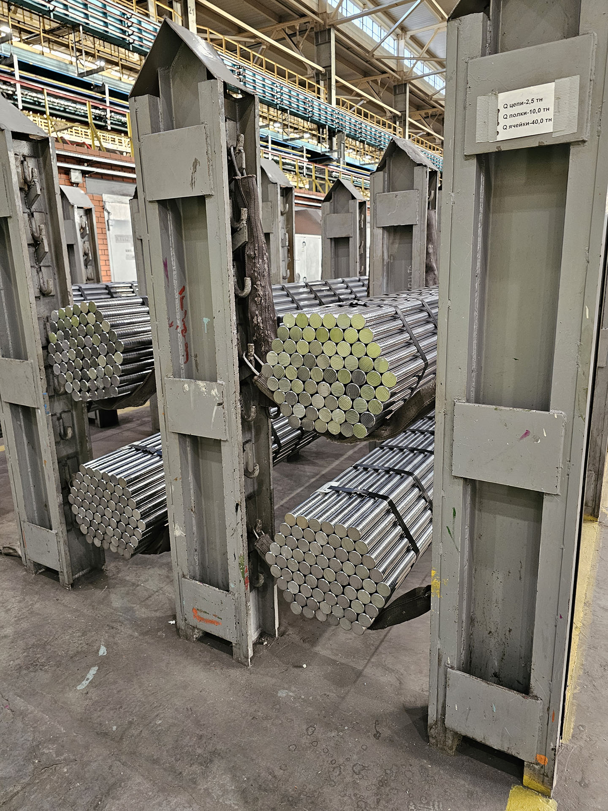
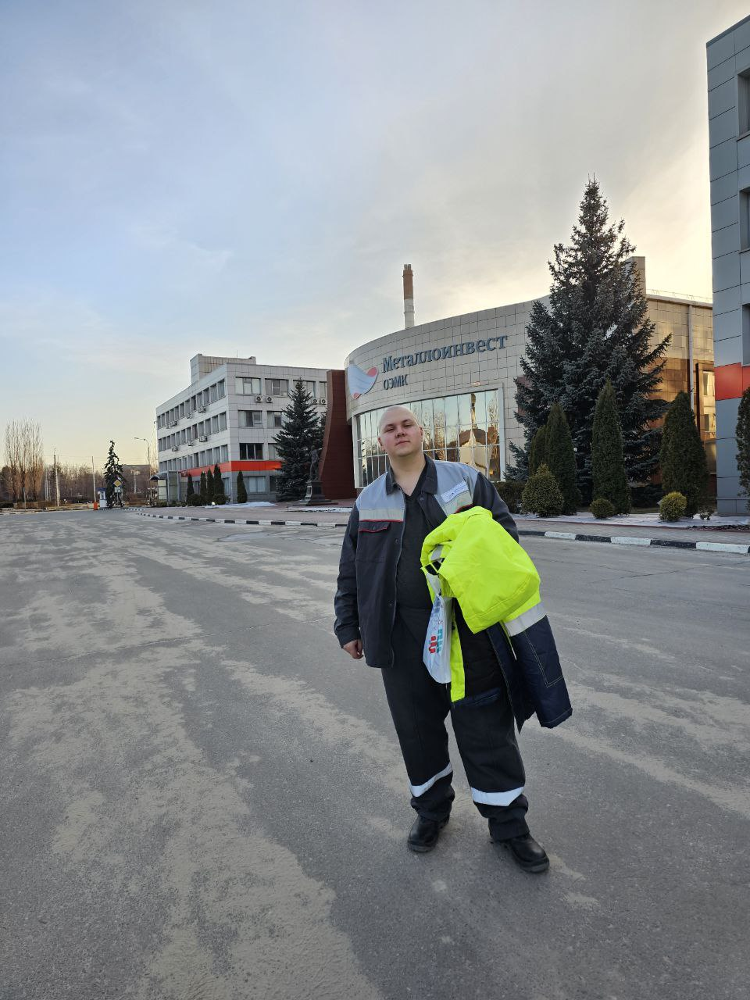

# Лебединский ГОК

<gallery>
    
    
    
    
</gallery>

Посмотрел на самый большой в мире карьер.
Очень впечатлился.
Глубина 500 метров.
Своего рода гора "наоборот"!
С самого верха огромные Белазы выглядят меньше, чем игрушеные!

Потом посетили сам горно-обогатительный комбинат.
Внутри показали не очень много, но меня очень впечатлили "мельницы", которые поступающую руду перемалывают внутри себя за счет сил гравитации.

Все огромное, все трясется, все шумит... **Мощно!** 
Жаль только что кроме этого зала ничего "машинного" больше не показали.

# Оскольский ЭМК

<gallery>
    
    
    
    
</gallery>

После карьера и горно-обогатительного комбината нас повезли в Осколький электрометаллургический комбинат.
Там тоже показали не очень много, но огромное впечатление на меня произвели бесконечно уходящие в обе стороны цеха, своего рода отдельная вселенная -- "промышленная вселенная".

Теперь понимаю, откуда берут референсы все эти многочисленные сцены на заводах в фильмах и играх.
Это другой мир -- темный мир раскаленного железа, огромных печей и прессов, мир бесконечных труб.
В такие моменты понимаешь, почему исторический этап появления подобных монстров от мира науки -- заводов -- называют "промышленной революцией" и насколько качественно и количественно отличается от всего, что было "до".

# Остальные экскурсии

Помимо основных точек интереса: карьера, ГОК и ЭМК, мы посетили и другие интересные места.
Очень впечатлили меня меловые пещеры с кельями монахов, дегустация сыров и экскурсия по процессам выпечки хлеба.

В конце первого дня нас отвезли в отель.
Хорошо отдохнули в бассейне и банях.
Был забавный момент -- очень долго искали сам бассейн, расхаживая в один только плавках по проходным с кучей народа.

Понравились два основных экскурсовода, которые очень много интересной информации рассказывали во время переездов между экскурсиями.
Они так забавно периодически спорили друг с другом, кто будет рассказывать про ту или иную достопримечательность.