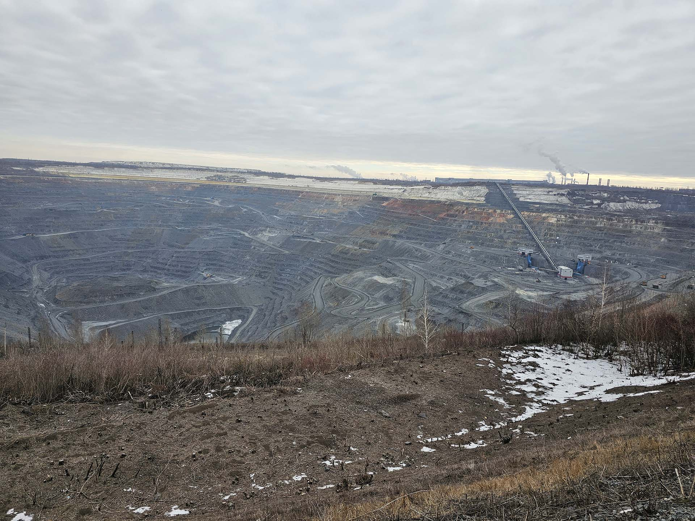
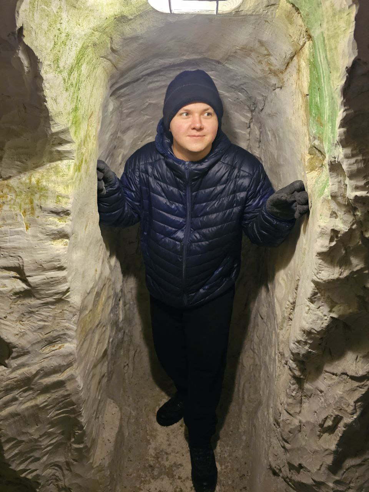
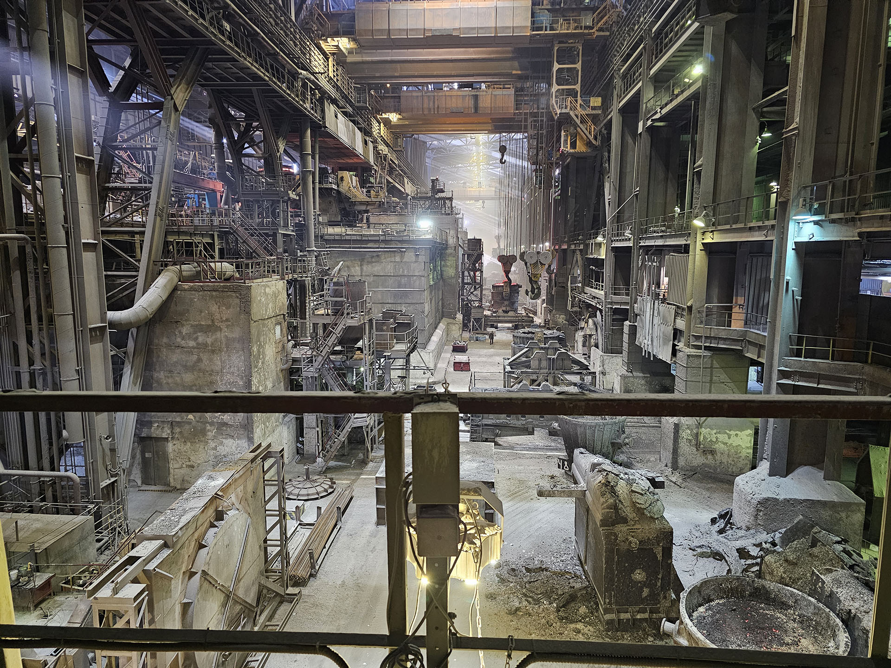
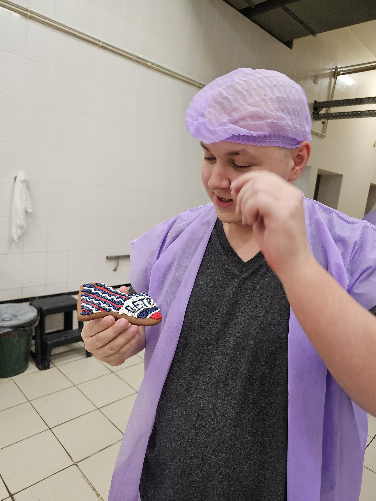
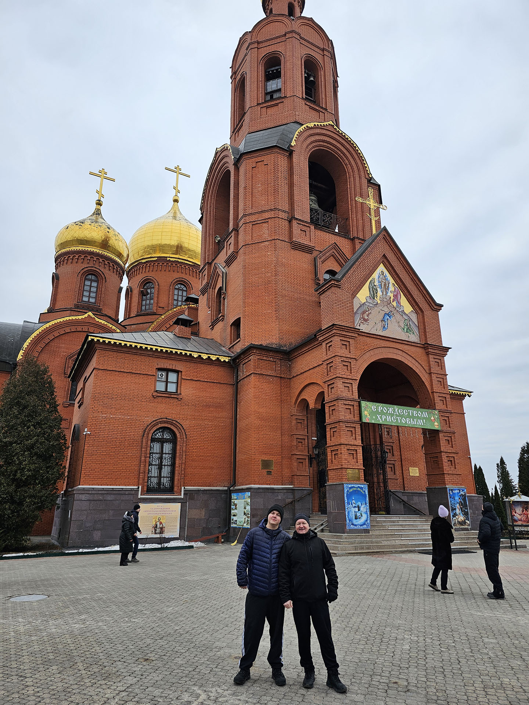
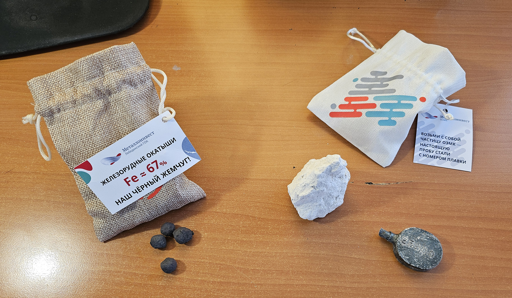

<gallery>
    
    
    
    
    
    
</gallery>

Вместе с отцом по подготовленной мамой программе посетили крупнейшие в стране предприятия по добыче и обогащению железной руды с последующей ее переплавкой в различные заготовки.
Впервые в жизни изнутри увидел, что такое "завод".
Посетили и другие экскурсии в области: меловые пещеры под монастырем и производство хлеба.