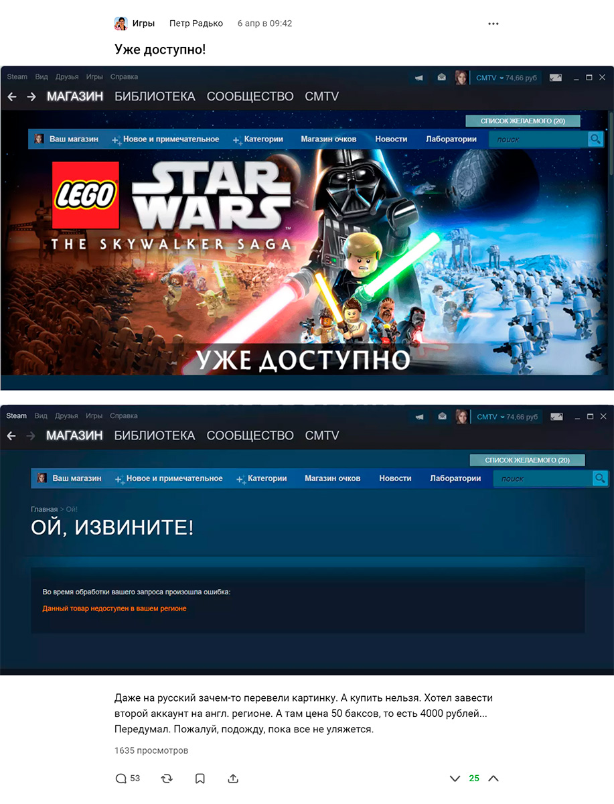
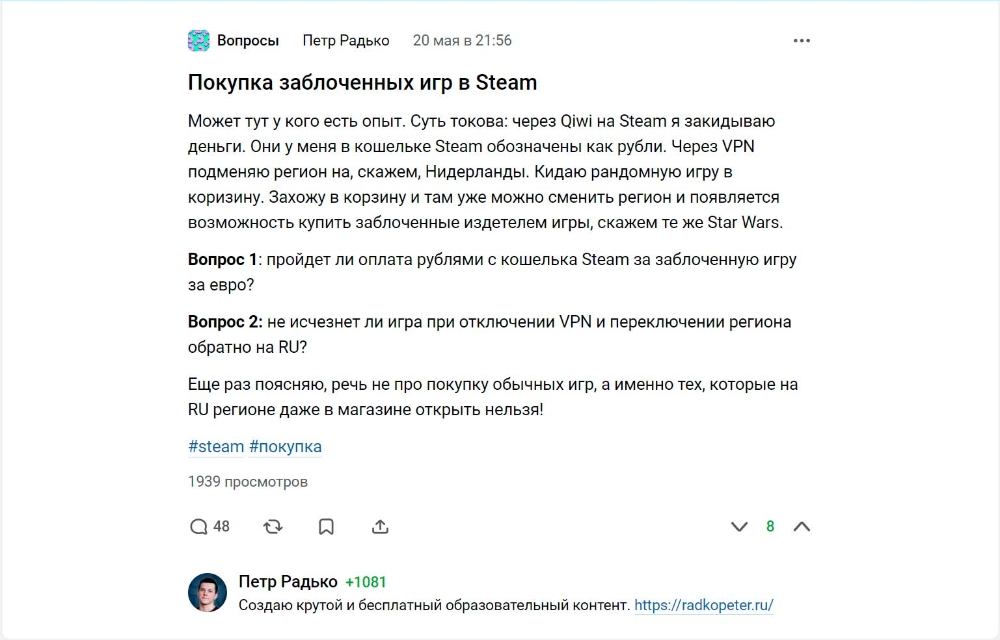
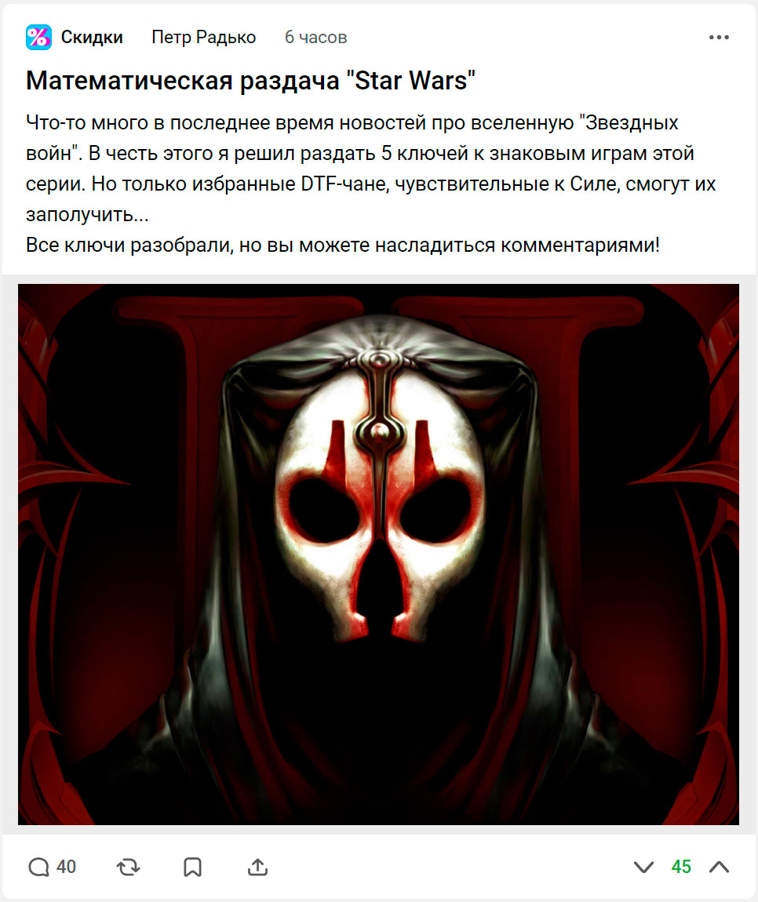
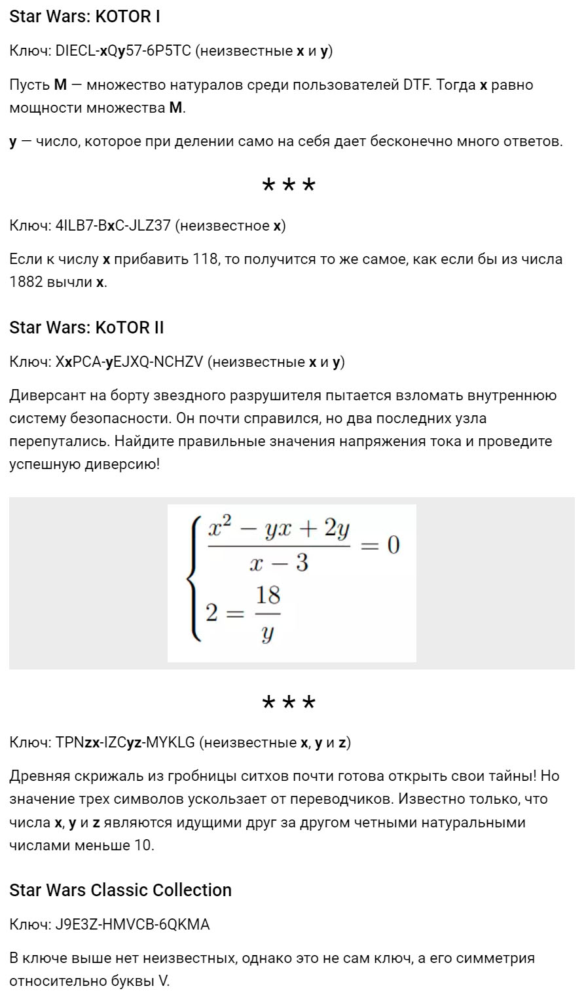
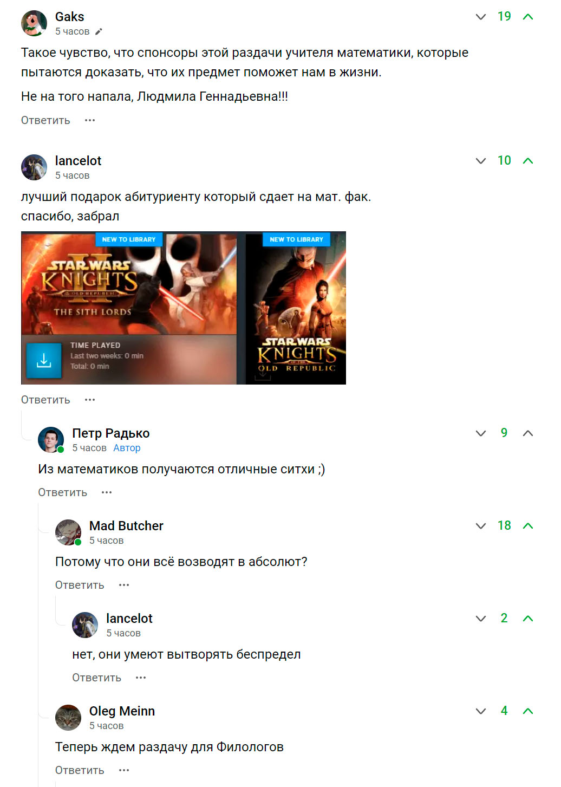

Игра дества!
Рассказать историю про то, каким необычным способом я получил игру!
Попал аж на первую страницу со своей раздачей.

# (Май 2022) Невероятная история получения

Из-за санкций часть игр вообще невозможно было купить в Steam, так как издатели поставили блокировку российского региона.
Недоступна оказалась и вышедшая в апреле лего игра по вселенной Star Wars.
В детстве я уже играл в лего Звездные войны и мне очень нравилось: необычный геймплей, множество персонажей, головоломки, испытания, шутки и прочее.
Кроме того, эта игра охватывает все девять фильмов.

Короче, у меня очень чесались руки получить эту игру.

## Первый пост на DTF

В день выхода игры в Steam на главной странице магазина появился баннер о старте продаж на русском языке.
Но если на него нажать, появляется страница об ошибке.
Про эту ситуацию я выпустил шутливый [пост](https://dtf.ru/games/1148657-uzhe-dostupno) на DTF.

## Пиратка

Через некоторое время не удержался и все же установил себе пиратскую версию.
Очень залип на вступительном интро и главном меню.
Прямо чувствуется, что люди делали игру с любовью.
Сама игра тоже великолепная, прямо в детство вернулся!

Увидев количетсво персонажей, собираемых предметов, древа прокачки и все остальное принял решение удалить пиратку и дождаться выхода игры в российском регионе Steam.

## Второй пост на DTF

В мае мне уже надоело терять и получть звезды в [CS: GO](p:cs-go).
Новых игр нет или заблокированы в России.
Тогда я попробывал хакнуть систему и с помощью VPN сменить регион в Steam и купить Звездные войны.
К сожалению, ничего не вышло.
Чтобы деньги на кошельке Steam конвертировались в нужную валюту нужно хотя бы один раз оплатить какой-нибудь товар в этой валюте.
Свою попытку я описал во втором [посте](https://dtf.ru/ask/1201499-pokupka-zablochennyh-igr-v-steam) на DTF.

## Получение игры

В день публикации второго поста, когда я уже почти смирился с тем, что игру никак не достать, со мной связался пользователь DTF под ником [Yuriy](https://dtf.ru/u/96492-yuriy).
Он предложил мне скинуть ему деньги на карту, а он купить игру у себя в Казахстане и отправит мне игру "подарком".
Но этот способ не сработал, так как в регионах очень сильно отличались цены на игру.

Поэтому мы провернули еще более экстремальный вариант.
Я дал ему логин и пароль от аккаунта.
Он в него зашел, поменял регион, купил игру за тенге и отдал мне аккаунт.
После этого у меня не только появилась желанная игра, но еще и возможность покупать любые заблокированные в моем регионе игры!

## Награда

Я хотел просто отправить на карту Yuriy стоимость игры с добавкой за смененный регион.
Однако, он настоял на том, чтобы я эту сумму потратил на то, чтобы порадовать других пользователей сайта.
Цепочка добрых дел.

## Математическая раздача Star Wars

<gallery>
    
    
    
</gallery>

Я купил 5 ключей:

* 2 для KoTOR 1
* 2 для KoTOR 2
* 1 на Star Wars Classic Collection

Просто так раздавать ключи не хотелось.
Да и боты могут их даже быстрее людей распознать и забрать себе.
Хотелось устроить креативную раздачу.

В итоге в каждом ключе некоторые цифры я заменил на неизвестные и придумал связанную с ними простенькие математические задачи.

Признаться честно, я сильно волновался, как пройдет раздача.
Но все получилось просто великолепно.
За двадцать минут я осчастливил четырех человек.
В комментариях родилось много годных шуток.

По количеству лайков на тот момент это оказался самый популярный мой [пост](https://dtf.ru/sale/1210164-matematicheskaya-razdacha-star-wars) на DTF.
Он даже появился на главной странице!
Не на первых местах, конечно, но все же.