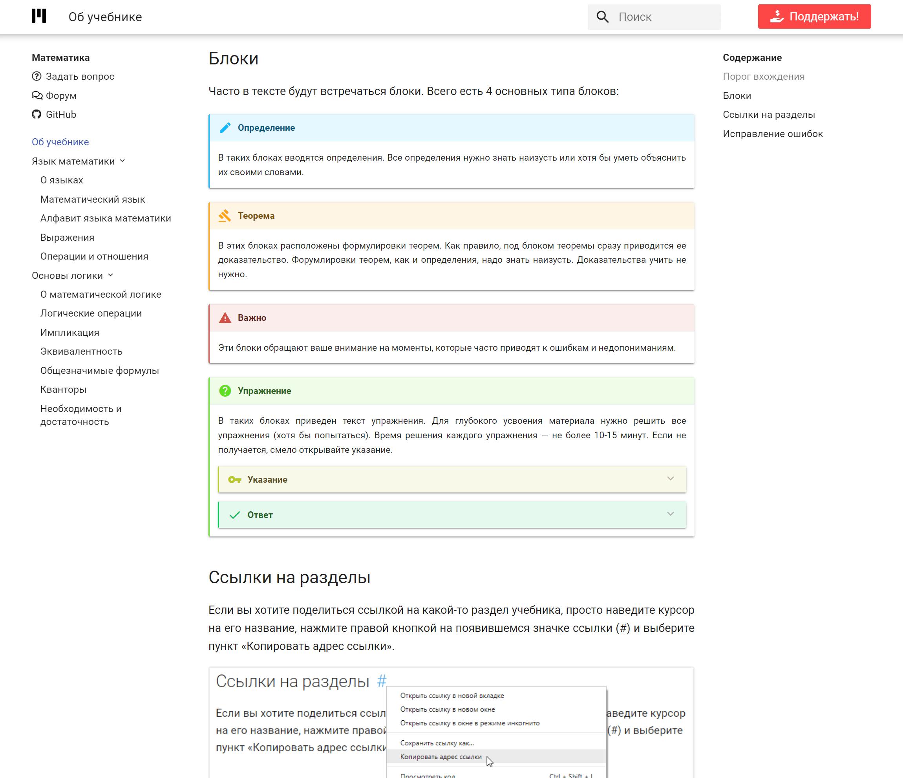
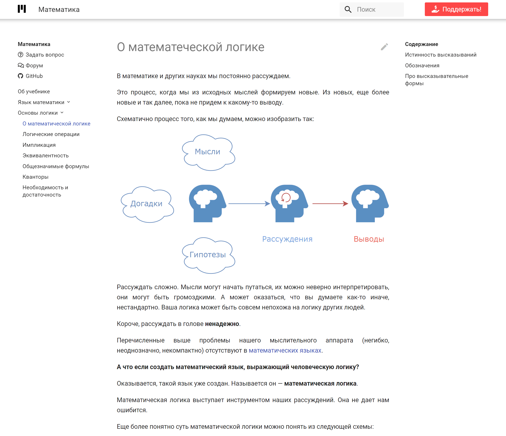
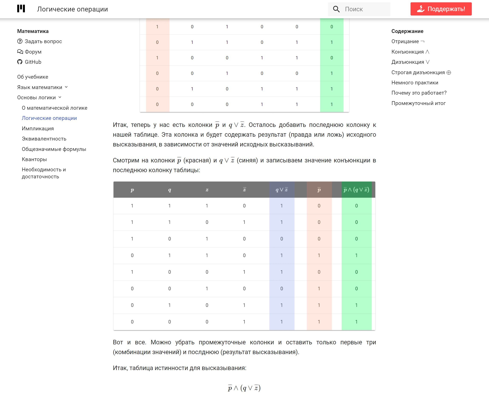

<gallery>
    
    
    
    
</gallery>

Вторая попытка создать лучший онайл учебник по математике.

В этот раз движок разрабатывал не сам, а использовал связку статического генератора MkDocs с очень популярной темой Material.
Вместе это сразу дало красивый сайт, который после небольшой полировки был готов к наполнению контентом.

Написал целых 13 статей про самые основы математики.
Особенно горжусь статьями про основы логики и статьей "О математической логике" в особенности.
В ней я максимально ясно и понятно попытался передать то, как работает формальная логика.

Также создал и форум, чтобы люди могли задавать вопросы по материалу учебника и делиться своими идеями.
Специально для Patreon-подписчиков создал три группы: Помощник, Соратник и Спонсор.
В зависимости от группы перед именем пользователя отображается особый значок.