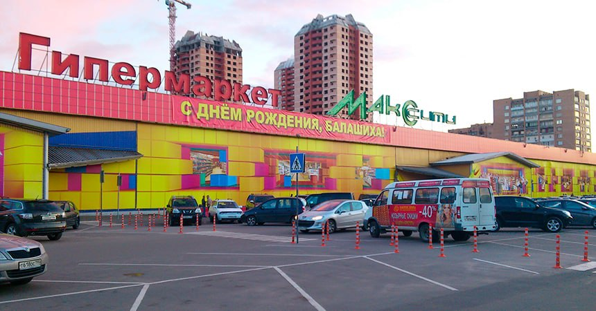

<gallery>
    
    
    
    
    
</gallery>

У брата моего отца была полиграфическая фирма.
Им поступил заказ на создание красивого дизайна для фасада гипермаркета "Макс Сити".
Дизайн решили выполнить в виде кубов, некоторое из которых отсутствуют, образуя "дыры" внутрь магазина.

Меня же пригласили для консультирования дизайнеров фирмы по работе с 3ds Max.
Создал несколько протопитов, на основе которых был сделан итоговый дизайн.