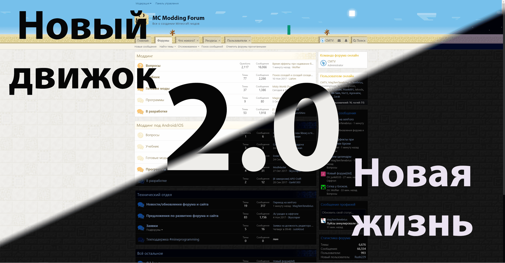

# Предыстория

Все началось с не особо популярного русскоязычного форума "minecraft.su".
На нем был раздел "Моддинг" в котором сидели вообще все разработчики модов из СНГ.
Там же распологался и учебник по их созданию.

{: .w8 }

Меня эта тема захватила и я решил снять серию роликов.
Уроки смотрели, на канал подписывались.

Популярность этой темы понятна: детям (мне в том числе) нравится играть в Minecraft.
Некоторым в какой-то момент хочется привнести в игру что-то свое.
Тут они и превращаются в целевую аудиторию моих роликов.

# Раздел про моддинг на Minecraft Wiki

Параллельно с созданием роликов решил писать и текстовые версии.
На официальной вики по Minecraft была пустая статья про создание модов с помощью ModLoader.
Я ей плотно занялся и за полтора месяца превратил ее в полноценный [мини-учебник](https://minecraft.fandom.com/ru/wiki/%D0%A1%D0%BE%D0%B7%D0%B4%D0%B0%D0%BD%D0%B8%D0%B5_%D0%BC%D0%BE%D0%B4%D0%B8%D1%84%D0%B8%D0%BA%D0%B0%D1%86%D0%B8%D0%B9_%D1%81_%D0%BF%D0%BE%D0%BC%D0%BE%D1%89%D1%8C%D1%8E_ModLoader).

Эта большая статья еще очень долго висела на первых местах в поисковиках по запросу создания Minecraft модов.
Уже после создания сайта и форума разместил на ссылки на них в вики, чтобы народ переходил на наши проект.

# Работа с anti344

Во время игры на каком-то сервере я встретил игрока под ником anti344 (Антон).
Сначала мы некоторое время играли вместе, потом я упомянул, что интересуюсь созданием модов и даже записываю обучающие ролики.
Он, как выяснилось, тоже этой темой увлекался и, в отличие от меня, разбирался он в ней отлично.

В результате мы скооперировались и начали долгую совместную работу над собственным порталом по Minecraft моддингу, над проектом "MC Modding".

Активнее всего он участвовал в ранней жизни проекта, с течением времени все реже и реже появляясь на нем (впрочем, как и я).
Но факт остается фактом, без его помощи проекта скорее всего не было бы.

# История учебника

<gallery>
    
    
    
</gallery>

В конце июня 2016 года главного администратора форума "minecraft.su" забрали в армию и у него не было времени и денег оплатить хостинг.
Судя по всему, сумму не собрали и проект вскоре закрылся.

Это закрытие очень сильно сыграло на руку открывшемуся как раз в июне учебнику, а позднее и форуму.
Я писал главы и снимал ролики по созданию модов, а Антон выступал в качестве главного редактора, часто помогал мне с кодом.
Он также писал параллельный учебник по основам языка Java.

## Свой движок

<gallery>
    
    
    
</gallery>

В отличие от форума, который уже был переведен на движок MyBB, внешний вид учебника практически не менялся.
В апреле 2017 года я решил полноценно вернуться на проект. Начал я с написания нового движка сайта.

Это обновление стало прорывным для меня в технологическом плане.
Именно движок учебника стал моим первым статическим сайтом, хостящимся на GitHub и собирающимся автоматически после каждого коммита. Эту технологию я буду применять во множестве последующих проектах.

Новый учебник прекрасно выглядел, распологался на GitHub, поддерживал разные версии Minecraft и разные API, имел простой формат статей (Markdown). Я перенес весь старый материал и написал ряд новых статей.

К сожалению, на новой версии учебника силы мои кончились.
Мне не хотелось влазить обратно в моддинг, копаться во всех этих сложностях.
Полноценного возвращения на проект не произошло, я так и остался техническим администратором, а задачу заполнения учебника передал своему заму.

## Переход на MkDocs Material

Учебник на моем собственном движке был конечно крутой, но работать нормально с ним мог только я.
Поэтому я начал поиск уже готовых генераторов. И нашел.

В начале 2019 года наткнулся на генератор документации MkDocs.
В нем очень просто добавлять статьи и составлять многоуровневое оглавление.
Кроме того, у него есть поиск, которого не было на моем движке.

Была только одна проблема — стандартные темы к MkDocs выглядели просто ужасно.
К счастью, нашлась очень популярная тема "Material", которая выглядела отлично, была адаптирована под мобильники и поддерживала нужные мне плагины.

В мае 2019 года полностью перенес все материалы из своего учебника на движок MkDocs с темой Material.
Упрощенная система принесла свои плоды. Народ стал активнее предлагать правки и даже целые статьи.

# История форума

<gallery>
    
    
    
</gallery>

С форумами ранее я никогда не работал.
Anti344 посоветовал простой и легкий движок PunBB.
Его и решили поставить.

Я помогал людям только по самым базовым вопросам, тогда как Антон и ряд других крутых программистов, пришедших с "minecraft.su", отвечали на более сложные вопросы.
На этом движке форум проработал несколько лет.
За это время накопилась огромная база из тысяч вопросов и ответов, а также сформировалась местная элита из опытных постоянных пользователей, некоторые из которых стали модераторами.

Появился и ряд проблем: пресное оформление, сложности с обновлением до новых версий. Но больше всего печалил ограниченный функционал: личный кабинет, персональные сообщения и система лайков с репутацией отсутствовали, а вопросы ничем не отличались от обычных тем.

## Переход на MyBB

<gallery>
    
    
    
    
</gallery>

Когда стало понятно, что форум "перерос" движок PunBB, я начал искать замену.
На короткое время перевел форум на движок phpBB, но народу не понравилось, да и он не отвечал моим требованиям по функционалу.

В своих поисках я наткнулся на MyBB.
Там было абсолютно все, что мне нужно: сносный дизайн, система лайков, плагин для вопросных тем и множество других крутых фишек.
Для форума я разработал уникальный дизайн в стиле храма в пустынном биоме.

Однако, без проблем тоже не обошлось.
Из-за внесенных обширных изменений в движок в какой-то момент я уже не мог обновлять его до последних версий.
Помимо этого, для обновления сообщений и публикации собственных приходилось постоянно обновлять страницу темы.
Неудобно.

## Переход на XenForo

<gallery>
    
    
    
    
    
</gallery>

Примерно через год после перехода из-за обозначенных выше проблем я начал искать более подходящий движок.
Мой заместитель рекомендовал XenForo, но я словно избегал этого движка, так как он был платным.
В конце концов, не найдя достойных вариантов я все же решил попробовать пиратскую версию XF.

Сначала попробовал первую версию движка.
Но у нее были ровно те же болячки, что и у других движков: убогий дизайн, старые технологии, необходимость перезагружать страницы для обновления сообщений и так далее.

Но мне невероятно повезло, что в дни моего поиска движка вышла бета второй версии XenForo.
И вот она меня поразила: адаптивный современный дизайн, современные технологии и верстка, удобный визуальный редактор, система тегов, достижения, встроенная система публикации ресурсов и еще миллион других крутых фич.

Особенно меня поразило то, насколько глубоко и относительно просто можно создавать свои аддоны.
Это был WordPress от мира форумных движков!

Попробовав бету XF 2.0, я почти сразу понял что переходить будем именно на нее.
Правда, пришлось самостоятельно написать несколько аддонов, в том числе аддон для вопросов с ответами.

По части дизайна решил сохранить пустынную тематику.
В шапке форума сделал пустыню с облаками, солнцем и кактусом, за котоым прячется зомби.
На шапки потратил очень много времени, но получилось действительно клево.
Эта была та фишка, которая визуально выделяет проект на фоне других, дает ему индивидуальность.

По многочисленным просьбам добавил еще и темную вариацию пустнной темы для тех, кто любит сидеть на форуме по ночам.
Сначала хотел заморочиться и сделать изменение темы в реальном времени с движением солнца и луны в шапке.
Но потом пришлось отказаться от этой идеи — слишком тяжело было реализовать.

Народ был в восторге от нового движка.
Я сам тоже на некоторое время активно включился в жизнь проекта.
Организовывал конкурсы на идеи для достижений и супер-гайды.
Начался золотой век проекта.

## Из пустыни в лето!

В августе 2020 вышла версия 2.2 движка XenForo, в которой появилось огромное количество крутых штук.
Вопросно-ответная система, статьи, баннеры профилей и возможность менять ник — почти все мои аддоны теперь реализованы на уровне ядра!

На тот момент я был на абсолютном пике своих знаний в XenForo, буквально мог сделать все что угодно.
Поэтому, к такому большому обновлению движка я решил сделать не менее крутое обновление дизайна форума, а также довести до ума множество проблем, в особенности лиги с достижениями, которые так и висели недоделанными с момента перехода на XenForo.

Надоевшая всем пустыня с желтоватой цветовой гаммой сменилась на умиротворяющую зеленую равнину.
Логотип теперь при каждой загрузке имеет разные текстуры, порой даже анимированные.
Добавил разных объектов в шапке, в том числе алмазный меч со сферами опыта.

Иконки разделов форума оформил в виде красивых кубов с иконками. Эту идею стащил с официального Minecraft форума, но реализовал гораздо круче — все векторное и не теряет четкости при масштабировании.

Довел до ума лиги: привязал их к реальным блокам в игре, добавил иконки в профиле, оформил справочную страницу.
Вместе с лигами добавил медали, которые выдаются за получение всех достижений в определенной ветке (сообщений, реакции, ответы и т.д.).
Теперь система прогрессии работает как надо. Пользователю действительно хочется получать достижения, ведь в конце его ждет крутая медаль и новая лига, которые видят другие пользователи.

Количество сообщений, лучших ответов и лайков теперь отображается в виде красивых счетчиков в одну строку под именем пользователя.