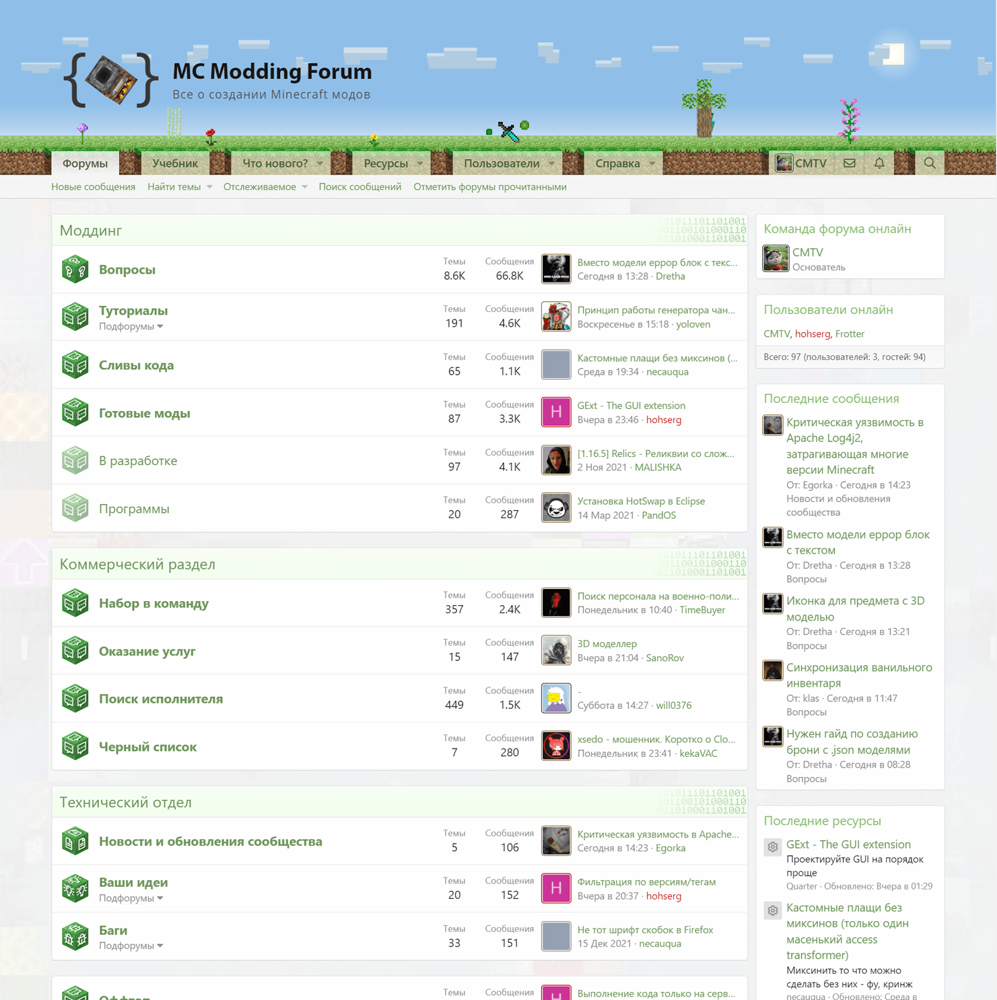
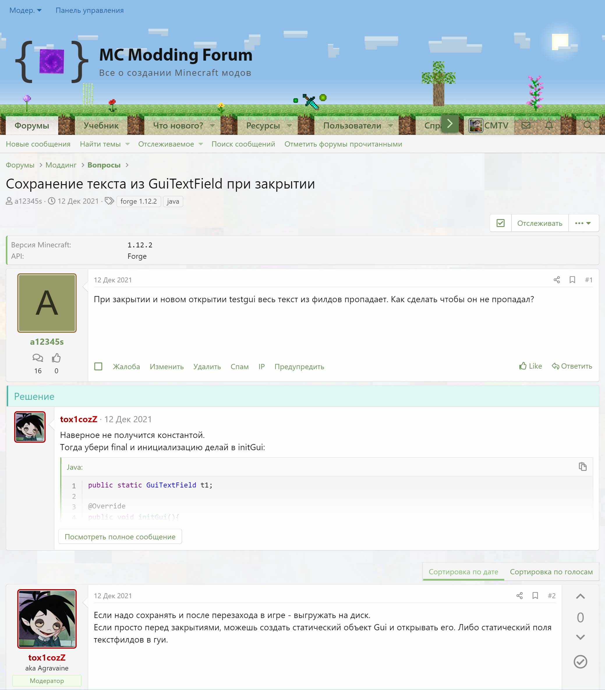
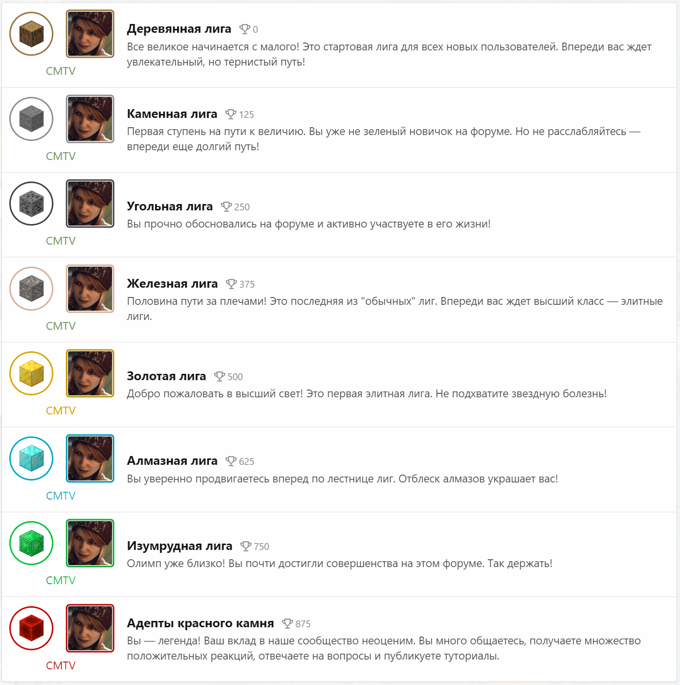
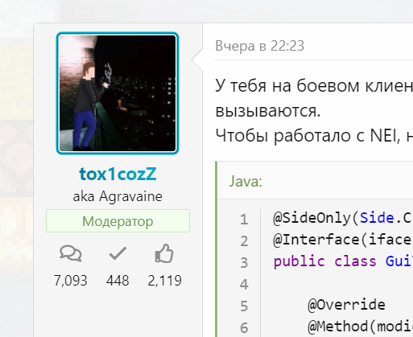
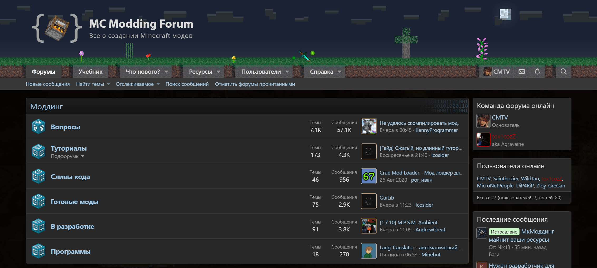
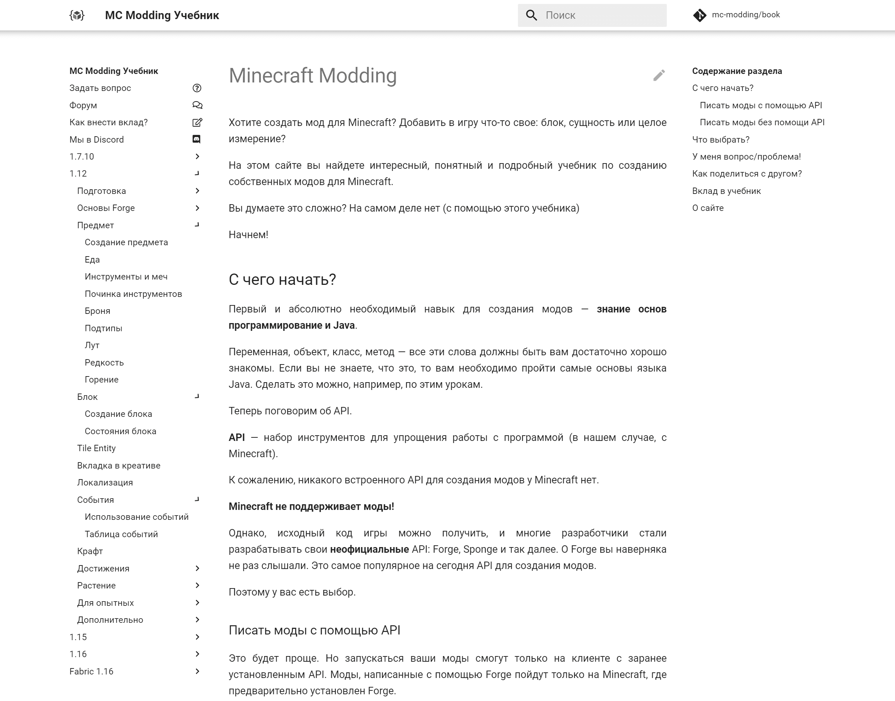
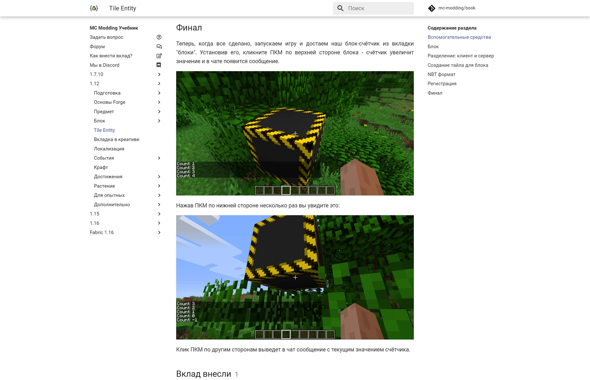
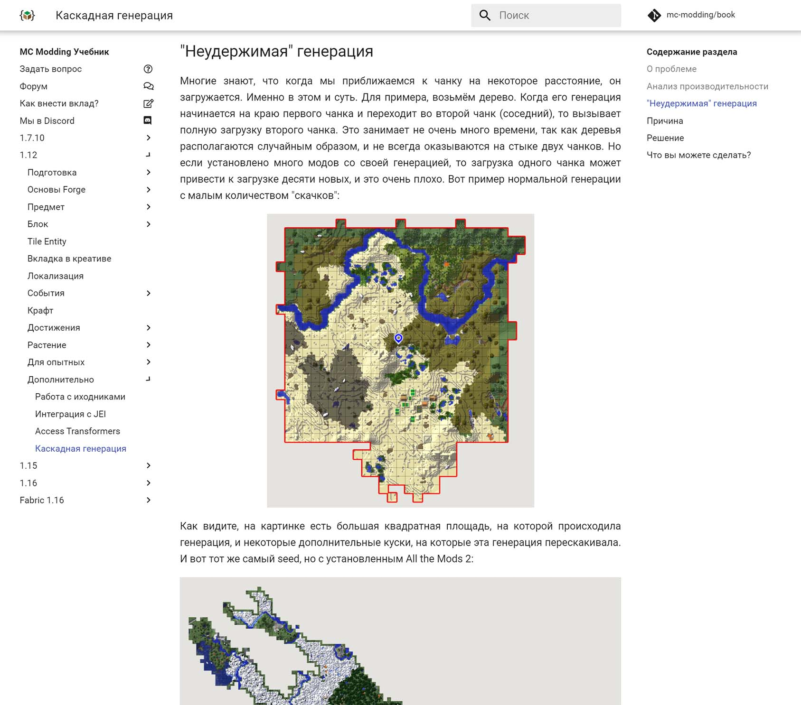

<gallery>
    
    
    
    
    
    
    
    
</gallery>

Эпохальный, самый долгоживущий и один из самых популярных моих проектов.
Начавшись в далеком 2013 году и закрепив мой курс на просвящение других, он пережил 5 крупнейших обновлений, каждое из которых отражало накопленные с годами знания и опыт.

Несмотря на то, что я уже давным давно не занимаюсь моддингом и не играю в Minecraft, проект живет своей жизнью, подкрепляемый постоянно приходящими новичками, которых обучают опытные старожилы.

В данный момент на проекте я выполняю роль технического администратора: изредка обновляю форум, чиню неполадки и оплачиваю хостинг с доменом.