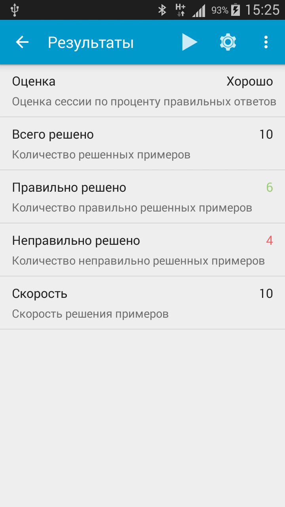

<gallery>
    
    
    
    
    
</gallery>

"Счет в уме" — первое и одно из самых популярных моих Android приложений.
В нем велся учет полной статистики, подсчитывалась средняя скорость счета, можно было выбирать тип отрабатываемых операций, сложность примеров и время тренировки.

Поначалу приложение почти никто не скачивал.
Где-то через год произошел резкий скачок и оно попало на первое место.
И уже с него не слезало, даже когда появились более функциональные аналоги.
Одно только приложение приносило около 5000 рублей в месяц.