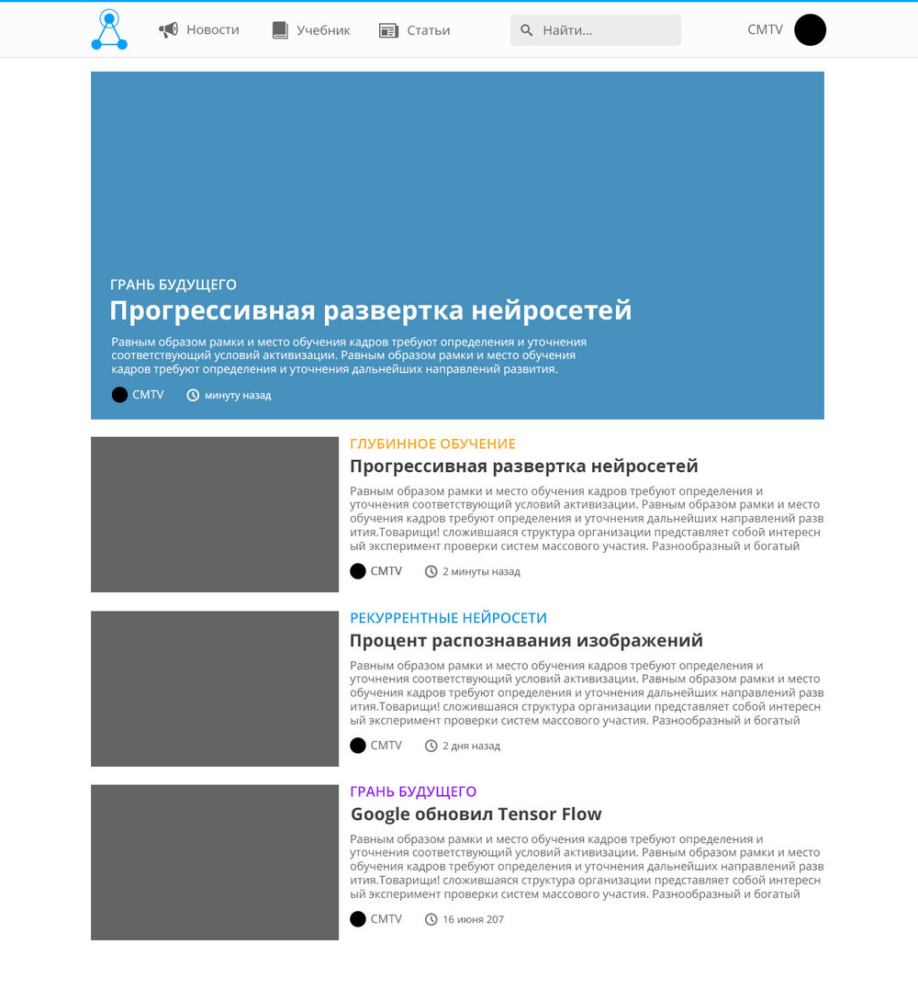
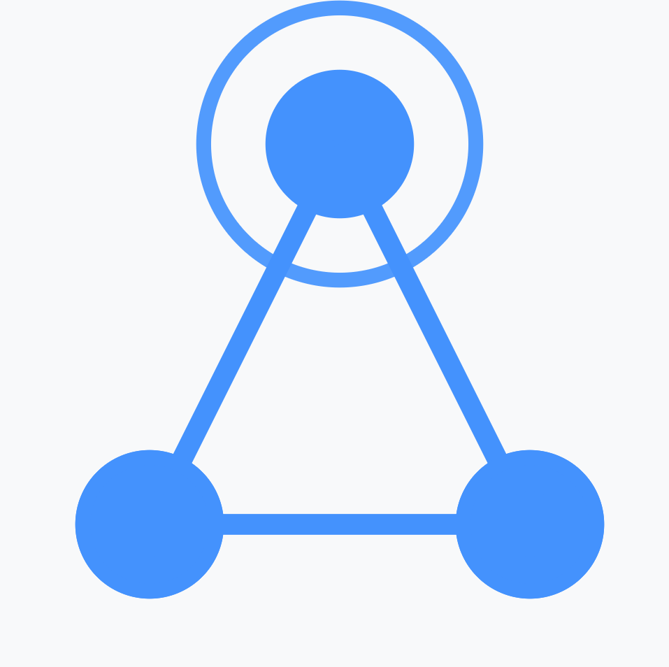
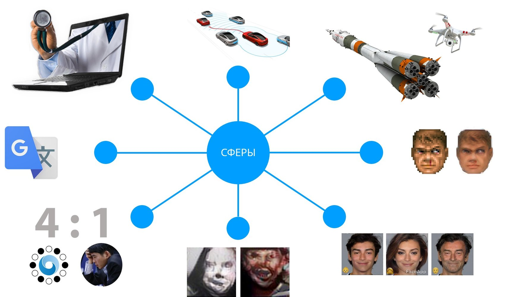
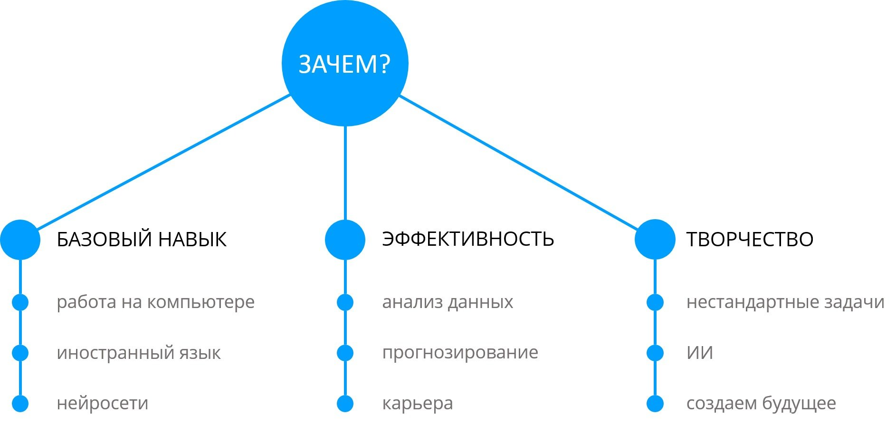
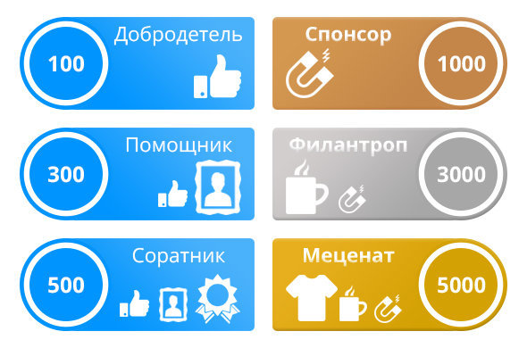
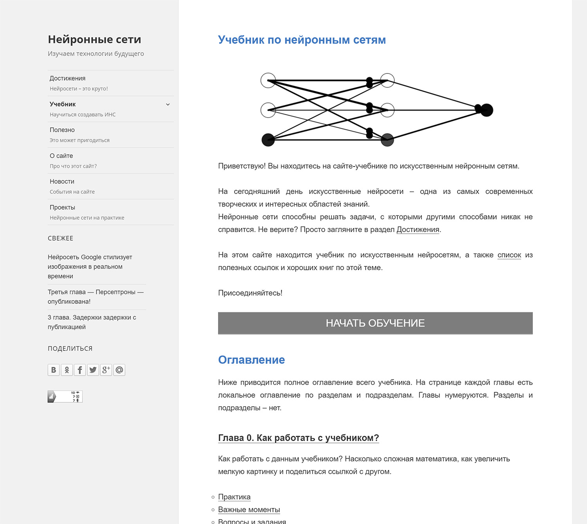
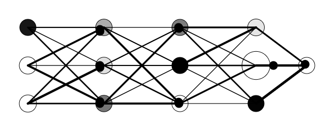

# Приостановка проекта

На пятой главе я сломался. Моей математической подготовки просто не хватало, чтобы нормально освоить материал и подготовить
интересные примеры. Более того, эту самую высшую математику требовалось объяснить и читателям. Короче, главу я так и не завершил... Принял решение изучать математику, а параллельно создавать другие проекты.

С момента приостановки нейросетей прошло очень много времени, множество проектов было создано. Может быть, когда-нибудь я триумфально вернусь в эту тему и продолжу лучший учебник по нейросетям всех времен и народов!

# Вторая версия

<gallery>
    
    
</gallery>

Вторую версию сайта я делал почти два месяца. На тот момент это был один из самых трудозатратных моих проектов.

Но результат превзошел все ожидания. Дизайн портала стал моим первым бриллиантом в сфере создания сайтов.
Он прекрасен во всем: легкий и воздушный интерфейс, полная адаптивность, автоматическое создание оглавления к главам учебника и статьям, возможность ссылаться на любой раздел учебника — многие из этих фич я почти без изменений использовал и в других проектах.

Основной портал (учебник + статьи + новости) работает на сильно модифицированном WordPress.
Тему к нему я писал самостоятельно и, насколько я помню, именно при разработке этой темы я впервые воспользовался
инструментарием Node.js и менеджером задач Gulp.
Также перевел форум на движок XenForo.

Отдельного упоминания заслуживает и логотип. Очень простой, красивый, запоминающийся, а главное — полностью передает суть нейросетей: связанные круглые нейроны, которые возбуждаются и передают сигнал на выходной нейрон сети.

Так как в четвертой главе много математических формул, написал свой первый WordPress плагин — [Insert Math](p:wp-insert-math).
Плагин, как и сам сайт, получился очень удобным.

# Краудфандинг

<gallery>
    
    
    
</gallery>

Через год первая версия сайта уже висела в топе Google и Yandex по основным запросам, связанным с нейросетями.
Пришла идея начать сбор средств на создание полноценного портала по нейросетям: переделанный учебник + статьи + форум.

Создал [кампанию](https://planeta.ru/campaigns/neural) на Planeta.ru.
Специально для кампании целую неделю делал ролик. В результате получился один из самых крутых роликов в моей жизни.

Кампания прошла неудачно. Удалось собрать всего 4401 рубль из планируемых 100 000. На успех кампании я особо не рассчитывал, а вторую версию проекта сделать собирался в любом случае. Поэтому, сразу после начала сбора средств, начал разработку второй версии сайта.

    <iframe style="width: 100%; height: 100%;" src="https://www.youtube.com/embed/ZEhwZhdk-zI" title="YouTube video player" frameborder="0" allow="accelerometer; clipboard-write; encrypted-media; gyroscope; picture-in-picture" allowfullscreen></iframe>

# Первая версия

<gallery>
    
    
</gallery>

Тема нейросетей очень заинтересовала меня и моих зрителей, поэтому я решил превратить курс по ним на сайте ["Центр CMTV"](p:cmtv-pro) в отдельный сайт "Нейронные сети".

Работал сайт на движке WordPress с сильно измененной темой Twenty Fifteen. На главной странице поместил очень красивую анимацию работы нейронной сети. Ее я взял с какого-то англоязычного сайта, посвященного IT технологиям. Каждый раз при загрузке страницы эта сеть генерировалась с разным количеством слоев и нейронов в слое.

Небольшие конспекты к роликам превратились в 3 больших, интересных и понятных главы учебника. Добавил разделы с новостями и достижениями нейросетей, а также страницу "Полезно" с ссылками на популярные сайты и книги.