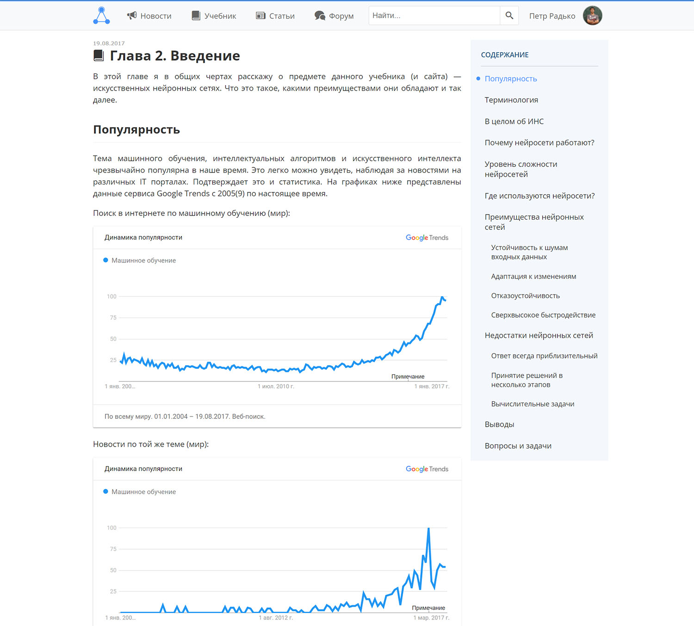
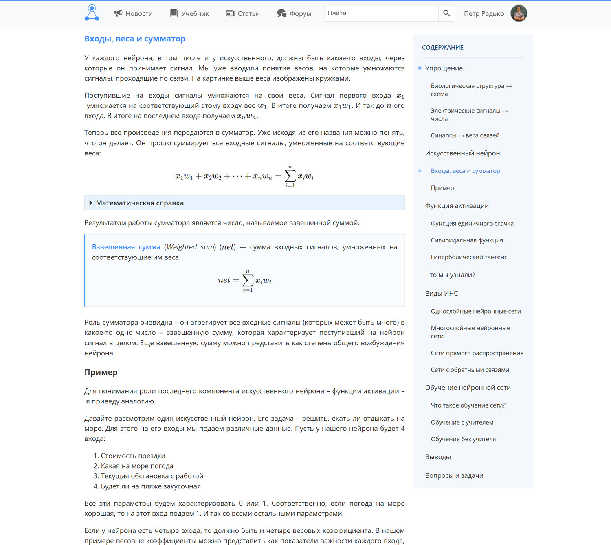
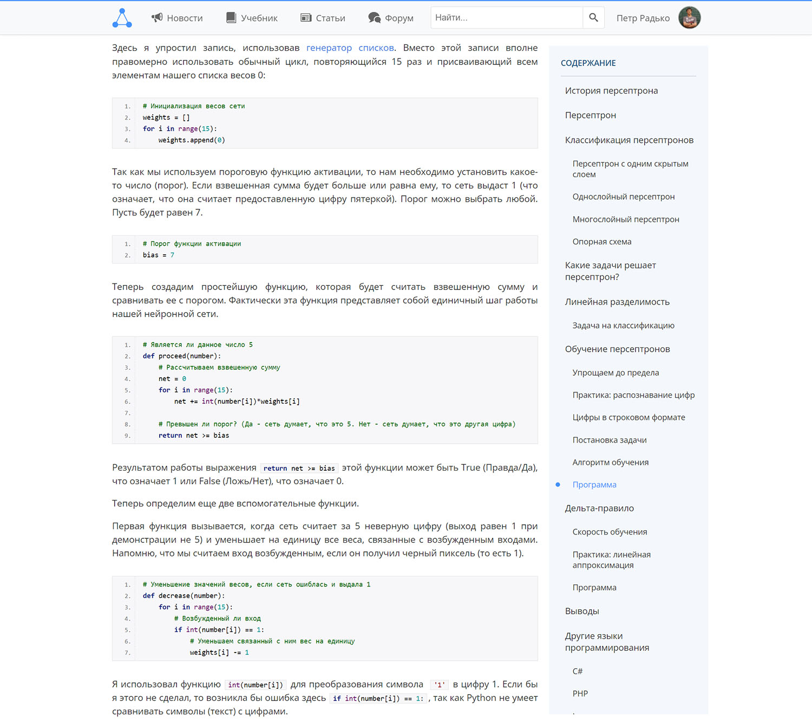
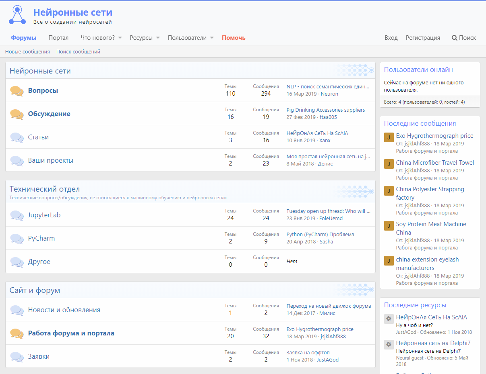

<gallery>
    
    
    
    
</gallery>

Концепция нейронных сетей и их возможности очень поразили меня.
Поразили настолько, что я решил создать образовательный проект по ним, включающий учебник,
форум для ответов на вопросы и портал со статьями.

Один из самых первых по-настоящему крупных и популярных моих проектов, который очень долго уверенно держался на первых местах во всех популярных поисковых системах. В каком-то смысле, он определил направление и форму моей дальнейшей деятельности.

Дизайн основного сайта, а также 4 больших и интересных главы учебника я считаю одними из самых крутых своих творений
в сфере веб-дизайна и образования.

В рамках этого проекта также [перевел](p:translation-neural) первую главу книги «Создаем нейронную сеть».
