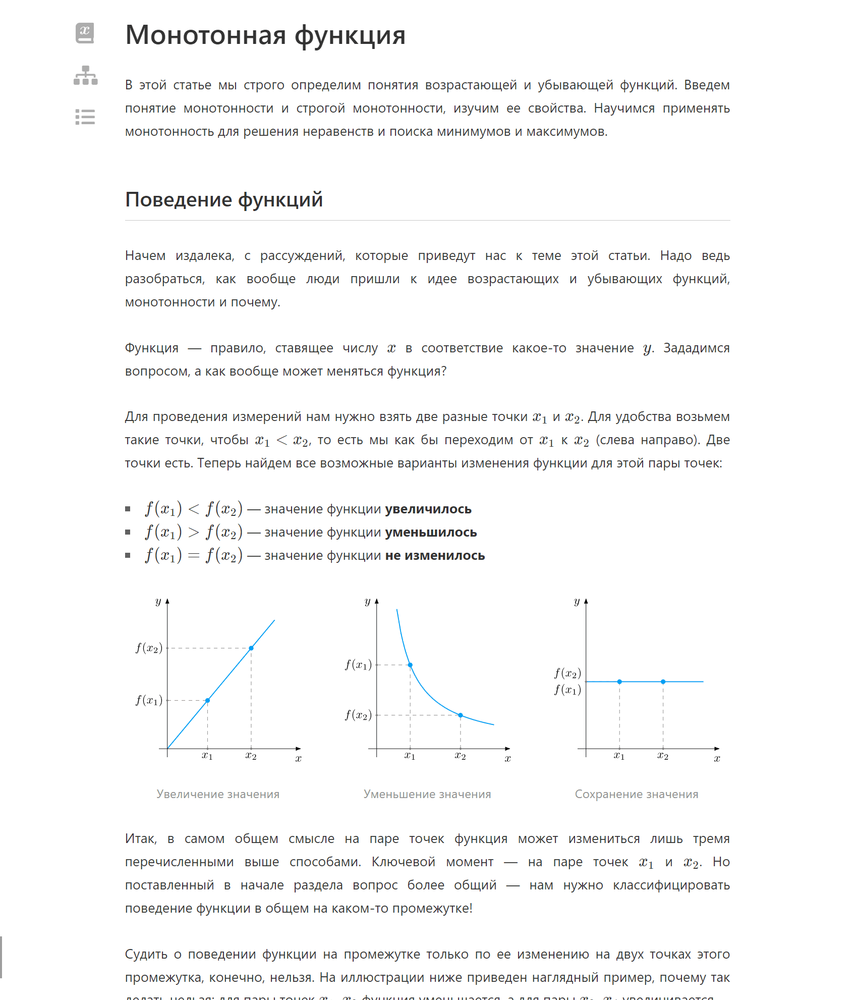
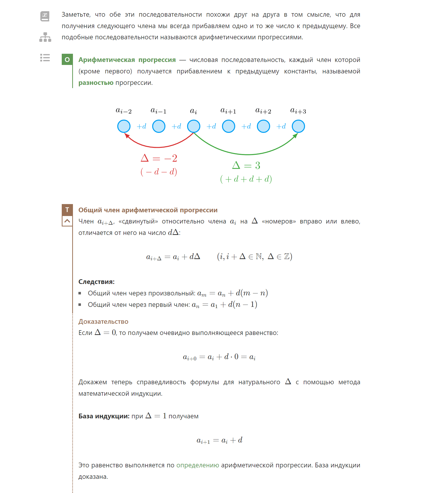
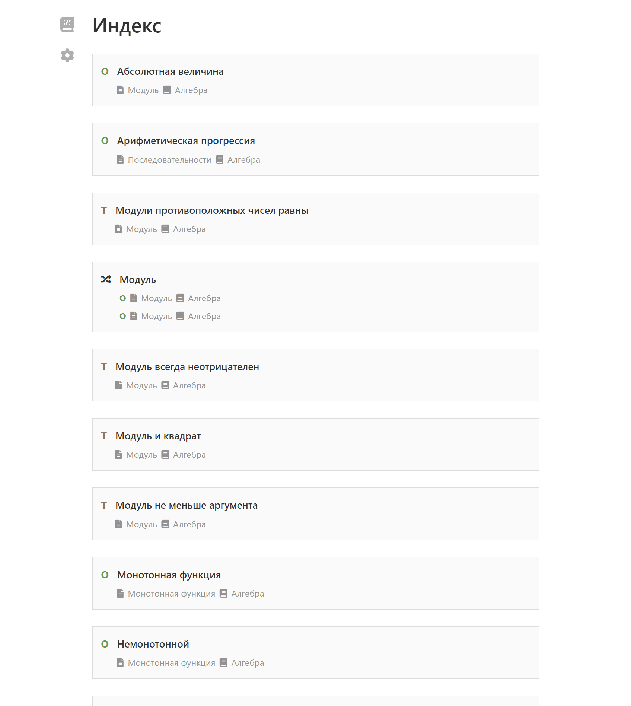
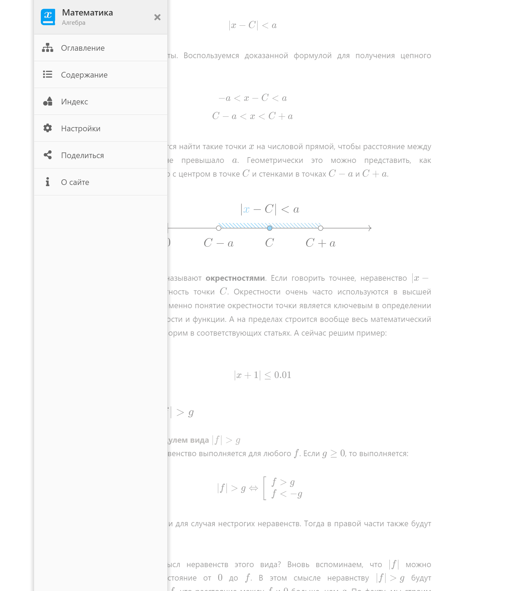
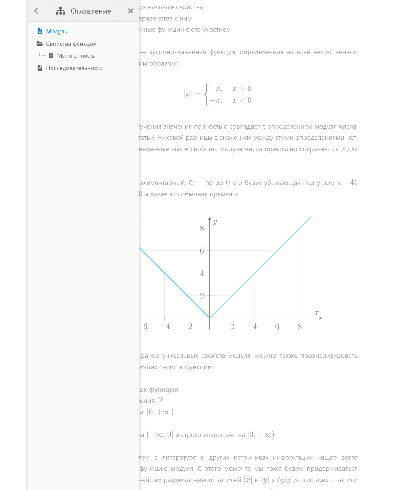

<gallery>
    
    
    
    
    
    
</gallery>

Четвертая и самая популярная, а также наполненная контентом попытка создать лучший онлайн учебник по математике.

После крутой второй версии [Демидовича](p:dodem) мне уже не хотелось возвращаться к старому учебнику по математике.
Было желание на таком же крутом уровне сделать новую версию учебника.

В своей попытке #4 я сделал максимальный акцент на самом главном — на изучаемом материале.
На странице статьи нет ни шапки, ни подвала, ни боковых блоков — ничего не отвлекает читателя от изучаемого материала. 
Только слева сверху есть три еле-заметные кнопки для вызова главного меню, общего оглавления и содержимого конкретной статьи.

Серьезно улучшил дизайн блоков акцента, таких как определения и теоремы.
Теперь они гораздо более органично смотряться в тексте статьи.
У каждой теоремы теперь есть название, а для просмотра доказательства надо нажать на специальную кнопку.

Написал 2 огромных, интересных и очень подробных статьи: про модуль и монотонные функции, которые отображались на первых местах в Яндексе и Google.
Также начал писать статью про прогрессии.

Потом наполнение забросил, так как решил написать третью версию [Демидовича](p:dodem).
После нее взялся за обновление [резюме](p:radkopeter), а там уже понял, что нужно делать новую версию учебника.