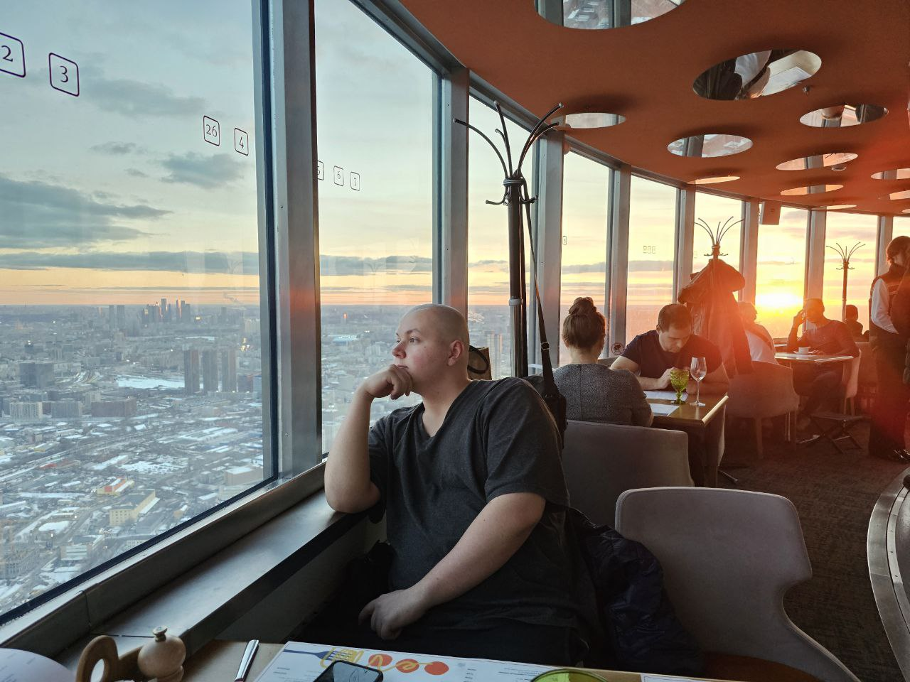
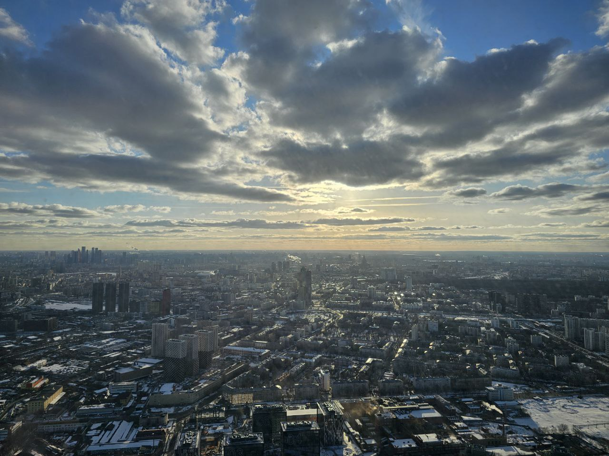
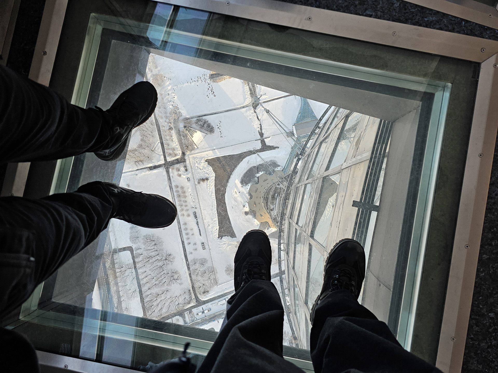
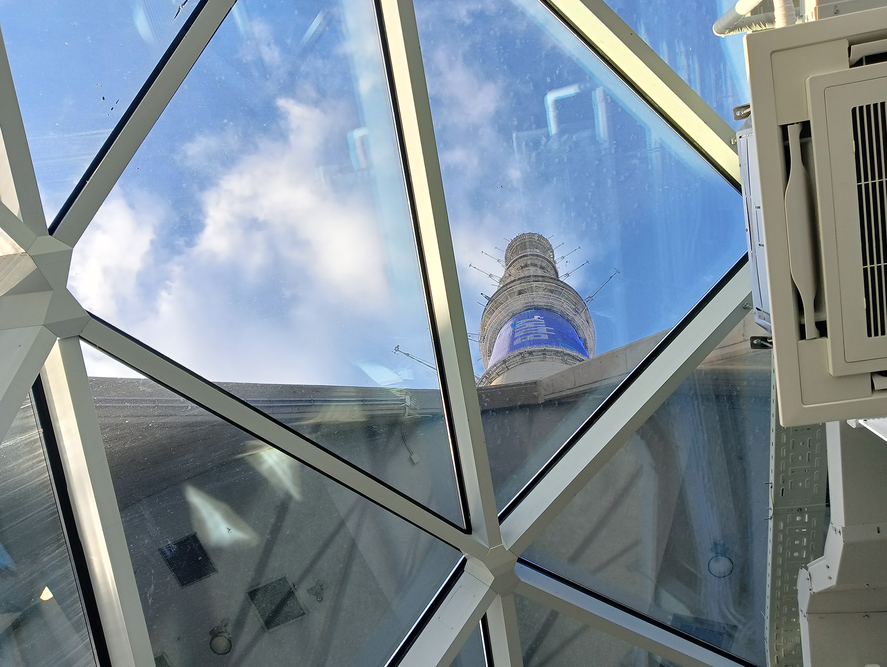
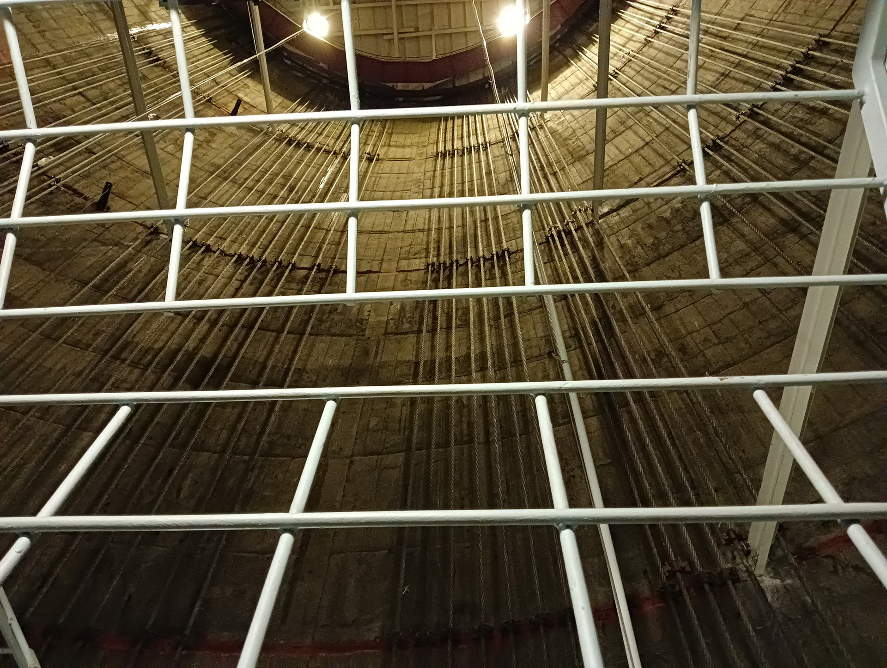

<gallery>
    
    
    
    
    
</gallery>

Посетили Останкинскую телебашню — самое высокое сооружение в Европе и России (540 метров).
У основания много интерактивных досок с интересной информацией и мини-музей.
Побывали внутри в техническом помещении с натянутыми канатами.
Под конец попали на обзорную площадку и поужинали во вращающемся ресторане с видом на всю Москву.

Много раз на протяжении свой жизни мимо этой башни проезжал и всегда было интересно ее посетить.
Так же наконец осознал масштабы города.
Оказывается, он не такой уж и большой и его вполне можно охватить взглядом целиком с такой высоты.