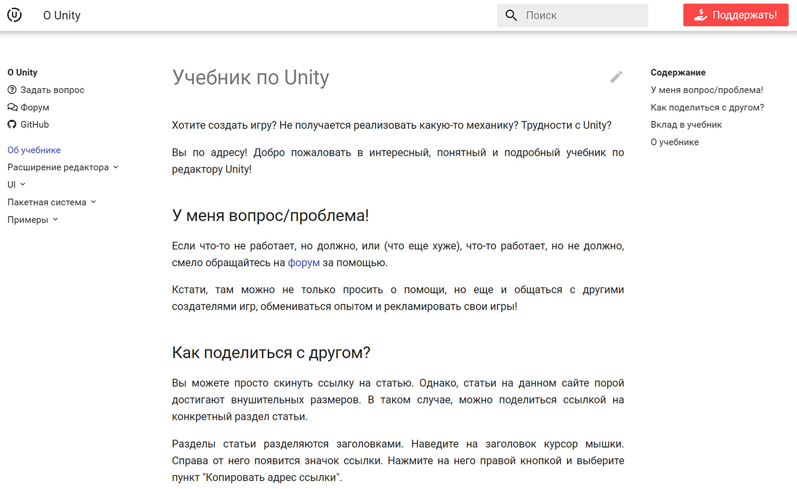
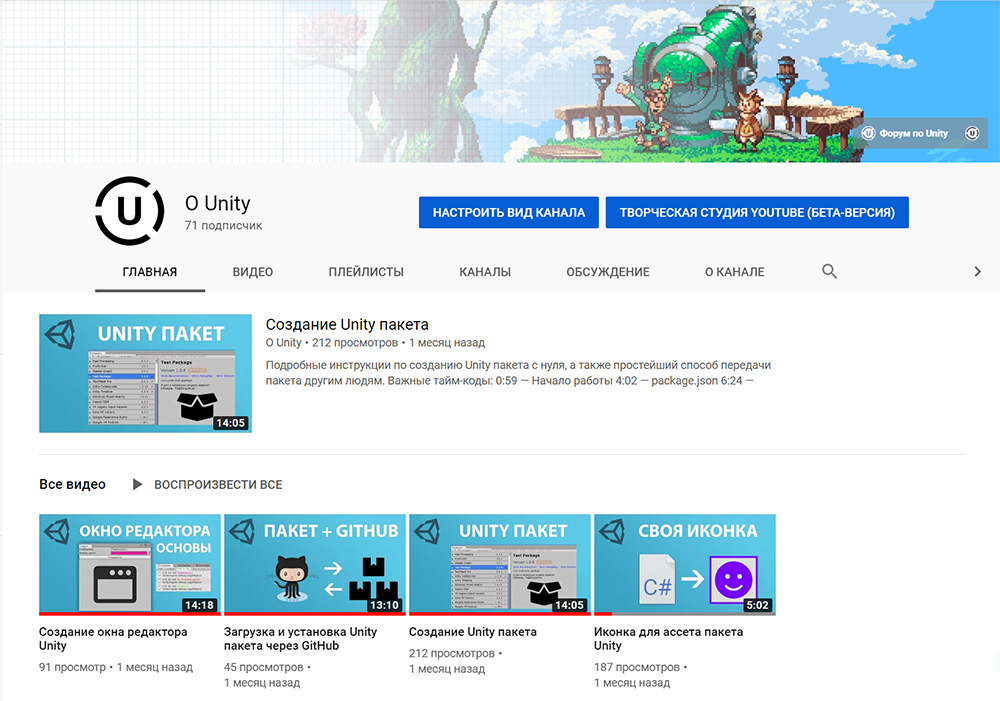
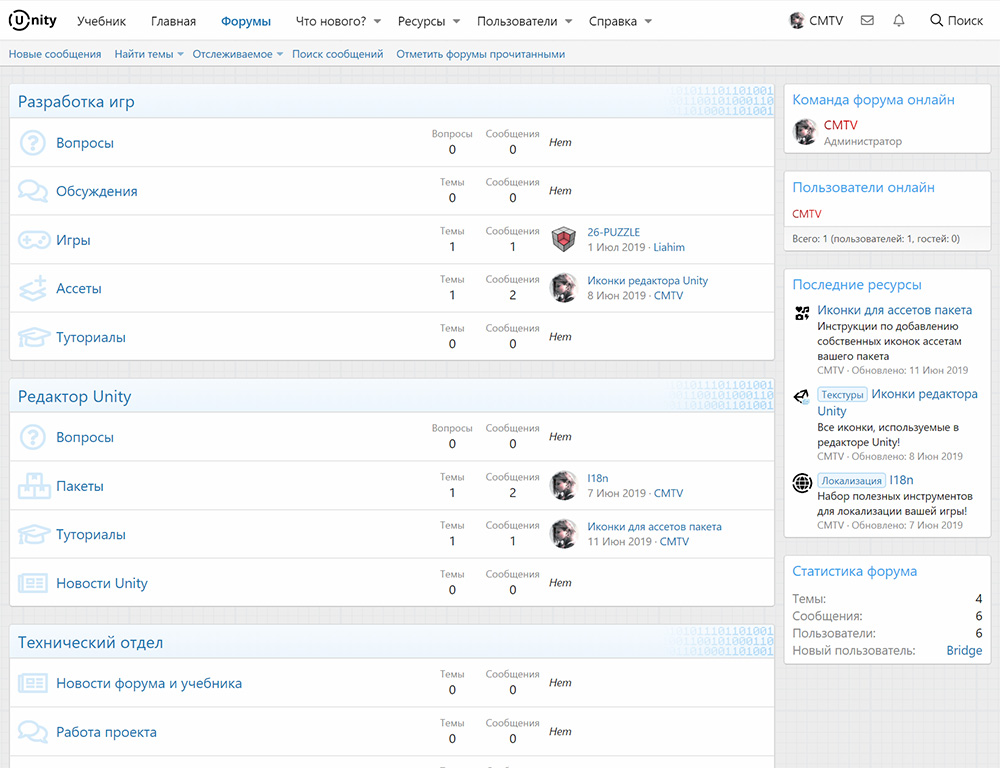
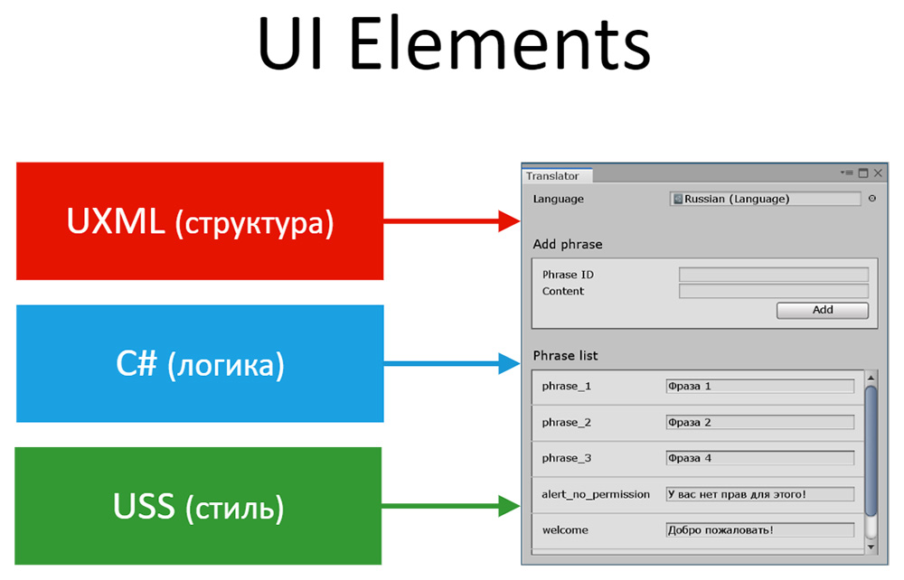

<gallery>
    
    
    
    
</gallery>

Движок Unity бесплатный, мощный и очень популярный.
Но единого и популярного русскоязычного портала по нему нет.
"О Unity" — попытка повторить успех [MC Modding](p:mcmodding) и полностью занять нишу Unity в России.

Проект состоял из учебника, форума и YouTube канала. Основная задача учебника и канала: подробно и понятно рассказывать про различные аспекты Unity. Задача форума: создание активного русскоязычного сообщества разработчиков игр на Unity.

Поработав над проектом 2 месяца я решил, что лучше сконцентрироваться на чем-то более фундаментальном и долговечном, чем Unity. Поэтому переключился на свои математические проекты.