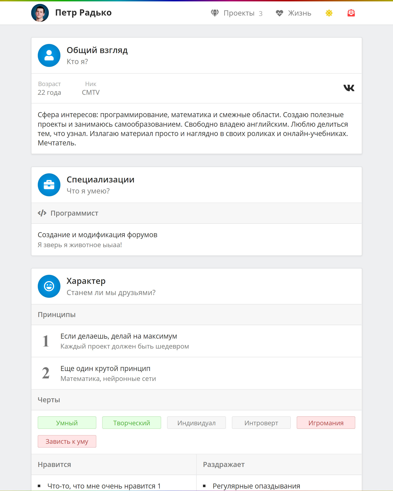

# (Февраль 2019) Первая версия на WordPress

<gallery>
    
    
    
    
    
</gallery>

К своему двадцатилетию у меня обозначились две важные задачи:

1. Необходимость хранить полную и подробную историю реализованных проектов в одном месте
2. Возможность одной ссылкой дать другим исчерпывающую информацию о моей деятельности

Для решения обеих задач решил создать собственный сайт-резюме.

Самую первую версию сделал достаточно быстро, всего за неделю.
В качестве движка использовал Wordpress. Тему для сайта написал самостоятельно.
С помощью плагина ACF доработал админ-панель для удобного добавления новых проектов.

Изначально было две версии сайта: русская и английская.
Позднее забил на заполнение английской версии и оставил только русскую.

У каждого проекта есть одна категория и набор тегов. Тогда я еще не подозревал,
что подход с одной категорией не годится и вызовет серьезные проблемы.

Во время разработки использовал:

* Node.js
* Gulp 4 для автоматизации сборки темы
* Среду разработки JetBrains PhpStorm

# (Август - сентябрь 2021) Первая итерация второй версии

<gallery>
    
    
    
    
</gallery>

## Предыстория

Ещё во время разработки третьей версии ["Демидовича"](p:dodem) я планировал в таком же стиле
переписать и свое резюме. Плюсы очевидны:

* Не нужно ежемесячно оплачивать хостинг
* Полный контроль над структурой и внешним видом сайта
* Легкие страницы, быстрые загрузки (статический сайт)
* Нет "прицепа" в виде лишнего функционала WordPress

Поэтому, когда мне в очередной раз пришло уведомление о необходимости оплатить хостинг, я
скопировал бекап сайта к себе на компьютер и отказался от хостинга.

В августе начал работать над второй версией резюме.
Впервые большую часть дизайна сначала спроектировал в виде скетча в Adobe XD.
В который раз убедился, что гораздо проще сначала все силы потратить на
практически полное проектирование дизайна. Зато потом можно без творческих мучений
спокойно программировать сайт.

## Основные фишки второй версии

Основную проблему первой версии я видел в **представлении проекта**. Точнее, в его отсутствии.
На странице проекта после названия и статус бара вся информация просто свалена в одну
большую кучу. В этой куче есть где-то описание проекта, где-то его история, где-то еще черт знает что.
Плюс, всю эту кучу текста некрасиво разделяют большие картинки. Читать все это неудобно.

Основная фишка второй версии — **строгая структура** страницы проекта.
Например, верхняя часть страницы представляет проект с точки зрения "портфолио" и специально выполнена в стиле
страницы какого-нибудь приложения в Google Play или AppStore:

1. Название
2. Короткое описание
3. Галерея картинок
4. Набор основных фактов и кнопка действия
5. Полноценное описание

Уже только по этой "шапке" человек быстро понимает, что за проект он просматривает, как он выглядит, в чем его суть.

Всякие подробности, вроде истории проекта, впечатлений и т.д. выделены в отдельные блоки в самом низу страницы.
Причем контент блоков скрыт. Посетитель может самостоятельно открыть интересующий его блок подробностей и прочитать его содержимое.

---

Еще одну прорывную фишку, хронокарту, подсказал отец. Хронокарта — таблица, в которой месяцы представлены столбиками,
а строки — годы. В ячейках этой таблицы можно создавать прямоугольники "действий". Бросив всего один взгляд на хронокарту
сразу становится понятно, чем и когда я занимался в рамках этого проекта.

На реализацию хронокарты ушло много времени. Но результат оказался просто потрясающим!
Казалось, все самое сложное уже позади! Осталось только доделать остальные страницы сайта...

# (Октябрь - ноябрь 2021) Вторая версия

<gallery>
    
    
    
    
</gallery>

## Фундаментальные проблемы

... и словно "Титаник" я врезался в айсберг на странице "Жизнь", в которой приведен список годов с основными результатами по ним.

В тот торжественный момент "близости завершения сайта" внезапно вскрылся ряд очень серьезных проблем:

**Проблема категорий**. Некоторые проекты невозможно отнести к какой-то одной, основной категории. И по какому принципу вообще эти самые категории создавать? По сфере деятельности (математика, физика, информатика...)? По типу действия (программирование, фитнес)? По принимаемой форме проекта (сайт, ролик, мелодия)? Как быть с тем, что они отчасти перекрывают друг с друга?

**Проблема итогов**. Что именно выводить в результатах года? Только список проектов, которыми я занимался? Но как понять, что в них были какие-то стоящие достижения? Как быть с тем, что эти достижения имеют разную природу и разную ценность: 3 сделанных сайта ведь более серьезный результат, чем 10 снятых роликов!

**Проблема широты**. Сайт оперирует абстрактным понятием "проект". Это что-то важное, на что я потратил свое время, с чем связаны сильные эмоции... Но под такое широкое описание попадают не только проекты для потрфолио.
Захватывающие книги, глубокие фильмы, увлекательные игры. Это ведь тоже проекты! Как их уместить рядом с проектами "напоказ"?

Все это поставило крест на уже почти готовой второй версии сайта. На смысловом уровне он просто не работал.

Начался долгий и мучительный процесс разрешения этих фундаментальных проблем.
Мы с отцом изрисовали набросками и схемами десятки листков, продумывая настоящую и непротиворечивую внутреннюю логику сайта.

## Решение проблем и новое видение

**Проблема категорий**. Нет категорий проектов — нет проблемы. Остались только теги, разбитые на 4 категории: область, действие, форма и остальные. И вот уже эти теги в любом количестве можно добавлять к проектам. Причем некоторые из присвоенных тегов можно пометить как "основные".

**Проблема итогов**. Введена простая система управления целями. Они создаются для каждого проекта отдельно. Целей без проекта не бывает. Система целей также позволила внести окончательную ясность касательно хронокарты. Теперь блоками в хронокарте выделяется как раз продвижение по целям!

**Проблема широты**. Добавлена классификация по типу проекта: "потребитель", "производитель" и "микс". Всякие книги, фильмы и игры являются полноправными проектами, просто у них тип "потребитель", ведь занимаясь ими я потребляю контент. Мои же собственные проекты имеют тип "производитель". Сильно возросшее число проектов компенсируется новой поисковой системой, которая позволяет найти только нужные проекты.

Полученные результаты вывели нас на новый уровень. Это был уже не просто сайт-резюме. Это настоящий цифровой слепок меня: хронология, ежедневник, автобиография и резюме в одном флаконе!

Изменений намечалось слишком много, поэтому сайт пришлось переписать с нуля.