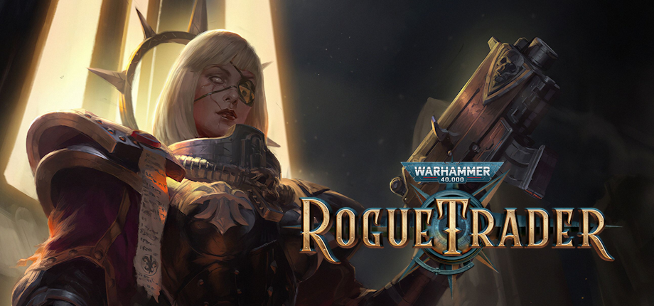
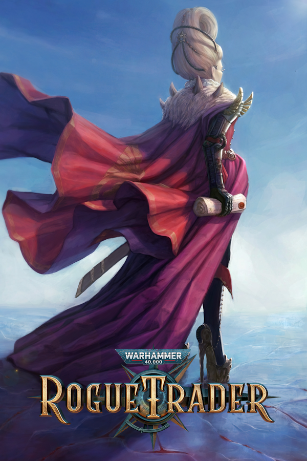
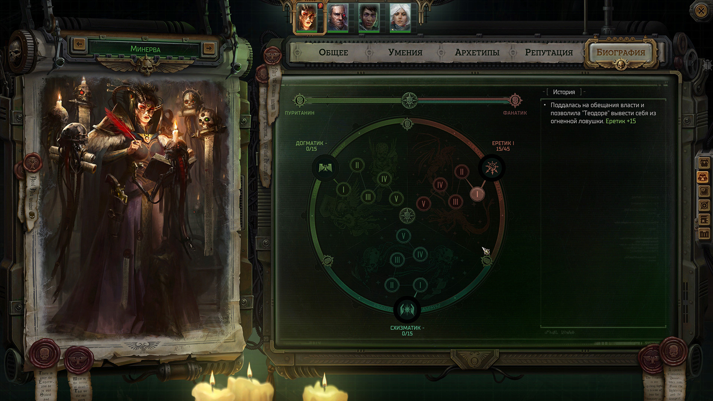
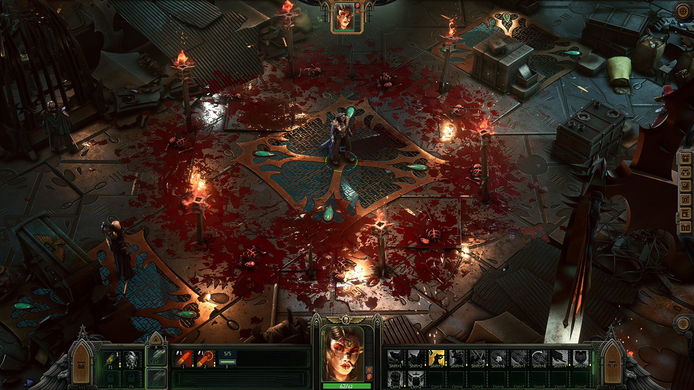
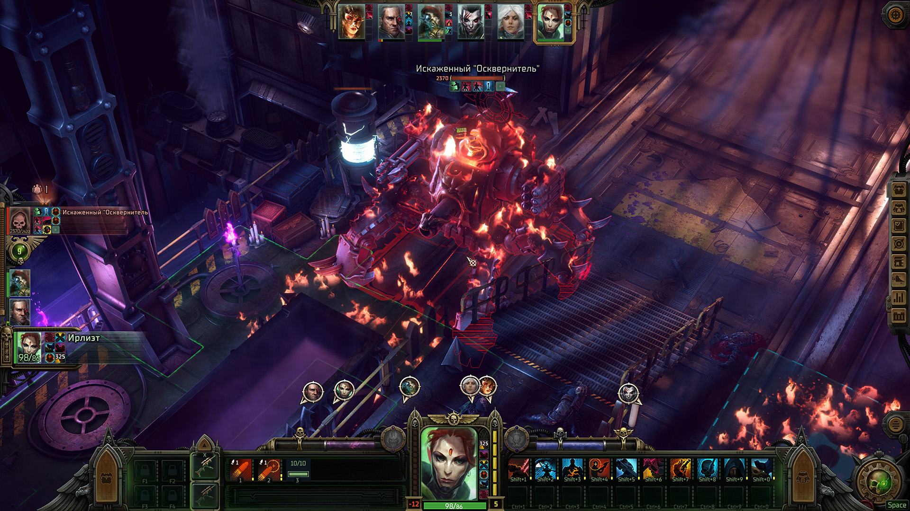

<gallery>
    
    
    
    
    
</gallery>

Игра привлекла внимание с первого же тизера.
Классная музыка, крайне необычный сеттинг, отличный предыдущий проект [студии](p:pathfinder-wotr)...
Приобрел на релизе и в тот же день начал проходить.

Rogue Trader — это дружелюбный Pathfinder в суровом и беспощадном сеттинге, в который вполне могут попробовать вкатиться не только "задроты" настолок.
Игру я вполне спокойно проходил на средней сложности.

К сожалению, после 3 главы баги перестали быть чисто-визуальными и стали напрямую ломать мою историю.
В итоге, свои последние 3 часа в этой игре я провел в устройстве отладки, вручную оперируя стадиями квестов и переменными, в тщетных попытках реанимировать основной квест за Еретика. Пациент оказался скорее мёртв, чем жив, после чего игру я удалил, чтобы повторно пройти ее как-нибудь потом.