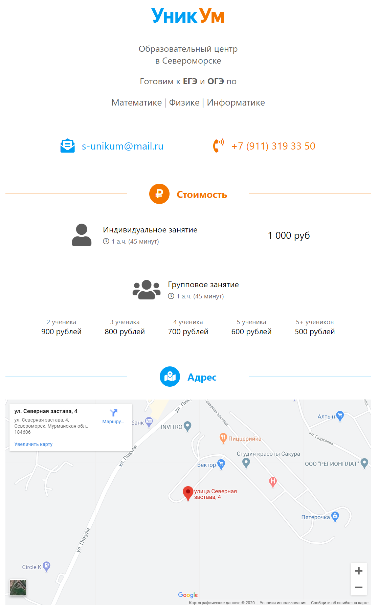

<gallery>
    
</gallery>

Во время моего пребывания в [Североморске](p:severomorsk) мой друг-репетитор Николай Нагибин попросил сделать сайт про образовательный, центр, который он собирается открывать.

Изначально планировалось сделать сайт на несколько страниц с расписанием, описанием преподавателей и так далее.
Но такая работа заняла бы относительно много времени, поэтому сошлись на одностраничном сайте-визитке.

Как и многие другие мои сайты, этот тоже является статическим генератором с файлами на GitHub, из которых после каждого коммита в репозиторий автоматически собирается сайт.