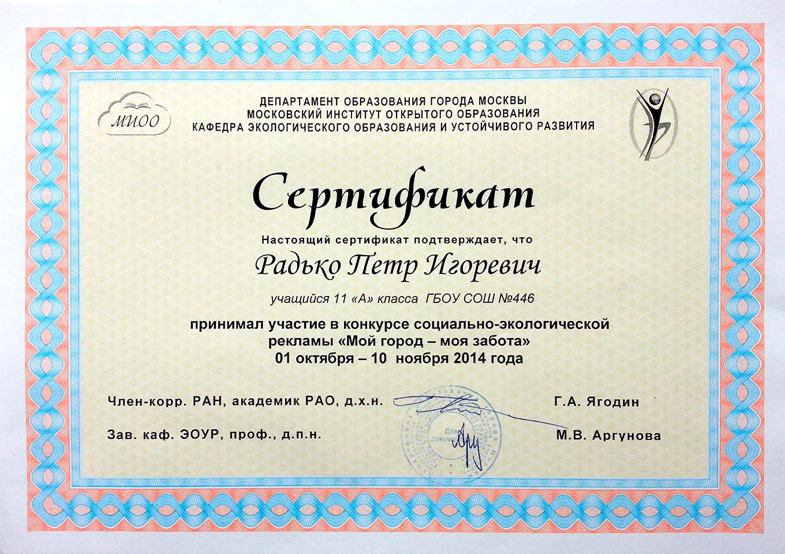

<gallery>
    
    
    
    
    
</gallery>

В старших классах я уже полностью самостоятельно занимался организацией своего школьного обучения: общался с учителями, назначал сроки сдачи и так далее.
Появилось больше свободного времени. Мне хотелось самореализовываться, пробовать себя в разных сферах.

Как следствие, я начал записывался на различные олимпиады.
Ошеломительного успеха добиться не удалось, но было интересно попробовать свои силы.
Соревнование умов гораздо спокойнее и интереснее, чем соревнование силы.