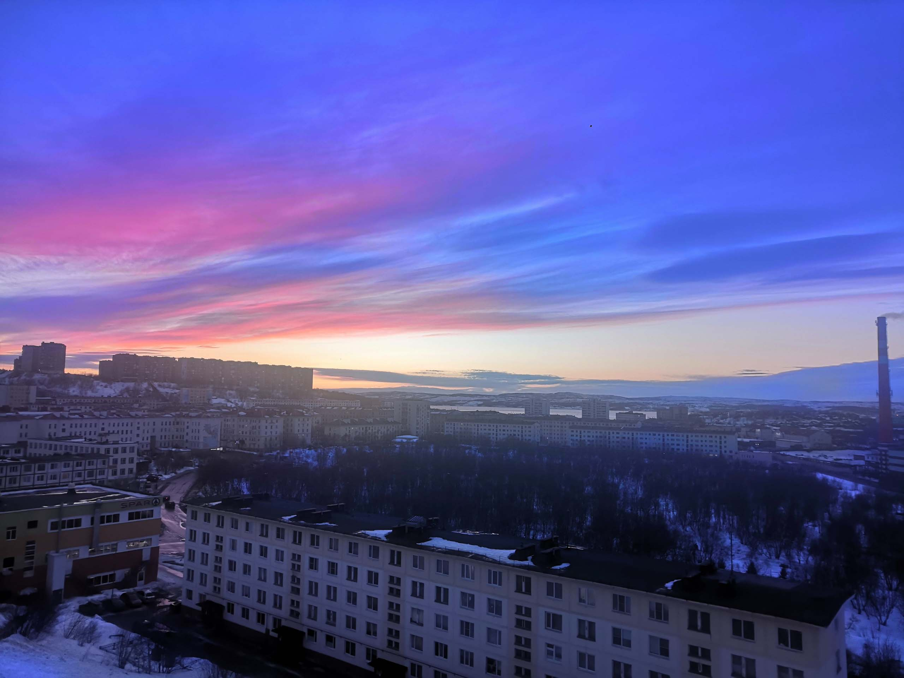
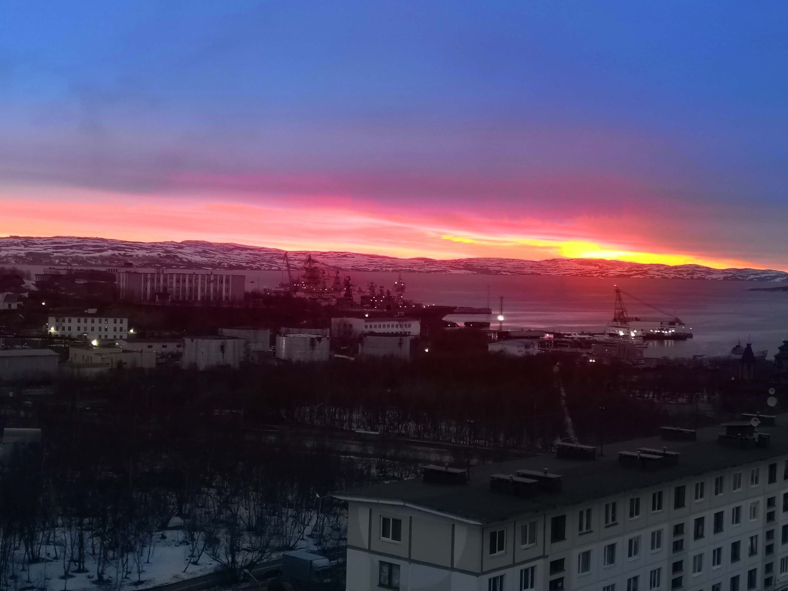
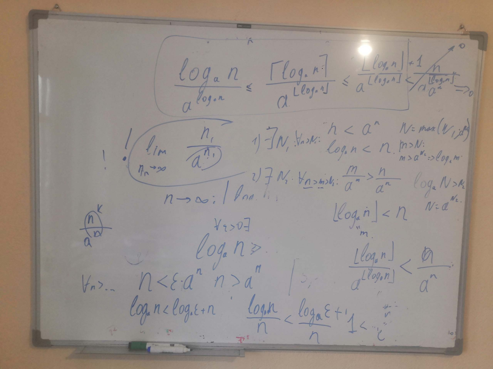
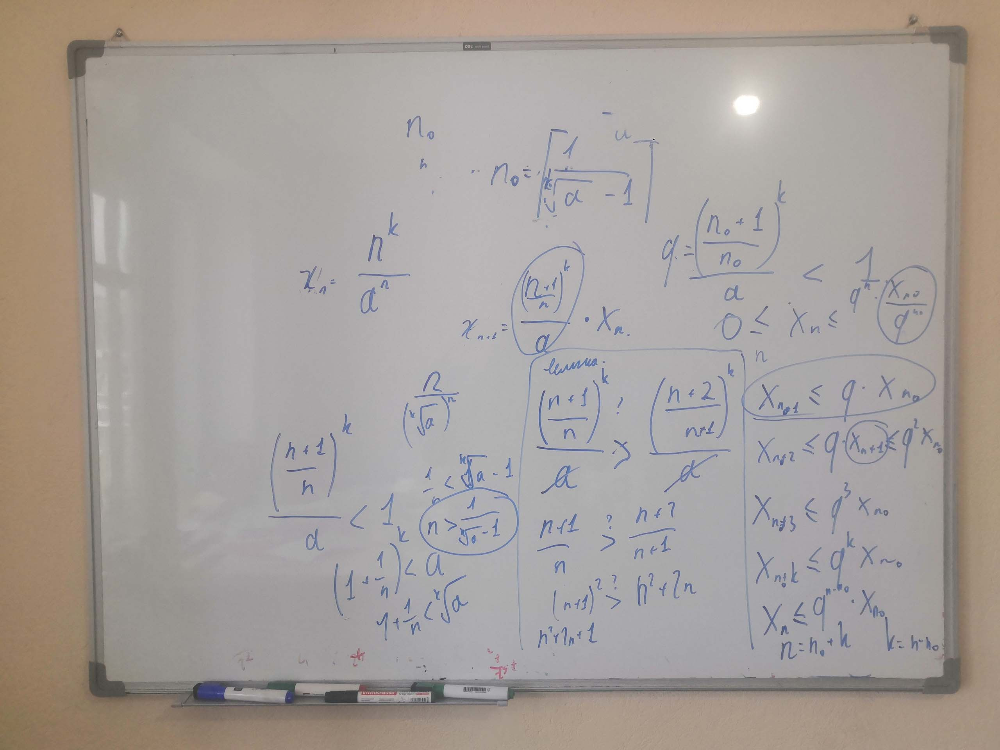
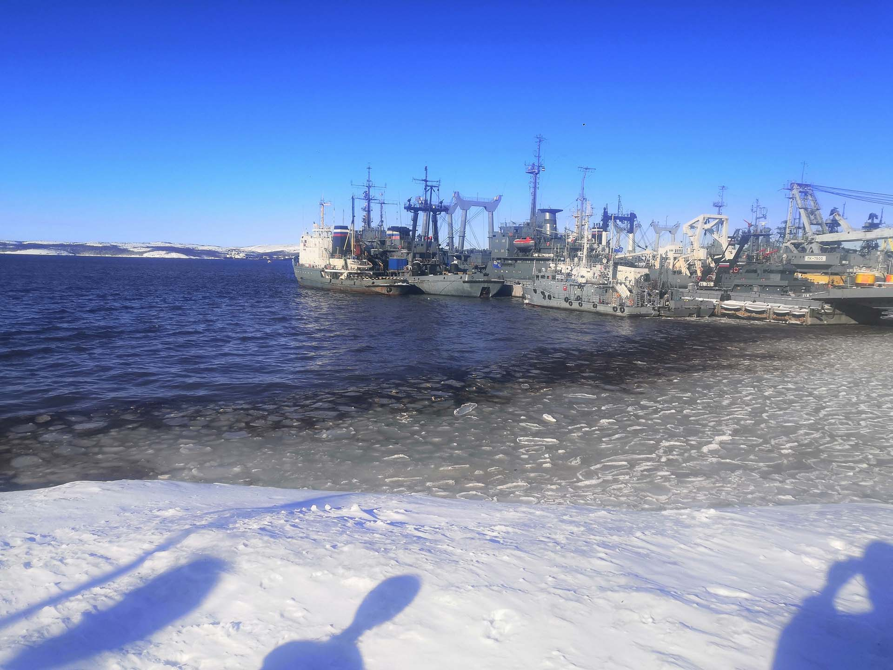
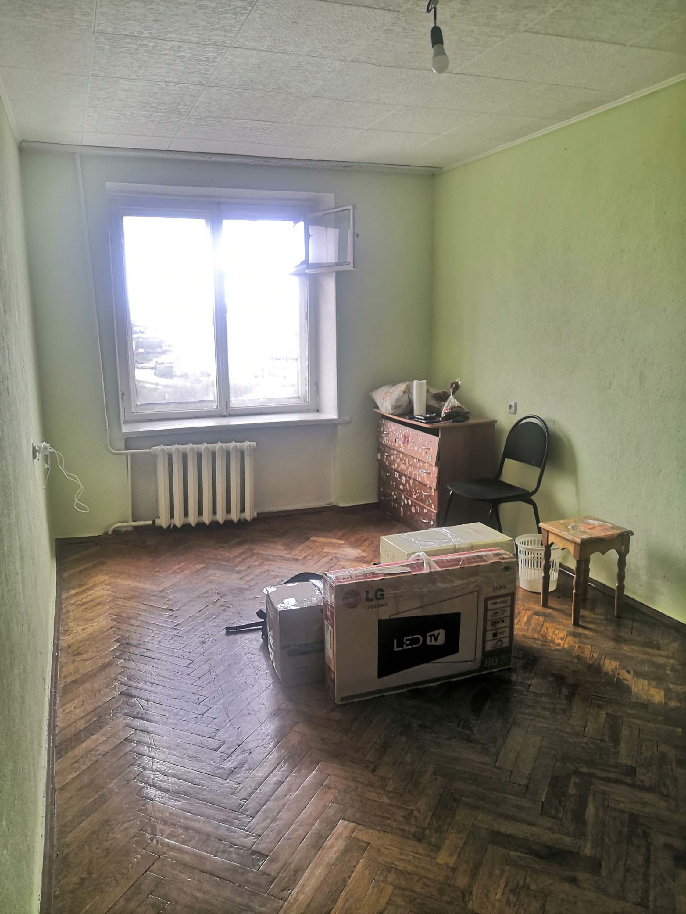

<gallery>
    
    
    
    
    
    
</gallery>

После университета мы полтора года не общались с Колей.
Когда я все же вышел на связь, оказалось, что он живет и работает в своем родном закрытом городе — Североморске.
Мне очень хотелось продолжить работать с ним.
Нечасто жизнь в качестве наставника дает крутого математика.

На связь выйти удалось, а через некоторое время появилась идея съездить прямо к нему, для повышения эффективности работы.
Своего рода образовательные командировки к наставнику.
Так и поступили. Сначала полтора месяца жил в Мурманске, потом дважды приезжал в Североморск на 3 месяца.

В рамках этих поездок мы наконец завершили тянущуюся несколько лет разработку ["Крестиков Ноликов 3D"](p:tictactoe3d).
Что еще более важно, он помог мне освоить базовую математическую логику, теорию множеств и отношений.
Построив прочный фундамент, мы взялись проходить более сложные темы, что в итоге привело к созданию ["Демидовича"](p:dodem).

В результате, я научился читать и понимать математические тексты, а также решать сложные задачи.
Более того, мне удалось уловить собственный темп прохождения материала.
Поездки и Коля в частности оказали огромное влияние на мою жизнь.