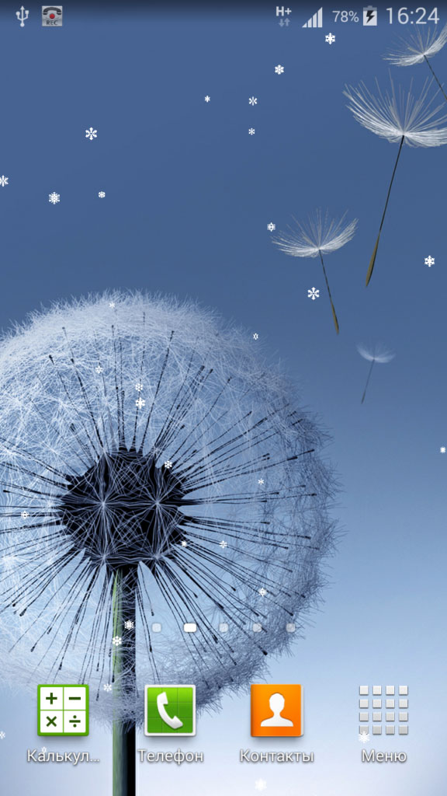
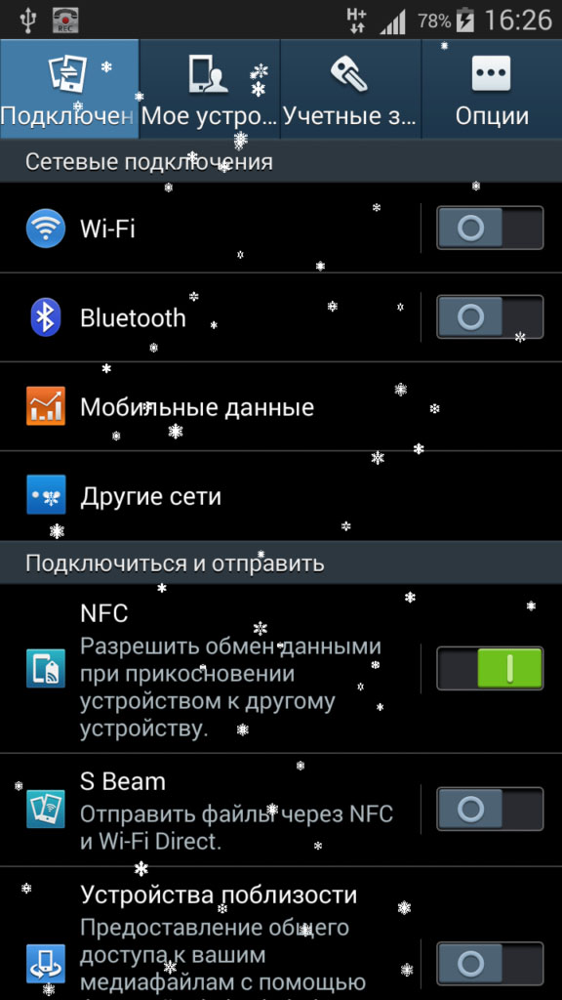
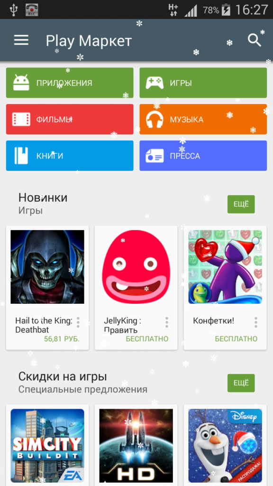
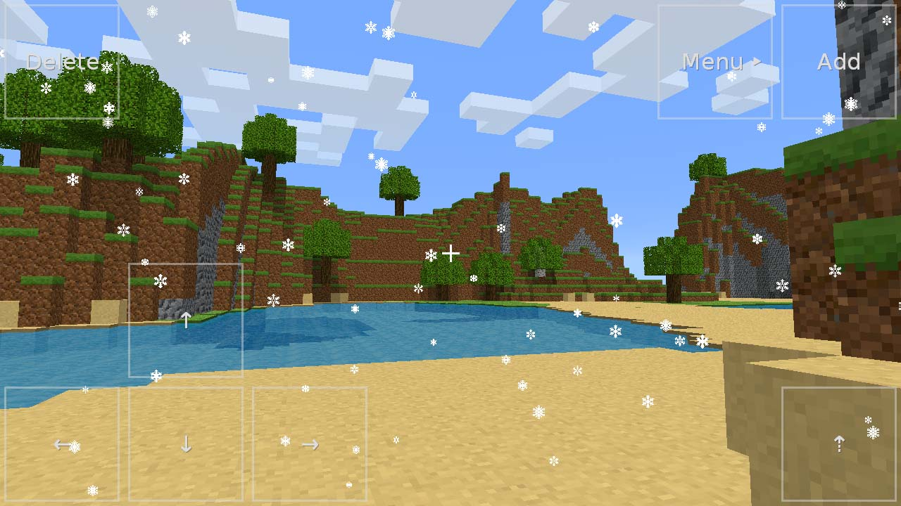

<gallery>
    
    
    
    
</gallery>

Перед Новым Годом обратил внимание, что в Google Play нет приложений, которые добавляют снегопад поверх всех активностей.
Решил занять пустующую нишу.

Во время разработки встретился с рядом проблем.
Больше всего их было с реализацией самого снегопада.
Я не осилил вращение и прошаренное красивое горизонтальное смещение снежинок.
В итоге просто сделал таймер, по которому снежинкам добавлялось смещение по X координате то в одну, то в другую сторону.

Особую поплуряность приложение не приобрело. Регулярно крашилось. Оценки были низкими.
В 2019 году обновилась политика Google Play. От меня требовалось внести небольшие изменения в приложение.
Но ключ разработчика я давно потерял, поэтому мое приложение удалили из каталога. Такая же участь позднее постигла и ["Счет в уме"](p:mental-calc).