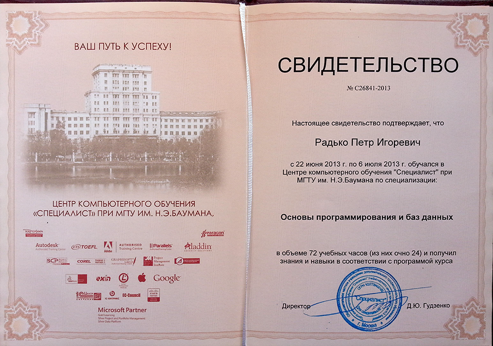
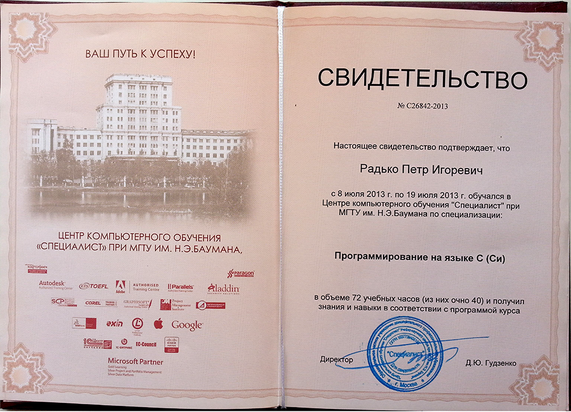
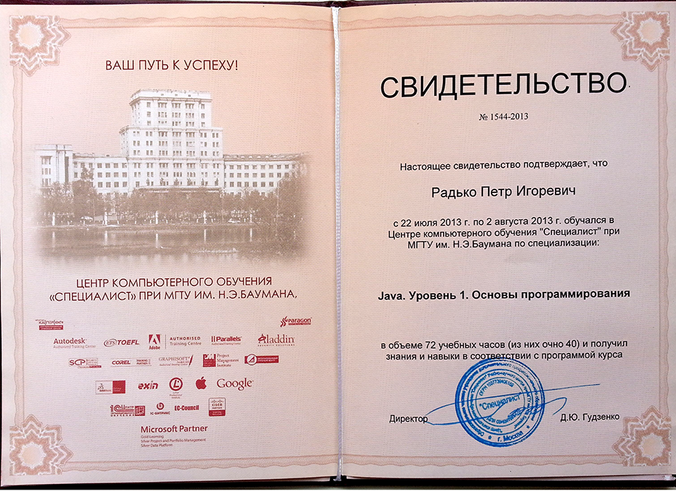

<gallery>
    
    
    
</gallery>

С книгами по программированию у меня пошло не так хорошо.
Тогда отец решил приобрести курсы по программированию из центра при МГТУ им. Баумана.
Курсы были не супер качественными, но все же оказались полезными.
Полученные знания я позднее конвертировал в серии роликов на своем основном YouTube [канале](p:youtube-cmtv).