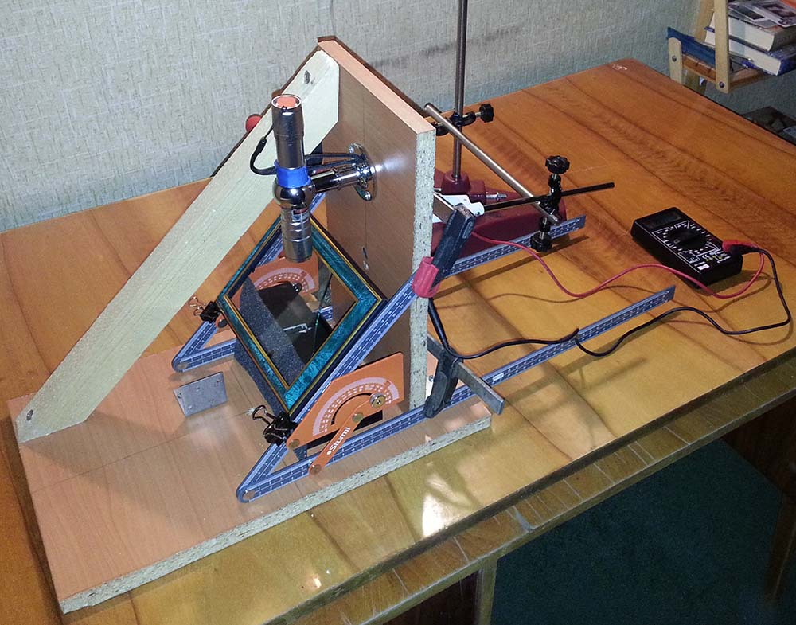
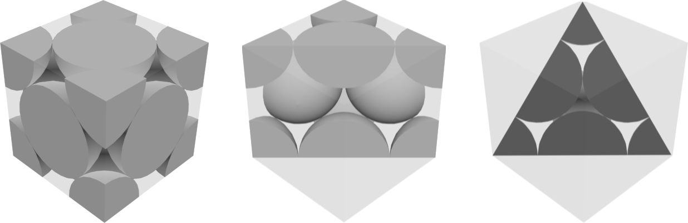
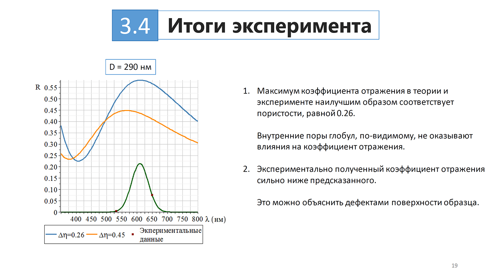
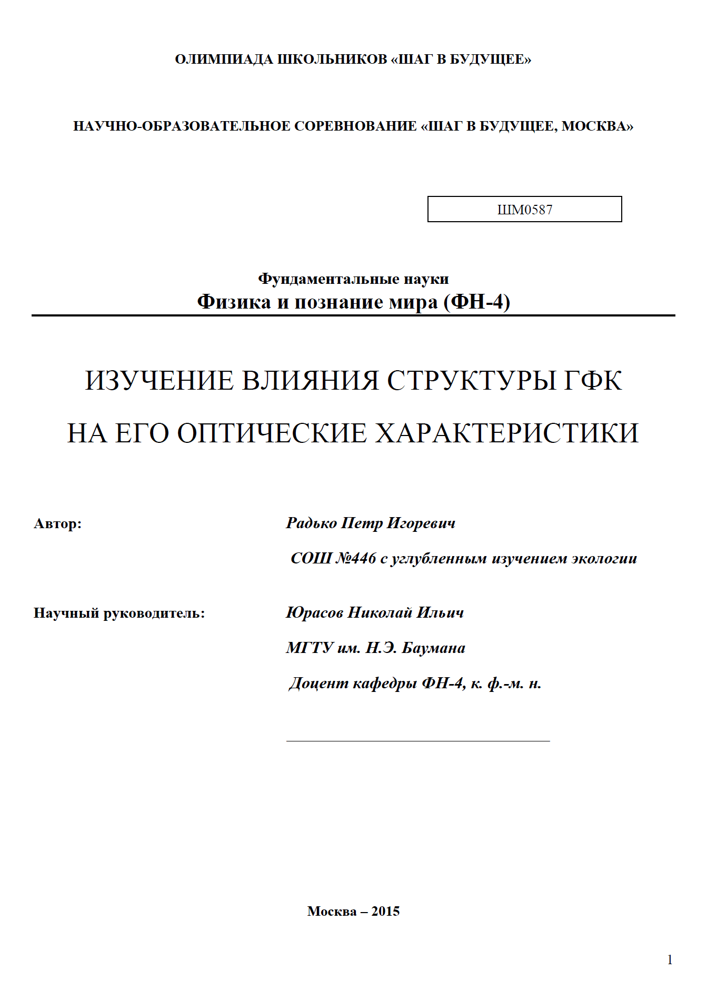
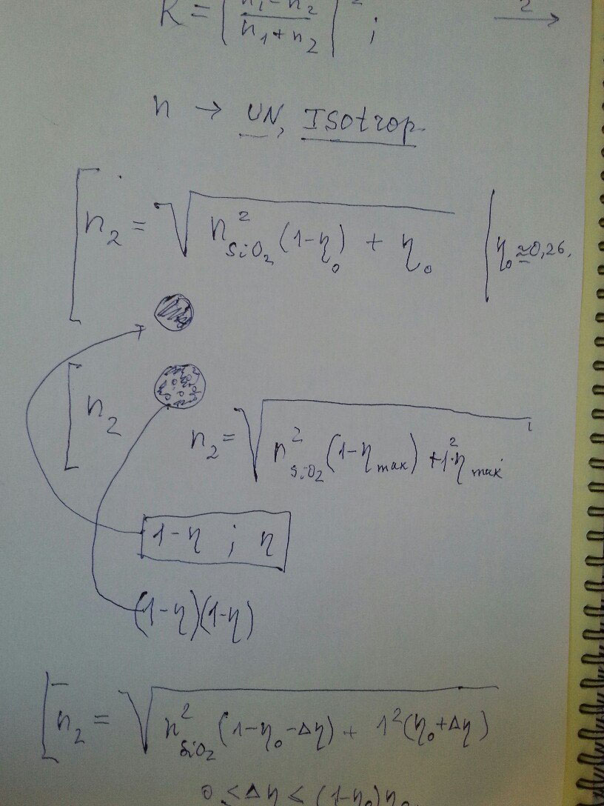
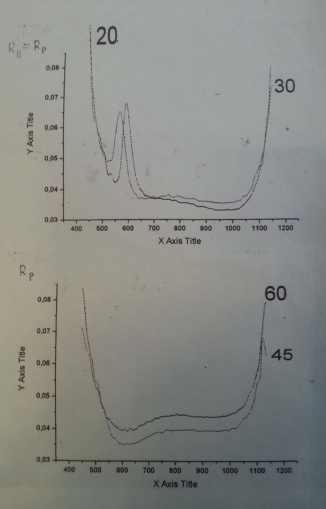

<gallery>
    
    
    
    
    
    
</gallery>

МГТУ им. Баумана проводит специальную олимпиаду "Шаг в будущее", пройдя которую можно поступить на бюджет без высоких баллов на ЕГЭ.
Олимпиада состоит из двух частей: научной работы и непосредственно олимпиады.

Вместе с научным руководителем я впервые в жизни занимался наукой: исследовал влияние структуры фотонных кристаллов на его оптические характеристики.
Собрали с отцом лабораторную установку, светили мощными лазерами на выданный образец кристалла и замеряли отраженный свет.

За презентацию и защиту научной работы я получил 50 баллов из 50.
А вот олимпиаду завалил, решив целиком только одну задачу.
Общей суммы балов не хватило, поэтому поступить в университет автоматом не получилось.