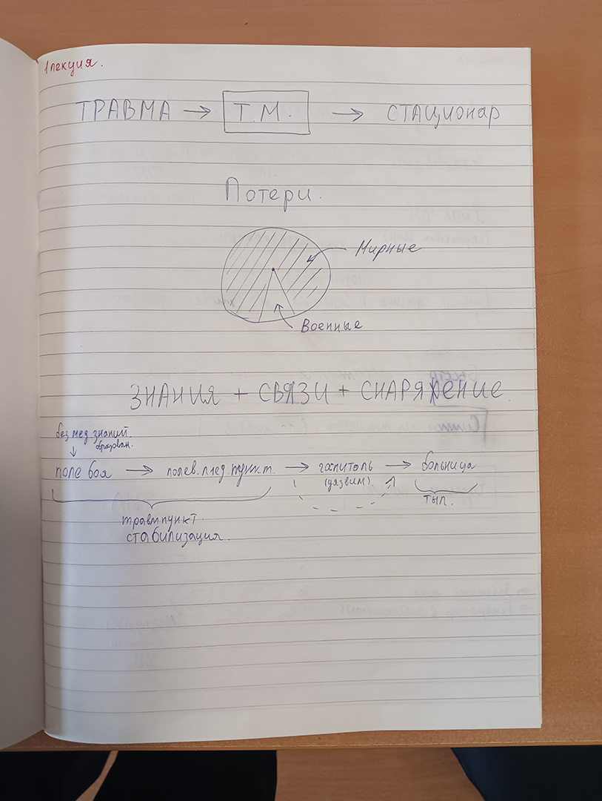
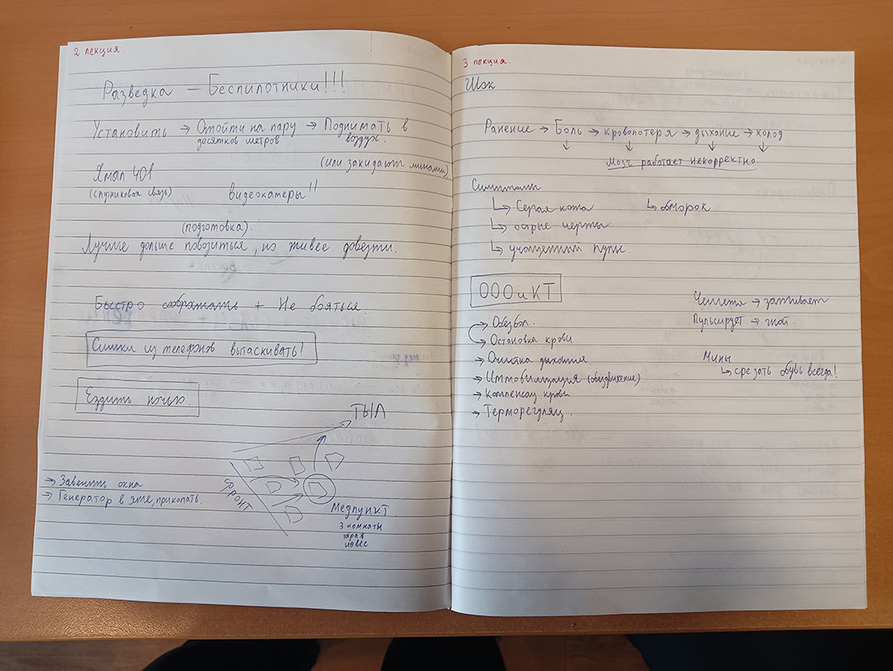
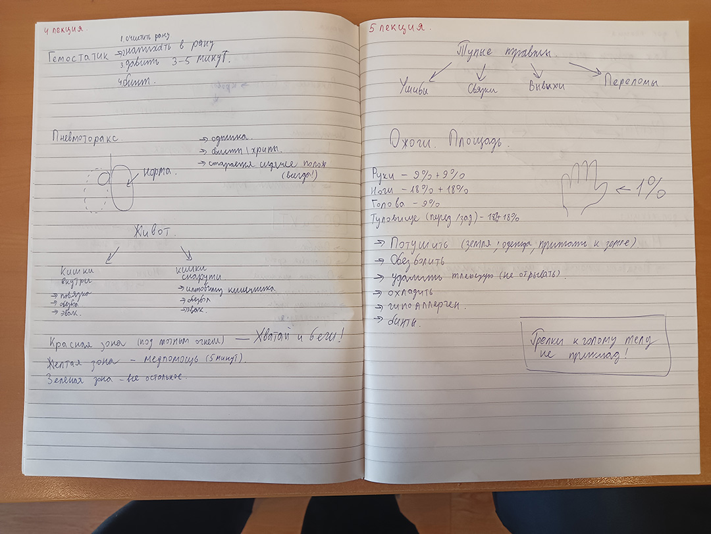
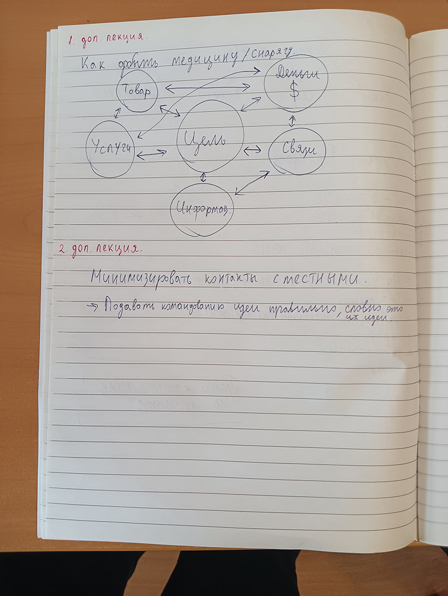

# Предыстория

Пару раз отец заводил разговор о том, что было бы неплохо пройти какие-нибудь курсы первой помощи.
Чтобы хотя бы знать, что делать в критической ситуации, чтобы спасти жизнь себе или другим.

В 2023 году, в связи с обстановкой в стране, отец предложил перейти от обсуждений к делу и записаться на курс "Тактическая медицина".
Он посвящен оказанию первой помощи в боевой обстановке.
После недолгих размышлений я согласился.

# (С 4 по 7 июня) Подготовка

<gallery>
    
    
    
    
</gallery>

После записи на курс нам прислали ссылку на подготовительные лекции.
На просмотр и конспектирование большей части этого материала ушло 3 дня.
Отец купил на Ozon защиту для коленок и локтей, тактические перчатки и пояса.

Тогда же у меня начали появляться сомнения насчет курса.
Уж слишком "военный" у него был уклон, в то время как я же в основном хотел получить знания по первой помощи в бытовой обстановке.
Как бы там ни было, деньги уже заплачены, так что проходить придется.

Меня также довольно сильно смутила излишняя "национализированность" ведущего лекций.
Кругом одни враги, "пендосы", "хохло-мутанты", "недогосударства" и прочее.
Так что ценную информацию (которой было полно) я впитывал, а идеологию и политику пропускал мимо ушей и проматывал.

# (16 июня) День 1

Встали пораньше, довольно долго собирались.
Было очень тревожно.
Не будем ли мы там в своих строительных куртках выглядеть, как белые вороны?

Сомнения довольно быстро развеялись.
Да, кто-то действительно пришел в военной форме по размеру, но было полно людей, которые вообще пришли в повседневной одежде.
После того, как я увидел девушку в легком топе без защиты коленок и локтей, я успокоился окончательно.

Весь первый день был посвящен первой помощи в красной зоне.
А состоит эта первая помощь из двух действий: наложения жгута себе и товарищам в самых разных позах и эвакуации в желтую зону.

Физически все это делать было тяжело.
Сам то падаешь на пол, то вскакиваешь на ноги.
Отрабатываешь повороты лежащих на полу тел, закидываешь их на себя, бегаешь и ползаешь с ними.
К концу дня с меня сошло 10 потов.

Для добавления стресса ведущий внезапно кидал в нас муляжом гранаты и называет раненую конечность.
Мы все падаем на пол и судорожно за 15-20 секунд должны эту конечность зажгутовать.
В первые пару раз никто в нужное время не укладывался.
Но чем дальше, тем более уверенно и быстро удавалось проводить эту процедуру.

Уже в первый день я понял, что отец не ошибся с выбором.
Каждую минуту даются очень ценные знания, которые ты прямо в тот же момент отрабатываешь на практике.

Под вечер, абсолютно вымотанный и уставший, но невероятно довольный, я упал в кровать и заснул за пару минут.

# (17 июня) День 2

На следующий день около плеч и на коленках обнаружил довольно много синяков.
Они еще дадут о себе знать.

Весь второй день посвящен действиям в желтой зоне: тампонада ран, наложение повязок, иммобилизация конечностей.
Гранаты в нас никто не кидал, тяжелых упражнений было меньше.
Но потом я обливался даже сильнее, чем в первый день.

Дело в том, что мы отрабатывали ряд приемов, для выполнения которых раненого надо было класть на колени.
И это была пытка.
У меня и так они в синяках, из-за чего очень больно просто на них опираться.
А тут в добавок к твоему весу на них сверху кладется таз другого человека.
Больно было почти до слез.

Тем не менее, я был очень доволен полученными знаниями.
На самом деле все эти приемы и действия очень простые, но их надо знать и отработать, чтобы суметь повторить в критической ситуации.

# (18 июня) День 3

Инструктора говорили, что первые два дня тяжело им, а легко нам.
А вот на третий день все будет наоборот, легко и весело будет им, а страдать будем мы.
Они не соврали.

Третий день проходил на специальном полигоне и был посвящен закреплению всех полученных навыков.
Сначала научились запихивать раненого в машину.
А весь оставшийся день потратили на отработку типовой боевой ситуации: группа из четырех человек продвигается вперед, разведчика ранят, он жгутуется, его на стропе вытягивают, эвакуируют в желтую зону, оказывают первую помощь, эвакуируют в зеленую зону.

Эту ситуцию надо было отработать 4 раза.
Причем каждый раз обстановка все хуже -- ранений больше и они более тяжелые, гранаты прилетают чаще.
Последние два захода перемещаться можно только лежа.

Все время, пока отрабатываешь, вокруг тебя ходят инструктора.
Орут и стреляют над ухом холостыми патронами.
Поначалу от каждого выстрела вздрагиваешь, но довольно быстро привыкаешь.

В полевом госпитале (большая палатка) хаос и куча народу, кого-то заматывают и готовят к окончательной эвакуации, кто-то учится ставить капельницу, кто-то отрабатывает СЛР.
Периодически внутрь залетают гранаты и все тут же кидаются на пол.
Ощущения, словно на реальной войне в лагере находишься.

Никакой травы и газона -- только щебенка.
Китайская защита такого напряжения не выдержала -- один из моих налокотников раскололся.

Этот день -- кульминация физического напряжения.
Утром все заряжены энергией и готовы ко всему.
Но вечером, на 4 заходе, все просто умирают.

Так сильно я не уставал никогда.
Тянешь человека по земле стропой, потом тащишь его на себе, затем тащишь уже лежа.
Глаза из орбит вылазят.
Адреналина хватает на пару десятков секунд, потом просто все конечности отнимаются.

Но, несомтря на смертельную усталость, впечатления невероятные.
Они со мной останутся на всю жизнь и точно не забудутся.

# Про национализм и жестокость

После третьего дня я наконец начал понимать, что регулярная жизнь в обстановке, похожей на третий день курса сильно меняет тебя.
Ты выкладываешься на максимум, из последних сил тянешь товарищей, совершаешь марш броски и все это под аккомпанемент из звуков выстрелов и взрывающихся гранат.
Кто-то умирает у тебя на руках...

В таких условиях еще вчера незнакомые люди быстро становятся товарищами.
Все разговоры и полутона уходят, остаются только "мы" и "враги".
Отсюда и все эти "пендосы", "хохло-мутанты" и прочее.
Проблемы нужно решать быстро и решительно.

Когда такие люди возвращаются в мирную жизнь, им становится очень тяжело.
Бюрократия, задержки, безотвественность, непонимание.
Все это раздражает, бесит, вызывает желание схватить автомат и дать очередь в воздух...