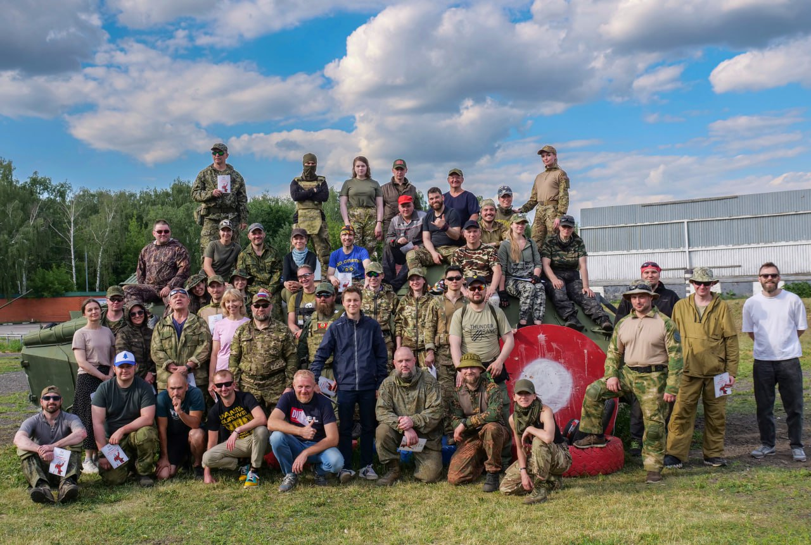
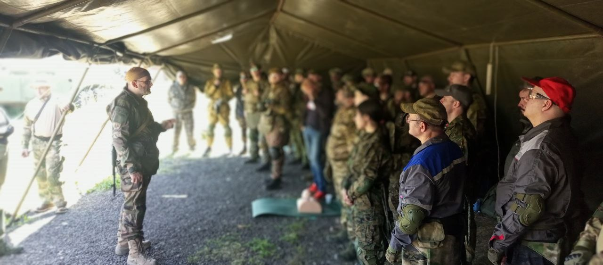
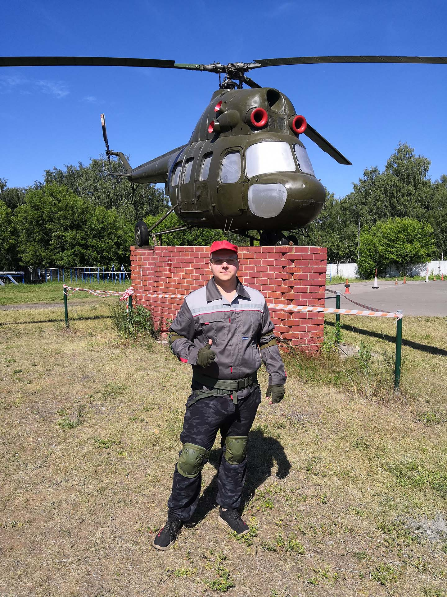
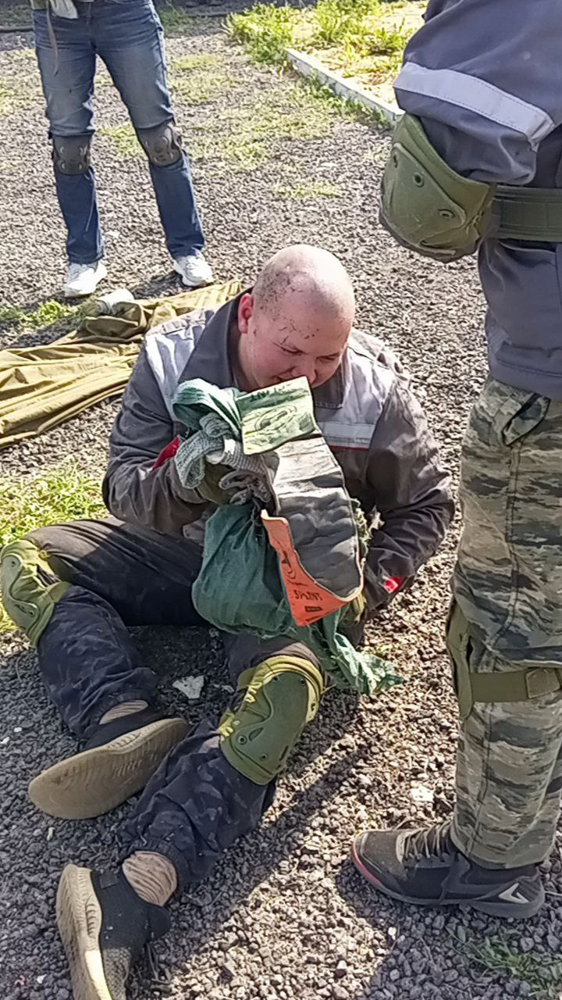
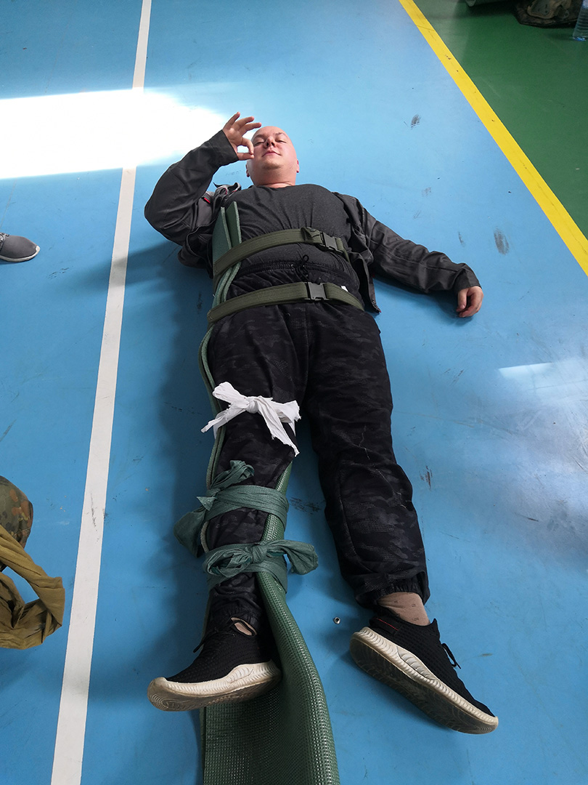
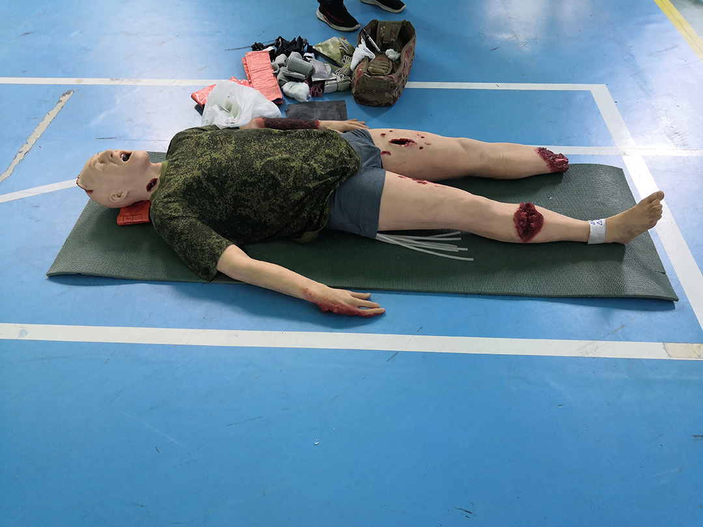
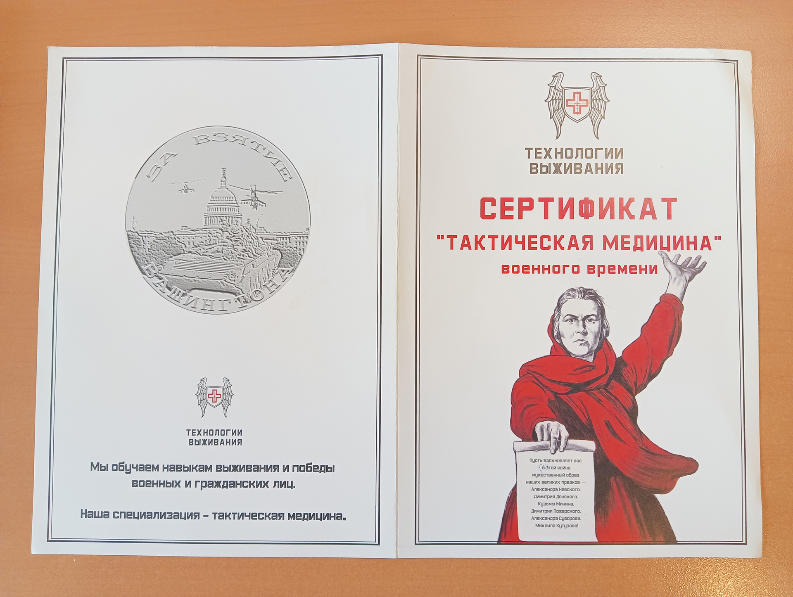
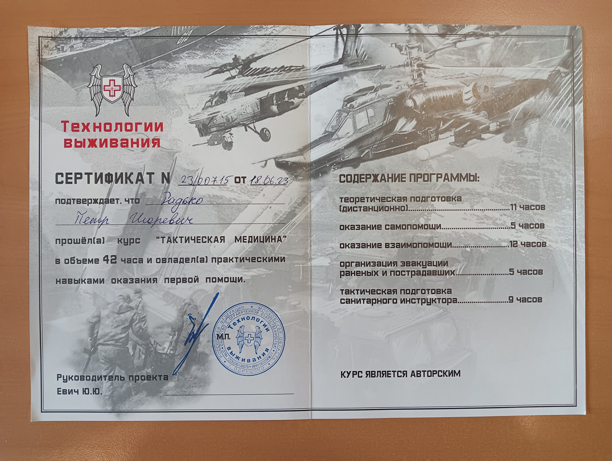

<gallery>
    
    
    
    
    
    
    
    
</gallery>

Частенько думал о том, что неплохо бы освоить первую помощь, что бы в критических ситуациях не стоять столбом и суметь спасти жизнь себе и другим. "Мечта" сбылась и теперь я действительно могу оказать помощь даже в самых суровых условиях и в любой позе: стоя, сидя или лежа.

Ну а вместе с бесценными знаниями на этом курсе я устал так, как еще никогда не уставал, получил невероятное количество положительных впечатлений и, кажется, понял и ощутил, как и почему война меняет людей.