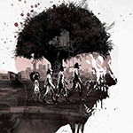
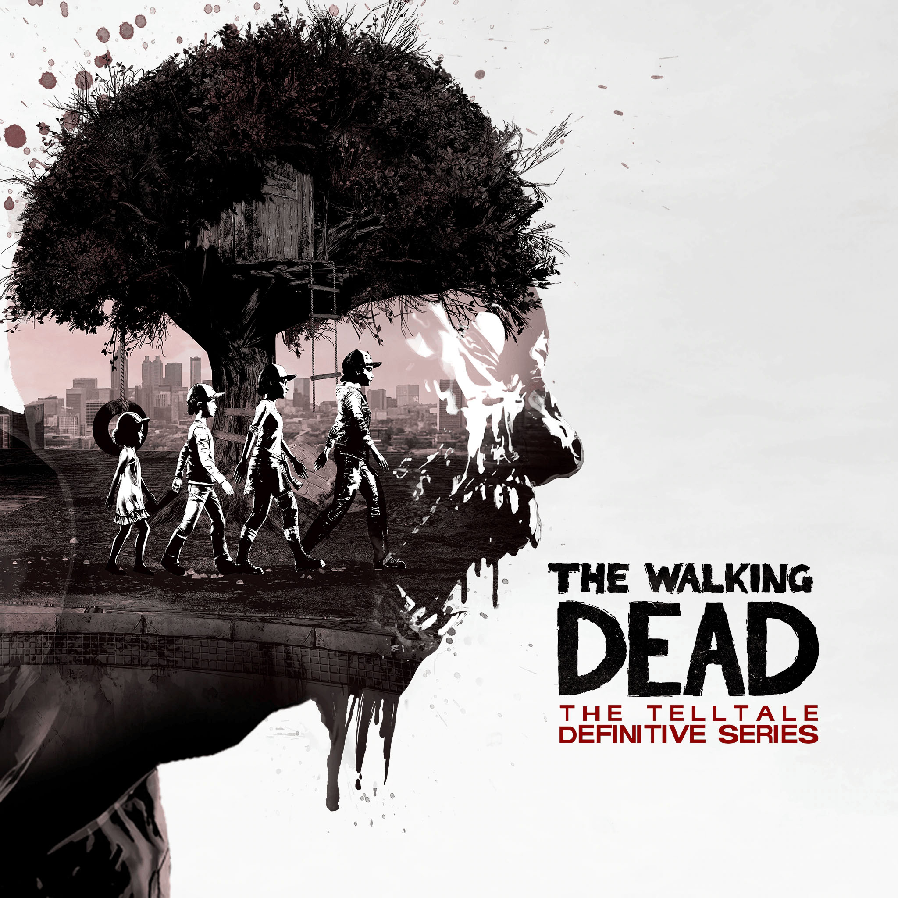

# (29 октября 2021) Первый сезон

Даже слова трудно подобрать, чтобы описать все те эмоции, что я испытывал во время прохождения первого сезона.
Это шедевр, который в нужных местах умеет развеселить, напугать и, конечно же, заставить горько грустить, даже плакать.

5 эпизодов, 5 разных историй, в которых строятся отношения между Ли и Клементиной.
Ты узнаешь ее, а она тебя, своим поведением показываешь ей пример, учишь выживать, проходишь через огонь и воду.
Между вами образуется тесная связь. И возникает ощущения, что уж вам двоим все нипочем.
И оттого разрыв этой связи в последнем эпизоде настолько мучительно грустный.
Еще столько вещей, которые они не обсудили, столько уроков, которые она не усвоила...
Формула концовки достаточно очевидная — но работает великолепно. Если бы в доме я сидел один, точно пустил бы слезу.
Очень на сердцо надавила и песня в титрах: Alela Diane - Take Us Back.

Отдельно очень по сердечку ударила ситуация с Карли. В первом эпизоде ты спасаешь ее от смерти.
Затем строишь с ней отношения вплоть до третьего эпизода. И вот она уже признается тебе в чувствах, и через
час с небольшим получает получает пулю в голову. Да, это типичная стратегия в духе "Игры Престолов", когда
тебе показывают классного персонажа, дают проникнуться к нему чувствами, а затем быстро, почти мгновенно, убивают его.
Но это работает.

Немного впечатление подпортил дерьмовейший перевод, из-за которого в паре мест я принимал не те решения, которые хотел.
Поэтому, последний эпизод я проходил уже на купленной Steam версии с исправленным переводом от Tolma4 Team. Заодно и забористые матюки
появились.

# (30 октября 2021) Второй сезон

Хочу отметить действительно мощный первый эпизод. Погоня, борьба с собакой, недоверие встреченной группы людей, ночь в сарае,
самостоятельное накладование шва на укус. Прямо ощущаешь враждебость нового мира во всем: в природе, в животных, в людях и только в последнюю очередь в зомби.
Градус напряжения немного спадает в остальных эпизодах, когда мы попадаем в группу людей.

Очень щемит в сердце, когда уже от лица Клементины рассказываешь о Ли. О том, как он помогал, как спас, как пришлось его убить.
Было приятно, когда Кенни тоже о нем вспомнил. Такие моменты делают историю целостной, строят эмоциональные мостики между первым и вторым сезонами.

Концовка первого сезона была мощной, но выбор там был чисто символический. Ли в любом случае уже мертв.
Можно лишь подарить ему быструю смерть. А вот во втором сезоне выбор очень тяжелый и неоднозначный. Его действительно не хочешь совершать.
Приходится решать, кого из двух сцепившихся друг с другом неплохих людей убить. Красиво поставлен и сам выбор. Можно либо застрелить Кенни,
либо закрыть уши и отвернутся, но это никому не поможет. Тогда он убьет Джейн. Пришлось стрелять. Суку Джейн я тоже послал подальше. Она
заставила меня застрелить лучшего друга, чтобы доказать свою правоту. Она его убила моими руками.

Сильно бесит только одно. Начиная с 4 эпизода становится понятно, что на меня повесят еще одного спиногрыза. Я всеми силами старался от него избавится,
но игра просто не дает этого сделать. Очень боюсь, что в следующем сезоне история плавно скатится в очередные сисипусечки с очередным ребенком.
Мне бы хотелось, чтобы история развивалась вокруг взросления и становления самой Клементины и только ее. Посмотрим, как они разыграют карты с этим ребенком...

# (1 ноября 2021) Третий сезон

Начало первого эпизода третьего сезона мне не очень понравилось. Новые персонажи, новые проблемы. К тому же, в этом сезоне я умудрился два раза
тупо застрять из-за коряво расставленных триггеров. Приходилось загружать чекпоинт. Короче, впечатления были не самые приятные ровно до того момента,
пока не появилась Клем. Во-первых, нарисовали ее модельку действительно очень красиво. Во-вторых, с ее появлением все события сразу стали ближе к сердцу, не такими чужими.

Интересный факт. На протяжении всего сезона подавляющее количество игроков делали выбор в поддержку Клементины, даже если сам этот выбор
достаточно сложный. Это и понятно. Мы заботились о ней в первом сезоне, играли за нее во втором. Понятное дело, что мы заботимся о ней и в третьем.

Сезон получился неплохой. Любовный треугольник, два брата с разным мировоззрением, акцент не на личном выживание, а на проблемах соцуима.
Мне даже удалось получить позитивную концовку, умерло не так много хороших людей. Город спасли, новую жену сохранили, сделали Клементину "супер крутой".

# (3 ноября 2021) Четвертый сезон

<gallery>
    
    
    
</gallery>

В целом видно, что разработчики выложились на максимум в последнем сезоне: бесподобная графика, прекрасная музыка, мощные постановка и диалоги.
Впечатлений по этому сезону осталось очень много, поэтому самые основные я решил разбить блоки.

## Технологический скачок

Визуально четвертый сезон очень сильно отличается от всех предыдущих.
Модели стали детализированнее, освещение — реалистичнее, локации — поработаннее, и доверху набиты разными объектами.
Сильно улучшена и постановка. Движения камеры и ракурсы прямо как в настоящем кино. Начало первого эпизода вообще напоминает крутейшие экшен сцены из
каких-нибудь Uncharted или The Last of Us.

{: style="max-width: 300px" }

## Заставка

Отдельно хочу упомянуть про заставку, которую показывают в каждом эпизоде, прямо как в настоящих сериалах.
И эта заставка прекрасна. Красивая мелодия, необычная стилистика, а самое главное — ее посыл.
Сквозь ужасных монстров, которые почти уничтожили человечество, постепенно начинают прорастать цветы, цветы жизни, новое поколение людей.
Мир людей изменился до неузнаваемости, но не был уничтожен, и теперь он вновь в буквальном смысле прорастает сквозь зомби, сквозь смерть.

{: .w8 .invertable }

Мелодия в заставке: The Be Good Tanyas - "Waiting Around To Die".

## Концовка

Весь последний сезон я размышлял о том, как же он завершится.
Исходя из общей мрачности предыдущих сезонов, я думал, возможно только два варианта: меня укусят в попытке спасти Элвина, либо дадут выбор — пожертвовать им или собой.

Как же мне стало больно, когда игра пошла по первому варианту. В первом сезоне мне ценой огромных усилий удалось сдержать слезы.
Но в этот раз сил у меня не хватило и финальный (как мне казалось) диалог в конюшне меня сломал, ответы я выбирал сквозь льющиеся слезы.

За 4 сезона моими усилиями Клементина превратилась из незнакомой и милой маленькой девочки в
родного человека, в семью. Я направлял ее в ужасном новом мире, был рядом в самые трудные и болезненные моменты, помог ей повзрослеть и стать правильным (в моем понимании) человеком (помог ей стать мной?).
И вот теперь игра заставляет меня руками Элвина убить родного человека, причем даже не застрелить, а зарубить топором, потому что патроны кончились. Разработчики
в этом кульминационном моменте просто бросают меня в пучину горя и безысходности, ведь он убивает не только ее, но еще и меня, так как за 4 сезона она стала мной, а я — ей...

Список:

* Первый элемент
* Второй

Жестокий цикл ужасного мира зомби апокалипсиса замкнулся. Ли заражается, спасая Клементину, и она убивает его в конце. Клементина заражается, спасая Элвина, и он убивает ее в конце.
Если бы игра завершилась на этом моменте, то у нас получилась бы этакая "Зеленая миля" от мира компьютерных игр. Ожидаемая и неотвратимая, грустная концовка.
Но игра на этот моменте не заканчивается...

Дальше нам показывают эпилог, уже от лица Элвина.
Признаюсь честно, этот паренек все же понравился мне, но из-за гибели Клем в душе осталась пустота.
Эту пустоту усиляет и грустная музыка, такая же, как и в титрах в конце первого сезона.

<gallery>
    
    
    
</gallery>

Как же я удивился, когда на дворе школы вновь услышал ее голос. Я сналача подумал, что это что-то вроде образа в голове, как было у Клем с Ли.
Но потом камера меняет ракурс и я вижу ее... В этот момент пустота и печаль ушла и я буквально стал счастлив! Она жива!
Элвин действительно замахнулся топором и ударил. Но не по голове, а по укушенной голени. Он спас Клементину!

Я считаю, что концовка получилась гениальной. Сначала разработчики реализуют самый страшный и грустный вариант событий, буквально убивая
тебя внутри вместе с убийством Клементины. А потом оказывается, что пацан не выполнил свое обещание добить ее, а наоборт, решил спасти.
И этим действитем он спасает и тебя, как игрока. Мы получили одновременно и грустный и счастливый варианты концовки!
Элвин и Клем живы, счастливы и нашли настоящий дом. Лучше способа завершить историю Клементины и не придумаешь!

# (4 ноября 2021) Ощущения после

Поздним вечером, уже после завершения последнего эпизода, на кухне я снова плакал. Просто от переполнявших меня эмоций от всех сезонов.

Весь следующий день были очень странные ощущения. Смесь грусти и опустошенности.

Вечером я начал думать, во что бы поиграть. И заметил, что надо бы добить все достижения. Но для этого нужно по новой пройти эпизоды первого сезона.
И тут я поймал себя на мысли, что я не хочу запускать первый сезон. Не хочу смотреть глазами Ли на Клементину, которую впереди ждут столько боли и страданий...

Я так и не смог заставить себя запустить игру. Как-будто цепенел. Забавно это говорить, но я будто боялся ее снова запустить.
Может быть, игра нанесла мне своего рода психологическую травму. Пишу и сам улыбаюсь тому, как это выглядит: "игра настолько хороша, что психологически травмировала меня!".

Таких игр я еще очень долго не увижу, если это вообще когда-нибудь произойдет.
Другие игры тоже запускать не хочется. Какая-то пустота внутри. И есть четкая уверенность, что никакая другая игра эту пустоту не закроет...

Попытался смотреть всякие ролики, но эмоций нет. Они куда-то ушли. Видимо, они все ушли на вчерашний вечер со слезами...

# (6 ноября 2021) Обзор в Steam

Настоящий бриллиант от мира видеоигр прошлого десятилетия (2012 - 2019), в который обязан сыграть каждый уважающий себя геймер.

Вместо упора на геймплей (которого тут почти нет) разработчики полностью сконцентрировались на создании цепляющей трагической истории, давящей атмосфере зомби апокалипсиса, проработанных персонажей, мощных диалогов и множестве тяжелых выборах, которые вам предстоит совершать... а потом жить с их последствиями. И в этих аспектах "Ходячие мертвецы" настолько хороши, что и сравнивать особо не с чем.

**Предупреждаю!** На протяжении всех 40 часов игра регулярно будет наносить вам душевные травмы и шокировать. Она прекрасно знает, как и когда ударить вас по сердцу так, чтобы вам стало больно. Нередки будут ситуации, в которых вы будете вынуждены выбрать один из нескольких ужасных вариантов. Иной раз от жестокости и беспощадности происходящего вообще кровь стынет в жилах. Ну а финал истории заставит вас плакать. По крайней мере, мне сдержать слезы не удалось :)

Дерзайте!

P.S: Оригинальный перевод первых трех сезонов ужасен, содержит кучу ошибок, местами теряет связь с контекстом, а порой вообще напоминает машинный! А вам по этим диалогам придется решать, кому жить, а кому умереть! Поэтому, обязательно установите русификатор от Tolma4 Team! Заодно и забористый мат появится, которого в игре просто навалом.

# (8 ноября 2021) Сезон про Мишонн

Ожидания от этого мини-сезона у меня были низкими. По отзывам все плохо, да и народ особо пробовать не рекомендовал.
Но все достижения получить надо, поэтому я приступил к прохождению.

На самом деле, очень даже неплохая история. Ничего оригинального, но после каждого эпизода было интересно, что будет дальше.
Очень красивые экшен сцены. Неплохая идея с постоянными флешбеками. Интересный основной конфликт.
Потраченного времени не жаль.