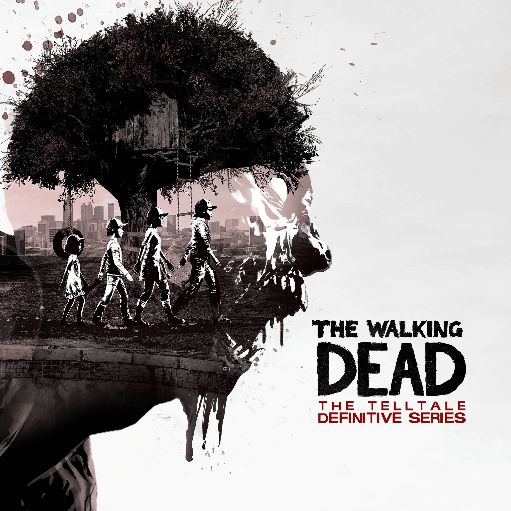

<gallery>
    
    
    
    
    
</gallery>

Невероятная история взросления Клементины в жестоком и беспощадном мире зомби апокалипсиса.
По мере развития сюжета настолько привязываешься к ней, что в какой-то момент начинаешь
воспринимать ее как своего ребенка. А затем как часть самого себя. А потому ее боль и страдания
воспринимаешь, как свои собственные.

Игр с более тяжелыми и сложными выборами я еще не встречал.
Никогда бы не подумал, что в игре про принятие решений будут ситуации, в которых
эти решения принимать не хочешь, потому что любой вариант приведет к боли и страданиям.

Одна из лучших игр, в которые я когда-либо играл. Игра, в конце которой я плакал...