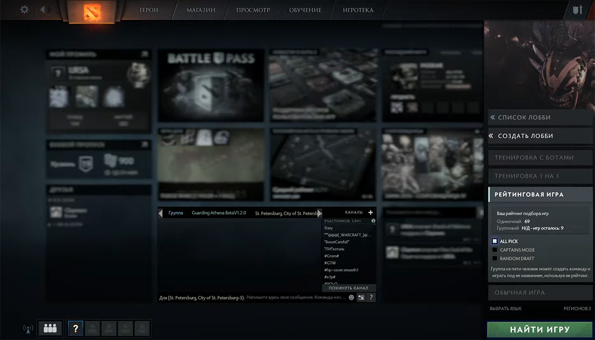
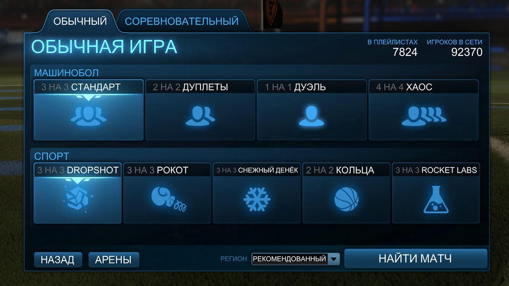
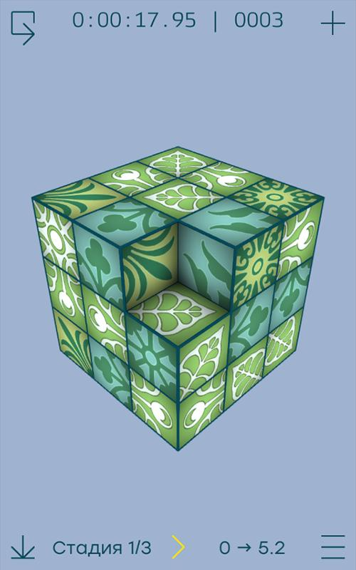
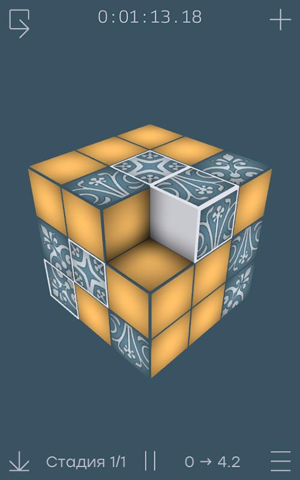
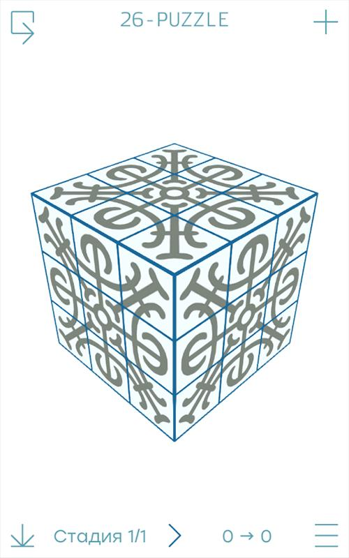
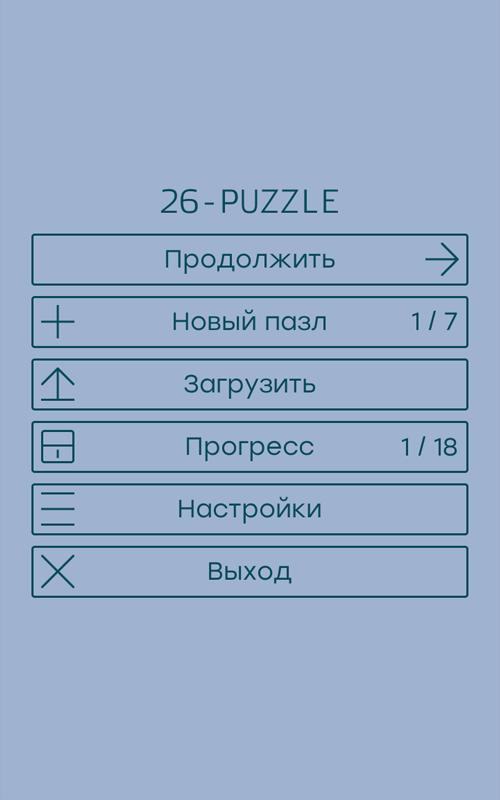

# Идея игры

Долгое время игра провела просто в голове в виде концепта, который мы с отцом придумывали на ходу во время прогулок с собакой.

Сначала мы хотели просто перенести правила всем известных крестиков-ноликов из плоскости на поверхность куба.
В какой-то момент мы поняли, что с кубами связана не менее известная игра "Кубик Рубика".
Так появилась идея вращения граней.

Мало-помалу вырисовывался смысл игры: закрасить как можно больше кубиков, хитро используя повороты граней.

Была также идея реализовать режим испытаний, где игроку уже дается какая-нибудь игровая ситуация и требуется выполнить ряд задач соблюдая условия (например, выиграть за 3 хода).

# Источники вдохновения

Самое большое влияние на мое видение игры оказали две самые популярные мультиплеерные игры: Dota 2 и CS: GO, а также Rocket League.
Он простой, в нем невозможно запутаться и имеет интуитивные небольшие анимации.

## Игровой процесс

Основной концепт сетевой игры, соревновательный рейтинг (MMR), целиком взял из игр Valve.
Игра пытается подобрать похожего по рейтингу противника.
Победитель получает очки рейтинга, а проигравший теряет.

Формула изменения учитывает рейтинг обоих игроков.
Если слабый победил сильного, то он получит много очков рейтинга.
Наоборот, если слабый игрок проиграл сильному, то он потеряет совсем немного очков.

## Дизайн

<gallery>
    
    
</gallery>

Интерфейс в Dota 2 и CS сделан идеально.
Особенно мне понравилось, что при нажатии на "Играть" в обеих играх справа красиво выползает окно с настройками.
Можно изменить регион и выбрать режим.
Но самое главное, что кнопка "Играть" остается на месте!
То есть, если я уже ранее все настроил и просто хочу играть, мне нужно всего лишь дважды на нее нажать. Гениально!

А из Rocket League я позаимствовал подход к реализации самих настроек режимов.
Выбираешь желаемый режим. Если выбраешь сразу несколько, получишь какой-то случайно выбранный один.
Максимально просто и понятно!

# Прототипы

В марте 2018 года я впервые попробовал реализовать часть механик.
Опыта работы с Unity у меня практически не было.
Кое-как у меня получилось спрограммировать вращение куба пальцем, а также масштабирование с помощью двух пальцев.

Далее время от времени продолжал работать над прототипами на протяжении 5 месяцев.
Полученные результаты оформлял в виде небольших [роликов](https://vk.com/video/playlist/77335203_1) и отсылал их Коле.

## Необъяснимая функция

Во время поворота граней нужно перенести необходимо обновить состояния кубиков.
Я целый день мучился, пытаясь написать абстрактную функцию для игрового куба произвольного размера, которая по данным координатам кубика и направлению поворота грани высчитывает его новые координаты.

И у меня получилось! Вот только я почти сразу забыл, как именно она работает.
Уже во время полноценной разработки я использовал эту функцию как черный ящик.

## Свой движок анимаций

Мне было лень разбираться в стандартном функционале Unity по работе с анимациями, поэтому я потратил пару дней на создание своего аналога, который полностью управлялся из кода.
На его основе я реализовал все анимации в главном меню и только потом заметил, что на средних телефонах все анимации жутко тормозят, а функции Unity на самом деле простые, оптимизированные и удобные.

Пришлось вновь переписывать весь интерфес, но уже используя средства Unity.
Однако, я не жалею, что потратил время на создание своего аналога, получил ценный опыт.

## Генерация страницы настроек

Очень горжусь тем, что с помощью рефлексии написал механизм, который создает интерфейс страницы настроек игры прямо из кода, прямо как публичные переменные выносятся в инспектор Unity.

Эта технология дошла до релиза практически без изменений.

## Игра в главном меню

В процессе разработки выяснилось, что в главном кнопки у меня только сверху и снизу.
Центральная область пустует.
Решил поместить туда игровой куб, который играет сам с собой, используя цвета и наклейки игрока.

# Полноценная разработка

Работать над игрой в полную силу мы с Николаем начали после моего переезда в [Североморск](p:severomorsk).
В целом процесс шел хорошо. Некоторые особо запомнившиеся эпизоды расписал ниже.

## Усложнение правил

По мере разработки мы постоянно обновляли и усложняли правила игры.

Довольно быстро мы отказались от идеи полной закраски всех кубиков грани при завершении комбо, так как из-за такого подхода выгодно играть было только на одной грани, то есть в обычные крестики-нолики.

Другая проблема состояла в том, что механика поворота граней была не очень полезной.
Действительно, зачем поворачивать грань ради дополнительного хода, если в этот дополнительный ход ты все равно закрасишь только один кубик?
Тогда решили сделать первое вращение в ходу бесплатным, а также поставили лимит в максимум 3 дополнительных хода.

Была еще проблема с тем, что можно было войти в бесконечный цикл, постоянно разрывая и собирая одни и те же комбо с помощью поворотов граней.
Решили мы ее через глобальный счетчик комбо. Если в результате действий игрока количество комбо не изменилось, значит дополнительный ход он не получит.

## Бот

В игре есть режим одиночной игры против самого телефона.
Сначала мы хотели обучить полноценную нейросеть, но быстро от этой идеи отказались, так как ни я, ни он не имели достаточных знаний по этой теме.

В итоге остановились на том, что легкий бот просчитывал все возможные ходы без учета вращения граней и с некоторой вероятностью выбирал оптимальный вариант.
Средний бот делал то же самое, но уже с учетом вращения граней.
Наконец, сильный бот практически никогда не ошибался и выбирал самые выгодные варианты в рамках одного хода.

Мы очень много времени потратили на то, чтобы проверить, действительно ли он играет по правилам.
Правила были сложными, а некоторые его ходы были совсем странными.
Дошло до того, я выводил целый список всех возможных ходов с расставленными приоритетами.

Бот получился добротным. Сложную его версию даже Коля обыгрывал с трудом.

## Неуловимая ошибка

Уже на финишной прямой мы заметили странные ходы нашего бота.
Иногда он пытался закрашивать уже занятые кубы.
Кроме того, после поворота граней, игра заканчивалась с неверным счетом или вообще преждевременно со свободными пустыми клетками.

Сначала я пытался найти ошибку в одиночку. Но у меня ничего не вышло.
В итоге мы уже вдвоем потратили целый день на проверку каждого класса и каждой функции, которая отвечает за игровой процесс.
И нашли ошибку!

Проблема была в том, что в нашем игровом кубе отсутствует ячека в центре, поэтому формула для расчета координат ячеек, на которую мы опирались, работала нормально только для одной половины куба.
Как только требовалось получить координаты "за центром" кубика, они оказывались "смещенными" на единицу "назад".
Простое добавление +1 к координатам для компенсации отсутствующей центральной ячейки решили проблему.

## Мнимый процентный рейтинг

Нам очень понравилась идея выводить не только числовой рейтинг игрока, но еще и писать что-то в духе "Вы лучше, чем X% игроков".
Проблема заключалась в том, что составить такой процентный рейтинг можно было только имея на руках глобальную статистику рейтинга игроков.

В итоге решили схитрить. Мы прикинули, какой средний рейтинг будут иметь большинство игроков и построили нормальное распределение, по которому и рассчитывался процентный рейтинг.
Игрокам приятно видеть, что они крутые, а мы не потратили силы на создание глобального рейтинга.

# Публикация

Поздним вечером 1-го декабря работа была выполнена, игра загружена в Google Play и проходила модерацию.
Мы заказали 3 пиццы (по одной каждому и одну про запас) и две бутылки пепси.
Пиццу везли очень долго, хотя само заведение находилось в пяти минутах ходьбы от нас.
В итоге, насладиться ей мы смогли только в первом часу ночи.

Мы оба так устали за все время разработки, что во время еды больше молчали.
Все темы осудили, на все вопросы ответили.
Просто два довольных разработчика молча едят пиццу и пьют пепси...

# Планы на будущее

Мы планировали добавлять новые игровые режимы, даже специальные мини-игры.
Конечно, хотели расширить возможности и кастомизации тоже, добавить уникальные анимированные фоны и наклейки.
Но игра не выстрелила, поэтому все это так и осталось в планах.

# Ощущения от разработки

Если коротко, было очень тяжело и одновременно очень интересно!

Отдельно хочу поделиться впечатлениями от совместой работы.
Программированием занимался я, но вот ежедневные обсуждения дальнейших действий, совместное построение математических моделей, споры как лучше реализовать ту или иную систему, проверка на прочность правил игры и многое другое мы делали вдвоем.

Это был совершенно необычный для меня опыт.
Я привык работать один. В этом много плюсов.
С другой стороны, в команде можно распределять обязанности и задействовать сильные стороны каждого участника.
Так получается создавать действительно большие и комплексные проекты.

# 3D Пятнашки

<gallery>
    
    
    
    
</gallery>

Не только я в то время разрабатывал игру с большим кубом в главной роли.
Мне удалось сагитировать Liahim, одного из создателей Minecraft модов и пользователей проекта [MC Modding](p:mcmodding), создать и свою игру тоже.
Он решил перенести пятнашки из плоскости на поверхность куба. [Игра](https://play.google.com/store/apps/details?id=com.liahim85.puzzle26) получилась классной. Скачиваний у него больше, чем у нашей игры. 