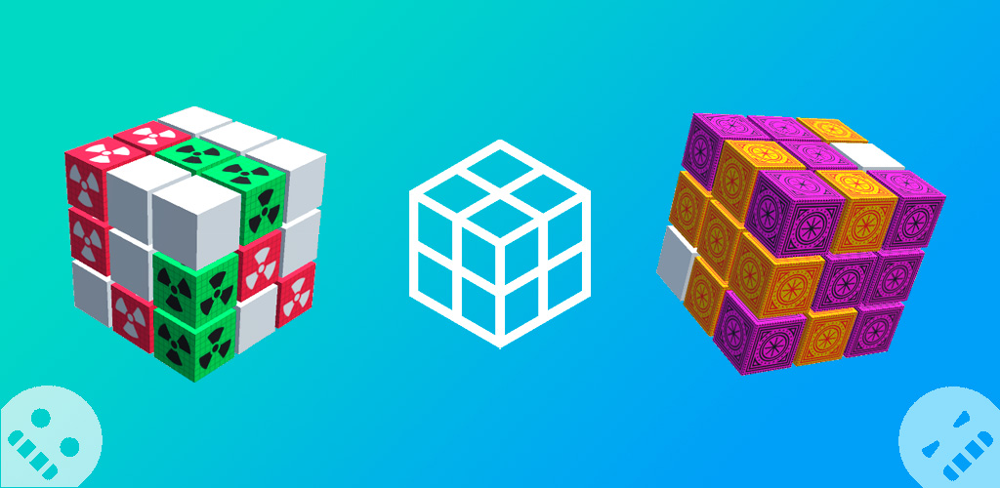
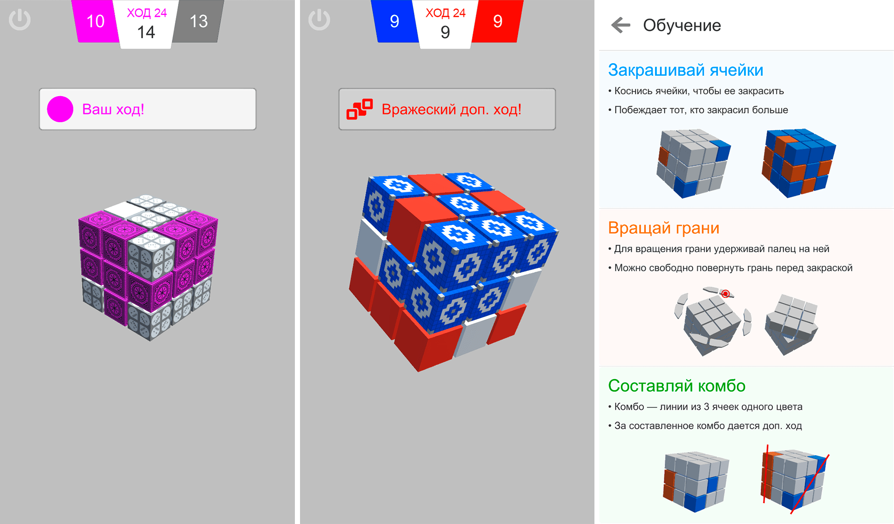
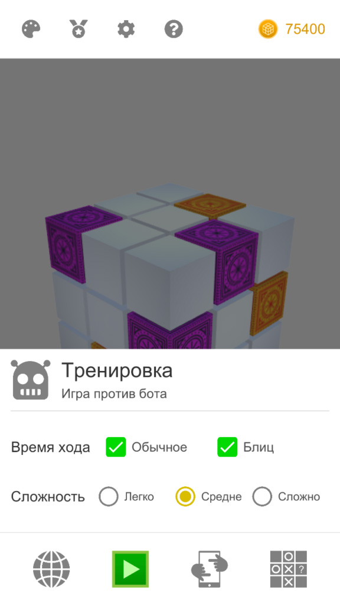
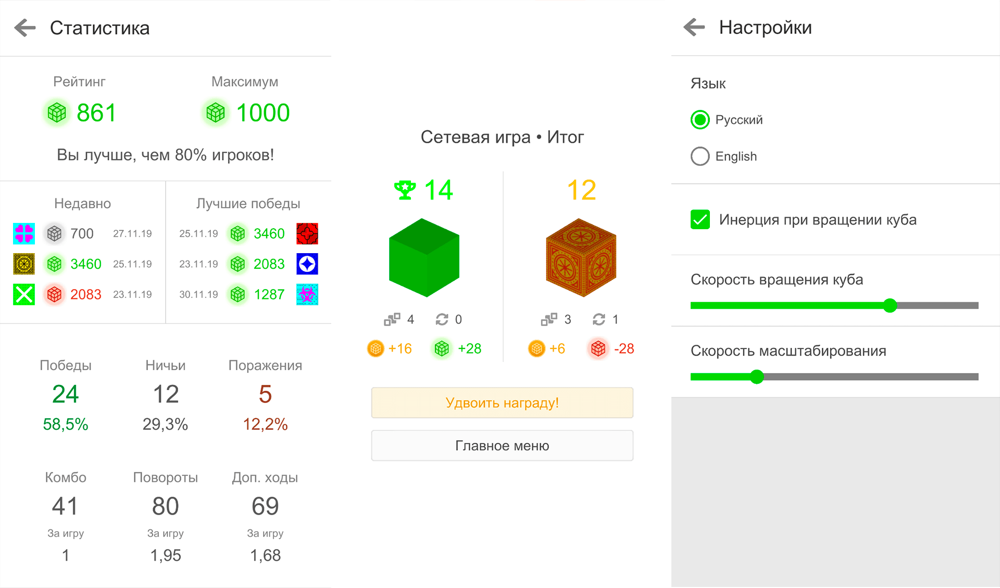
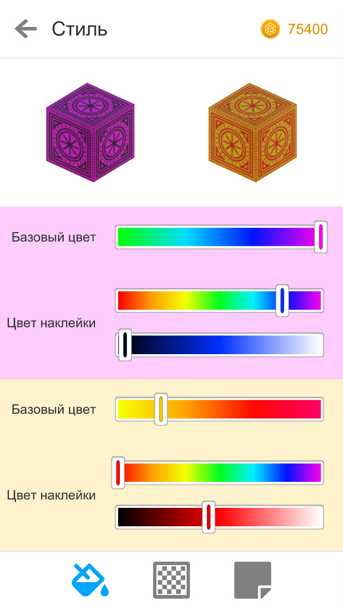

<gallery>
    
    
    
    
    
</gallery>

Головоломка, основанная на переносе повсеместно известных крестиков-ноликов из плоскости на поверхность куба.
Правила достаточно сильно поменялись, но базовая суть одна — игроки по очереди закрашивают кубы в свои цвета.
Создание комбо линии или диагонали дает дополнительный ход.
Побеждает тот, кто закрасил больше кубиков.

Помимо закраски есть еще механика поворота граней, прямо как в Кубике Рубика.
Эта механика добавляет множество хитрых стратегий, например закрашивать кубы в отдаленных местах, а затем с помощью поворота собирать их в комбинацию, получая дополнительный ход.

Реализовали сетевую игру и даже соревновательный рейтинг, на манер MMR в [Dota 2](p:dota-2).
За заработанные монетки можно было настраивать внешний вид своих блоков: менять цвета, текстуру и наклейки.

Сама идея и разные программные наработки растянулись на пару лет.
Полноценной разработкой занялся уже в [Североморске](p:severomorsk) совместно с Николаем Нагибином.

Планы на поддержку игры были очень обширными.
Но она не выстрелила, поэтому мы решили переключиться на математику.
Примерно тогда я понял, что не хочу заниматься разработкой игр в качестве основной работы.