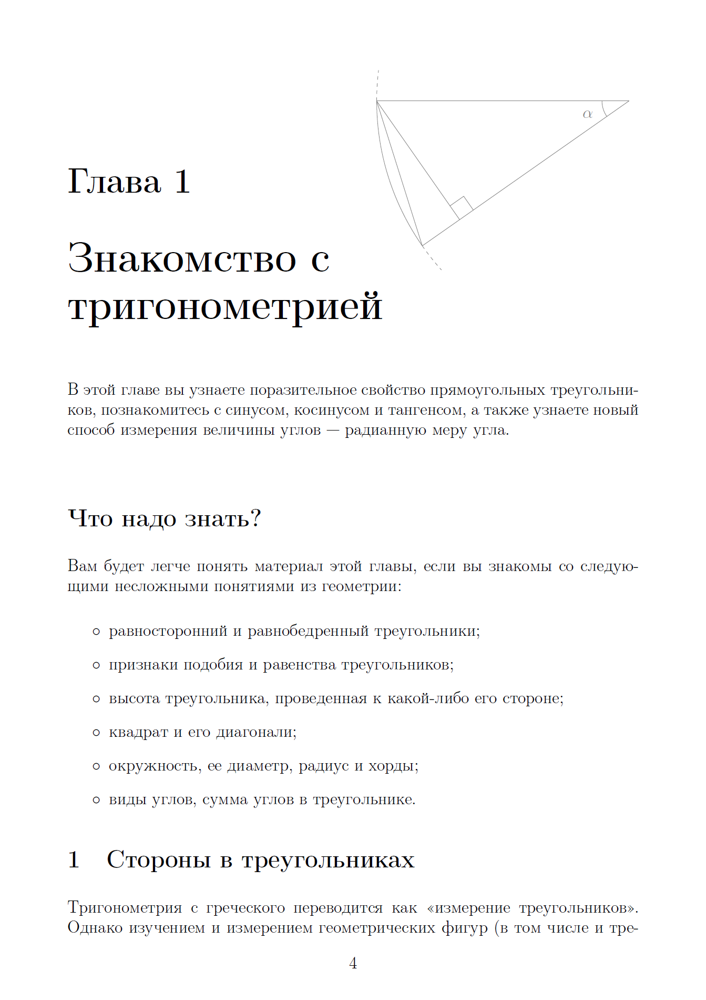
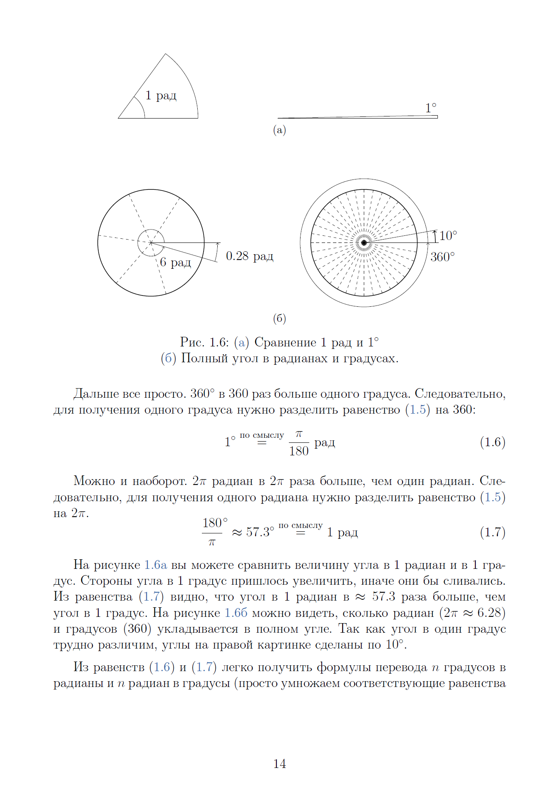
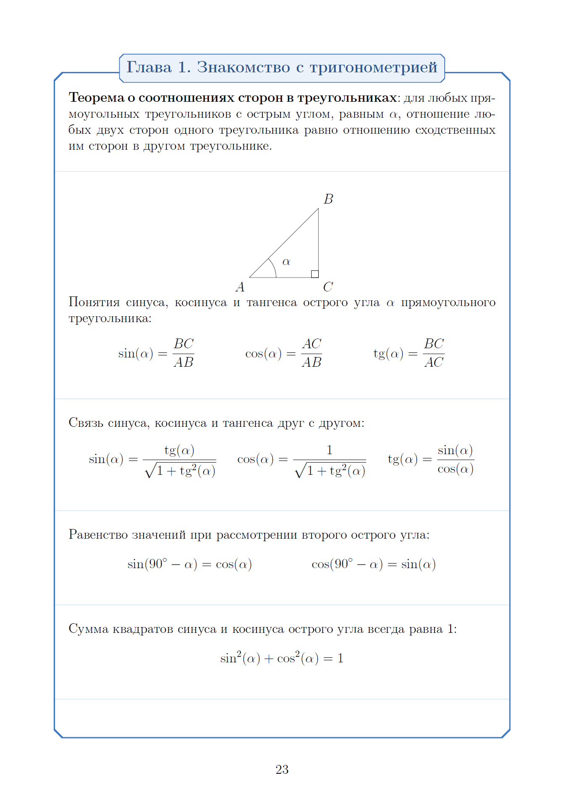
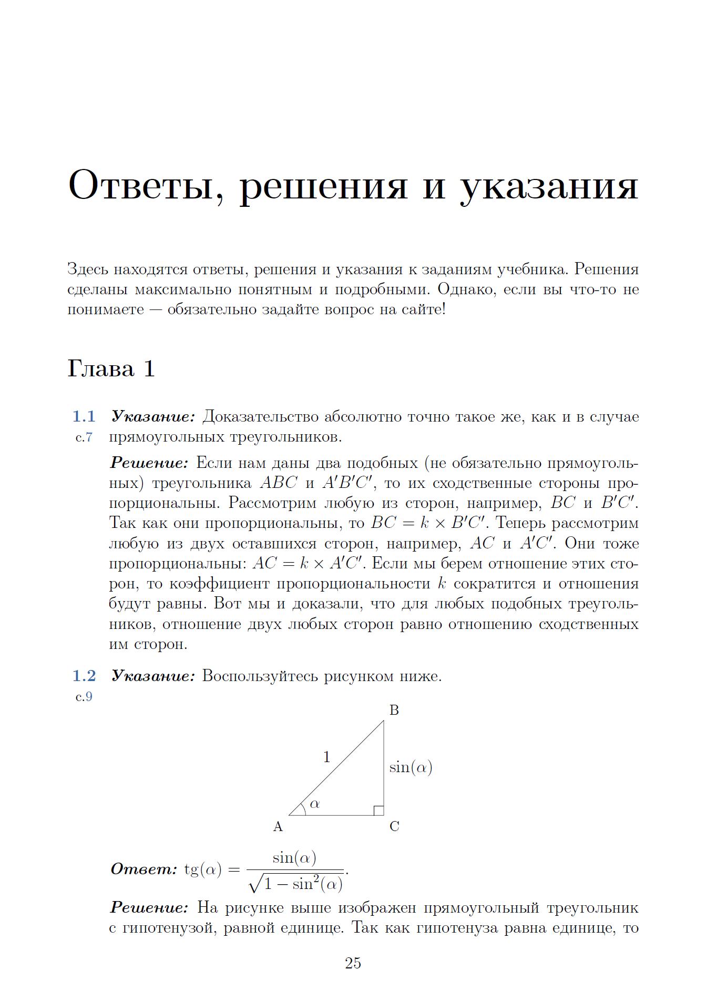
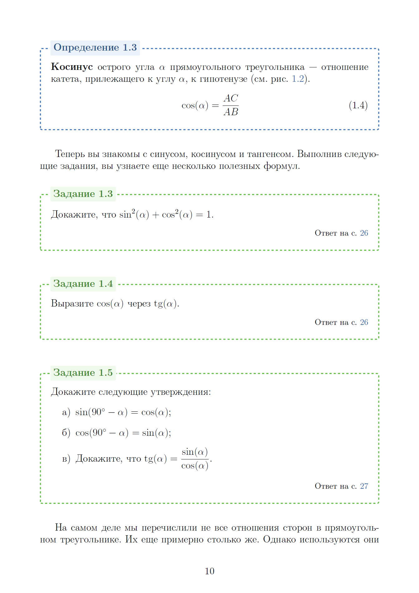

<gallery>
    
    
    
    
    
</gallery>

Мне надо было подтянуть знания по тригонометрии.
Наткнулся на учебник от Гельфанда.
Меня поразило то, насколько интересно и понятно он объясняет этот не самый легкий предмет.
Я загорелся идеей создания собственных учебных материалов.

Так зародился проект TopMath — моя первая попытка создавать понятные и увлекательные учебники по математике.
В рамках проекта я написал первую главу своего учебника по тригонометрии в двух версиях: в виде PDF файла, а также онлайн-учебника на базе WordPress.

Из-за технических трудностей публикации материала учебника на сайт, а также проблем в ВУЗе проект забросил.